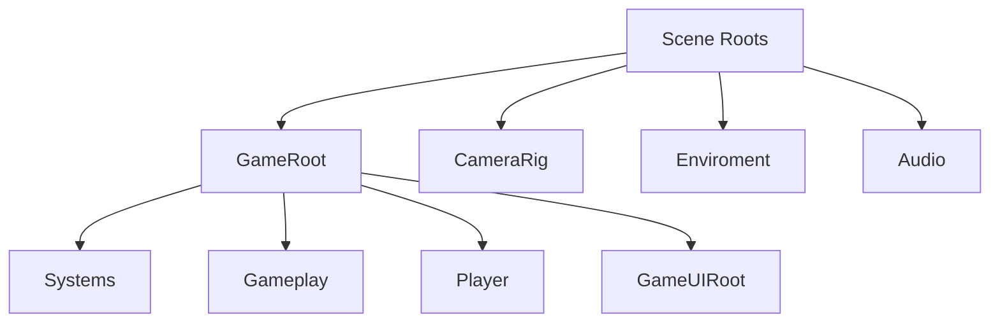

# Auditoria de jerarquia runtime

## Proposito

Este documento define que script debe vivir en cada nodo principal de escena o prefab. Su funcion es evitar contradicciones: dos scripts gobernando el mismo movimiento, tags configurables que compiten con catalogos centrales, boundaries serializados en prefabs, o componentes heredados que ya no tienen responsabilidad.

La ficha completa de la escena principal esta en [ZonaEpipelagica.md](ZonaEpipelagica.md).

## Regla central

Un nodo debe tener un solo propietario por responsabilidad.

La regla de capas completa esta definida en [SoftwareArchitecture.md](SoftwareArchitecture.md): los managers, controllers, directors y spawners de sistema son duenos de flujo; los `...State` modelan fases; las especializaciones ejecutan comportamiento concreto; y los datos/catalogos no ejecutan gameplay.

- Estado global: `GameSessionController`.
- Progresion macro de run: `RunProgressionDirector`.
- Flujo de escenas: `SceneFlowController`.
- Movimiento del jugador: `PlayerMovement`.
- Ink-Pulse: `InkPulseController` y `RuntimeInkPulseState`.
- Score y pace runtime: `RunProgressionDirector` acumula; `RuntimeRunScore` conserva puntaje; `RuntimePlayerPace` conserva progresion de velocidad; `ScoreCounterDisplay` muestra puntaje.
- Estado runtime del jugador: `PlayerStateController`.
- Visuales del jugador: `PlayerVisualStateController` en el root decide entre `SquidVisual`, `InkPulseVisual` y `PortalVisual`.
- Visual del cuerpo del jugador: `SquidVisual` con `Squid.controller`.
- Visual del Ink-Pulse: `InkPulseVisual` con `InkPulseVisual.controller`.
- Visual de portal: `PortalVisual` con `PortalEffect.controller`.
- Colision del jugador: `PlayerCollision`.
- Carga por proximidad: `GrazeDetector`.
- Camara: `CameraController`.
- Movimiento horizontal del mundo y boundaries: `HorizontalTracker`.
- Limpieza de objetos fuera de camara: `DestroyOffscreen`.
- Resolucion de boundaries: `BoundaryReferenceResolver`.
- Spawn de enemigos, camarones, tienda y portales: `LevelSpawner`, parametrizado por `ZoneSpawnProfile` cuando la zona lo tenga asignado.
- Tags compartidos: `GameplayTagCatalog`.
- Tags de enemigos: `EnemyTagCatalog`.
- Inventario runtime de gadgets: `PlayerGadgetInventory` y `RuntimeGadgetInventory`.
- Mercancia comprable: `GadgetShopItem`.
- Tienda temporal: `DealerFish` e `InGameShopManager`.
- Portales: `ScenePortal` detecta contacto; `SceneFlowController` decide destino.
- Iluminacion de zona: `ZoneLightingController` gobierna `LayerBlack`; `LightGrazeSource` declara posiciones de luz visual.
- Economia persistente: `ShrimpRuntimeWallet` como API runtime y `PersistentPlayerProfile` como almacenamiento JSON.
- Boss SS Carnage: `BossEventDirector`, `SSCarnageController` y `SSCarnageNetWall`.
- UI de pausa: `PauseMenuManager`.
- UI de game over: `GameOverMenuManager`.
- Animacion de botones de menu: `MenuButtonAnimation`.

## Contrato del prefab del jugador

El jugador canonico vive en:

```text
Assets/Content/Prefabs/Player/BabySquid.prefab
```

Las escenas jugables no deben contener copias manuales del jugador. El nodo visible en escena sigue llamandose `Squid`, pero debe ser una instancia de `BabySquid.prefab`.

Jerarquia canonica:

```text
BabySquid
|-- GrazeZone
|-- SquidVisual
|-- InkPulseVisual
`-- PortalVisual
```

Reglas:
- El prefab conserva componentes internos del jugador: `PlayerMovement`, `InkPulseController`, `ShrimpCollector`, `PlayerCollision`, `PlayerGadgetInventory`, `PlayerStateController`, `PlayerVisualStateController`, `Rigidbody2D`, `CircleCollider2D`, `GrazeDetector` y visuales.
- El prefab base no serializa referencias a `GameSession`, camara, HUD, progression director ni boundaries.
- Cada instancia de escena llamada `Squid` debe tener asignadas en Inspector sus referencias externas: `GameSession`, `RunProgressionDirector`, `Main Camera` y `ChargeBar`.
- Los componentes conservan resolucion runtime como respaldo defensivo, no como fuente primaria de cableado.
- `ZonaAbisopelagica` puede agregar `LightGrazeSource` como override de instancia, porque la luz de esa zona es una capacidad ambiental especifica, no una propiedad base de BabySquid.
- Los cambios de collider, visual base, `GrazeZone`, `SquidVisual`, `InkPulseVisual`, `PortalVisual` o inventario deben hacerse en el prefab, no en copias de escena.
- Las skins futuras deben ser variantes visuales o prefab variants; no deben duplicar scripts de gameplay.
- Si se reconstruye el player, usar `Tools/Squid/Rebuild And Wire Player Prefab Contract`.

## Contrato de boundaries

Toda zona jugable debe contener estas jerarquias exactas:

```text
PlayerBoundaries
|-- TopBoundary
`-- BottomBoundary

CameraBoundaries
|-- TopBoundary
`-- BottomBoundary
```

Cada `TopBoundary` y `BottomBoundary` debe tener un `Collider2D`. Los sistemas leen bounds fisicos internos mediante `BoundaryReferenceResolver`.

Reglas de mantenimiento:
- No serializar `topBorder`, `bottomBorder`, `playerTopBorder` ni `playerBottomBorder` en escenas o prefabs.
- No usar `fallbackMinY`, `fallbackMaxY`, `minY`, `maxY` ni offsets manuales de top boundary.
- No usar tags para encontrar boundaries.
- No crear una tercera jerarquia de limites para resolver un caso puntual.
- Si se cambia el tamano del escenario, se ajustan los colliders de `PlayerBoundaries` y `CameraBoundaries`; el codigo debe adaptarse solo.

## Propiedad de configuracion

Campos editables permitidos:
- Parametros de balance en managers o controladores duenos del sistema, por ejemplo `RunProgressionDirector`, `LevelSpawner`, `InGameShopManager`, `SceneFlowController`, `CameraController`, `BossEventDirector` o `SSCarnageController`.
- Referencias tecnicas en managers de escena, cuando el manager es el dueno de la coordinacion.
- Datos propios de prefab, por ejemplo `GadgetShopItem.gadgetId` o `ShrimpValue.amount`.

Campos que no deben existir:
- Tags como strings locales si ya existe catalogo.
- Boundaries como referencias serializadas por componente.
- Parametros de balance en entidades puras como `PufferfishEnemy`, `DealerFish`, `ScenePortal` o `SSCarnageNetWall`.
- Canvas o nodos visuales autogenerados por scripts cuando la escena ya contiene la UI.
- Prefabs de enemigo genericos que compitan con `enemyProfiles`.

Los perfiles de datos serializados (`ZoneSpawnProfile`, `EnemySpawnProfile`, `PufferfishEnemyTuning`, `FishingRodEnemyTuning`, `ShopGadgetOffer`) pueden tener campos editables, pero no son duenos de comportamiento: existen para que el manager/controller dueno lea configuracion declarativa.

## Jerarquia de escenas jugables

La escena se organiza con roots de escena separados. `GameRoot` agrupa sistemas de gameplay y UI; `CameraRig`, `Enviroment` y `Audio` son roots hermanos para mantener la composicion espacial clara.



## Estandar de coordenadas

Las escenas `ZonaEpipelagica`, `ZonaAbisopelagica` y `ZonaTutorial` deben quedar centradas alrededor del origen de mundo:

- `CameraRig/Main Camera`: posicion inicial `(0, 0, -10)`.
- `GameRoot/Player/Squid`: posicion inicial `(-5, 0, 0)`, conservando el desplazamiento del jugador respecto de la camara.
- `GameRoot/Gameplay/Boundaries`: cerca del origen; las distancias reales las definen sus hijos `TopBoundary` y `BottomBoundary`.
- `Enviroment/Background`: posicion local `(0, 0, 0)`; sus capas visuales se ubican cerca de la camara con sus escalas propias.
- No escalar `GameRoot`, `Gameplay`, `CameraRig`, `Enviroment` ni `Audio` para corregir tamano. Los roots estructurales deben permanecer con escala `(1, 1, 1)`.
- Un escalado global distinto de `1` requiere una pasada de balance separada, porque afecta velocidades, offsets, colliders, camara, spawn y limpieza.

La herramienta `Tools/Squid/Normalize Gameplay Scene Coordinates` ejecuta esta normalizacion sobre las tres escenas jugables. Su codigo vive en `Assets/Implementation/Editor/GameplaySceneCoordinateNormalizer.cs`.

| Nodo | Script esperado | Responsabilidad |
| --- | --- | --- |
| `GameSession` | `GameSessionController`, `RunProgressionDirector` | Estado de partida y progresion temporal. |
| `SceneFlow` | `SceneFlowController` | Carga de escenas y retorno al menu. |
| `LevelSpawner` | `LevelSpawner` con `zoneSpawnProfile` opcional | Spawn de monedas, enemigos, tienda y portales. Si hay perfil asignado, el asset es la fuente autoritativa de balance de spawn. |
| `Main Camera` | `CameraController` | Seguimiento y eventos de camara. |
| `Boundaries` | `HorizontalTracker` | Mantener boundaries alineados con el avance horizontal. |
| `PlayerBoundaries` | hijos con `Collider2D` | Limites verticales del jugador. |
| `CameraBoundaries` | hijos con `Collider2D` | Limites verticales de camara. |
| `GameUIRoot` | `GameUIRoot` | Contrato de composicion de UI jugable: referencia EventSystem, HUD, vistas prefab y managers, sin gobernar estados ni gameplay. |
| `Squid` | Instancia de `BabySquid.prefab`; `PlayerMovement`, `InkPulseController`, `ShrimpCollector`, `PlayerCollision`, `PlayerGadgetInventory`, `PlayerStateController`, `PlayerVisualStateController` | Control completo del jugador sin copia manual por escena. |
| `GrazeZone` | `GrazeDetector` | Carga de Ink-Pulse por proximidad a amenazas. |
| `SquidVisual` | `SpriteRenderer`, `Animator` | Sprite del calamar y animacion de movimiento. |
| `InkPulseVisual` | `SpriteRenderer`, `Animator` | Sprite largo del impulso de tinta; visible solo cuando `PlayerVisualStateController` selecciona Ink-Pulse. |
| `PortalVisual` | `SpriteRenderer`, `Animator` | Transicion visual `PortalEffect`; visible solo durante `PlayerRuntimeState.PortalTransition`. |
| `CleanUp` | Instancia de `Assets/Content/Prefabs/World/CleanUp.prefab` | Contenedor canonico de limpieza fuera de camara. No debe ser copia local de escena. |
| `CleanUp/DestroyZone/GarbageCollector` | `DestroyOffscreen` | Seguir el borde izquierdo de camara, adaptar su alto a `CameraBoundaries` y destruir enemigos, camarones, collectibles y portales que ya salieron de pantalla. |
| `SSCarnageManager` | `BossEventDirector` | Disparar y coordinar eventos de boss. |
| `PauseMenuManager` | `PauseMenuManager` | Abrir, cerrar y cablear pausa. |
| `GameOverMenuManager` | `GameOverMenuManager` | Abrir, cerrar y cablear derrota. |
| `InGameShopManager` | `InGameShopManager` | Abrir tienda temporal, calcular oferta/precio con score y resolver compra. |
| Botones de pausa/game over | `MenuButtonAnimation` | Animacion interactiva visual fija del boton; no expone parametros por boton. |
| Fondo burbujas UI | `MenuBubbles` | Movimiento decorativo compartido. |
| `InkBar` en `ZonaEpipelagica` | `ChargeBar`, `InkBarFillPresenter` con `RevealThroughFill` | Barra moderna horizontal/rotada. `Fill` funciona como mascara invisible y revela `InkBarEffectVisual`. |
| `InkBar` en `ZonaAbisopelagica` | `ChargeBar`, `InkBarFillPresenter` con `FollowFillTip` | Barra moderna vertical. `EffectAnchor` acompana la punta del relleno. |
| `InkPulseBar` en `ZonaTutorial` | `ChargeBar`, `Slider` | Variante legacy conservada temporalmente para tutorial. No debe mezclarse con los presenters modernos hasta redisenar esa escena. |
| `Score` | `ScoreCounterDisplay` | Puntaje runtime de la run. |
| `ShrimpCounter` | `ShrimpCounterDisplay` | Saldo persistente de camarones del perfil. |
| `GadgetSlots` | `GadgetInventoryHud` | Slots de inventario y teclas de gadgets activos. |

## Jerarquia especifica de ZonaAbisopelagica

`ZonaAbisopelagica` comparte el contrato de `ZonaEpipelagica`, pero agrega iluminacion ambiental:

| Nodo | Script esperado | Responsabilidad |
| --- | --- | --- |
| `Enviroment/ZoneLightingController` | `ZoneLightingController` | Oscurecer la zona y componer las zonas locales de luz. |
| `Enviroment/ZoneLightingController/LayerBlack` | `SpriteRenderer` | Capa negra semitransparente que cubre camara y recibe la textura compuesta de oscuridad. |
| `BossManager` / `SSCarnageManager` | ninguno | No debe existir en esta zona mientras SS Carnage no sea parte de su diseno. Si aparece con `BossEventDirector`, es legacy y debe retirarse. |

`LayerBlack` debe quedar sobre fondos y bajo entidades de gameplay. En el modo actual usa una textura generada por `ZoneLightingController` y `SpriteRenderer.maskInteraction = None`. El modo `VisibleOutsideMask` queda reservado para el fallback legacy con `SpriteMask`.

## Prefabs runtime

| Prefab | Script esperado | Tag esperado | Layer esperada |
| --- | --- | --- | --- |
| `BabySquid` | `PlayerMovement`, `InkPulseController`, `ShrimpCollector`, `PlayerCollision`, `PlayerGadgetInventory`, `PlayerStateController`, `PlayerVisualStateController` | `Player` | `Player` |
| `PezGlobo` | `PufferfishEnemy` | `EnemyPezGlobo` | `Enemy` |
| `Mina` | ninguno por ahora | `EnemyMina` | `Enemy` |
| `CanaPescar` | `FishingRodEnemy` | `EnemyCanaPescar` | `Enemy` |
| `ShrimpCoin` | `ShrimpValue` | `Shrimp` | `Collectible` |
| `ShrimpCoinX10` | `ShrimpValue` | `Shrimp` | `Collectible` |
| `ShellShield` | `GadgetShopItem` | `Untagged` | segun UI/prefab |
| `InkBottle` | `GadgetShopItem` | `Untagged` | segun UI/prefab |
| `DealerFish` | `DealerFish` | `Collectible` | `Collectible` |
| `ScenePortal` | `ScenePortal` | `Portal` | `Collectible` |
| `SSCarnage` | `SSCarnageController` | `SSCarnage` | `Enemy` |
| `BossNetWall` | `SSCarnageNetWall` | `SSCarnage` | `Enemy` |
| `CleanUp` | `DestroyOffscreen` en `DestroyZone/GarbageCollector` | root `Untagged`; hijo `DestroyZone` | root `Default`; hijos `DestroyZone` |

La mina no tiene script propio todavia porque su logica actual vive en el algoritmo de spawn. La cana ya tiene `FishingRodEnemy`; su temporizacion de aparicion pertenece a `LevelSpawner`, pero su caida vertical pertenece al prefab.

## Prefabs UI

Las barras de Ink-Pulse y el resto de HUD/menus principales existen como prefabs separados por variante. `ZonaEpipelagica` y `ZonaAbisopelagica` deben consumir estos assets como instancias de prefab, no como copias locales desempaquetadas.

| Prefab | Uso | Componentes esperados |
| --- | --- | --- |
| `Assets/Content/Prefabs/UI/HUD/InkBarHorizontal.prefab` | `ZonaEpipelagica` | `ChargeBar`, `InkBarFillPresenter`, `Mask` invisible en `Fill`, `Animator` en `InkBarEffectVisual` |
| `Assets/Content/Prefabs/UI/HUD/InkBarVertical.prefab` | `ZonaAbisopelagica` | `ChargeBar`, `InkBarFillPresenter`, `Mask` en `FillViewport`, `Animator` en `InkBarEffectVisual` |
| `Assets/Content/Prefabs/UI/HUD/InkPulseBarLegacy.prefab` | `ZonaTutorial` temporal | `ChargeBar`, `Slider` |
| `Assets/Content/Prefabs/UI/HUD/GadgetSlots.prefab` | HUD comun | `GadgetInventoryHud`, slots `Gadget1`/`Gadget2`, textos `Q`/`W` |
| `Assets/Content/Prefabs/UI/HUD/ShrimpCounter.prefab` | HUD comun | `ShrimpCounterDisplay`, icono y texto de cantidad |
| `Assets/Content/Prefabs/UI/HUD/ScoreCounter.prefab` | HUD comun | `ScoreCounterDisplay` |
| `Assets/Content/Prefabs/UI/Menus/PauseMenu.prefab` | Overlay de pausa | `PauseCanvas`, `CanvasGroup`, botones y animaciones visuales; sin manager dentro del prefab |
| `Assets/Content/Prefabs/UI/Menus/GameOverMenu.prefab` | Overlay de derrota | `GameOverCanvas`, `CanvasGroup`, botones y animaciones visuales; sin manager dentro del prefab |
| `Assets/Content/Prefabs/UI/Menus/InGameShopMenu.prefab` | Tienda temporal in-run | `InGameCanvas`, `CanvasGroup`, `Comprar`, `Gadget`, `Precio`, `B`, `SinSaldo`; sin manager dentro del prefab |

Reglas:
- La UI jugable debe colgar de `GameUIRoot`, no de un root generico `UI`.
- `GameUIRoot` es un contrato de composicion: expone referencias, pero no instancia prefabs ni decide estados.
- `ChargeBar` no debe contener reglas de layout de una variante concreta.
- `InkBarFillPresenter` no debe conocer gameplay; solo interpreta el valor recibido.
- Los prefabs UI no deben serializar referencias a `Squid`, `InkPulseController`, sesion ni managers.
- Las escenas asignan el `ChargeBar` al `InkPulseController` del jugador.
- Los botones de prefabs UI no deben serializar eventos persistentes hacia managers. El manager de escena los cablea al despertar.
- `PauseMenuManager`, `GameOverMenuManager` e `InGameShopManager` conservan las referencias de escena hacia las instancias visuales. Tambien pueden resolver referencias por nombre si el prefab visual se ubica bajo su jerarquia.
- `Assets/Implementation/Editor/GameplayUiPrefabSceneMigration.cs` permite reejecutar la migracion y validacion desde `Tools/Squid/Migrate Gameplay UI To Prefab Instances`.

## Spawn de enemigos

`LevelSpawner` no usa un prefab generico heredado. Todo enemigo nace desde `ZoneSpawnProfile.enemyProfiles` si la zona tiene perfil asignado; si no, usa los `enemyProfiles` legacy del componente como compatibilidad. Cada entrada define:

- `prefab`: prefab concreto a instanciar.
- `enemyTag`: tag logico del enemigo.
- `baseWeight`: peso relativo de aparicion.
- `minIntensity`: intensidad minima de run.
- `spawnIntervalMultiplier`: modificador local del intervalo tras ese spawn.

Despues de instanciar, `LevelSpawner` aplica el tag con `EnemyTagCatalog.ApplyEnemyTag()` y asigna capa `Enemy` de forma recursiva.
Los comportamientos de enemigos reciben `EnemySpawnContext`; sus parametros de balance viven en `LevelSpawner`, no en el prefab.
En `ZonaAbisopelagica`, `LevelSpawner` tambien garantiza `LightGrazeSource` en enemigos, camarones, `DealerFish` y portales instanciados, porque `LightGrazeSource.EnsureOn()` solo actua si existe `ZoneLightingController`.

## Spawn de tienda

`LevelSpawner` instancia `DealerFish` por intervalo independiente del spawn regular:
- aparece por la derecha de la camara;
- usa capa `Collectible`;
- usa tag `Collectible`;
- se ubica en la zona inferior configurable del rango definido por `PlayerBoundaries`;
- agenda cada aparicion con intervalo base multiplicado por un factor aleatorio de tienda;
- abre `InGameShopManager` al colisionar con el jugador.

## Spawn de portales

`LevelSpawner` instancia `ScenePortal` por politica de aparicion:
- aparece por la derecha de la camara;
- usa capa `Collectible`;
- usa tag `Portal`;
- se ubica dentro del rango definido por `PlayerBoundaries`;
- `ScenePortal` detecta la colision y `SceneFlowController` resuelve el destino.

Configuracion actual:
- `ZonaEpipelagica`: `PortalSpawnPolicy.PostBossWindow`, primer portal inmediato durante post-boss.
- `ZonaAbisopelagica`: `PortalSpawnPolicy.AlwaysInterval`, primer portal a los `20s` y repeticion cada `20s`.

## Light graze visual

`LightGrazeSource` no es un manager y no tiene parametros de balance. Es una declaracion runtime de capacidad visual.

Reglas:
- El balance visual vive solo en `ZoneLightingController`.
- La instancia `Squid` de `BabySquid.prefab` debe tener `LightGrazeSource` solo en `ZonaAbisopelagica`.
- Las entidades spawneadas reciben `LightGrazeSource` por `LevelSpawner` solo en zonas con `ZoneLightingController`.
- En modo compuesto, `LightGrazeSource` no crea renderers visibles: solo registra su posicion para que `ZoneLightingController` regenere una unica textura de oscuridad.
- El fallback legacy puede crear `LightGrazeMask` y `LightGrazeFeather` como hijos runtime si se desactiva `useCompositeLightOverlay`.
- `GrazeDetector` y `LightGrazeSource` no deben compartir estado ni cargar el mismo recurso.

## Scripts retirados o reemplazados

| Script anterior | Estado | Motivo |
| --- | --- | --- |
| `CameraFollowHorizontal` | eliminado | Duplicaba responsabilidades de `CameraController` y `HorizontalTracker`. |
| `PauseButtonAnimation` | reemplazado por `MenuButtonAnimation` | Su uso ya no es exclusivo del menu de pausa. |
| `PauseBubbles` | eliminado | `MenuBubbles` cubre la animacion decorativa compartida. |
| `GadgetPickup` | reemplazado | Los gadgets se compran, no se recogen directamente. |
| `ShopPickup` | reemplazado por `DealerFish` | El ente de tienda tiene identidad propia. |
| `PlayerInkPulseVisualController` | reemplazado en jerarquia por `PlayerVisualStateController` | Ink-Pulse ya no puede ser el unico dueno visual porque portal e Ink-Pulse compiten por ocultar el cuerpo. |

## Invariantes de mantenimiento

- No agregar un segundo script de movimiento a `Main Camera`.
- No agregar un fallback generico de enemigo al spawner si ya existen perfiles.
- No bloquear el spawn regular durante `BossActive`; el evento debe duplicar frecuencia, no detener obstaculos.
- No usar `LevelSpawner` para lanzar anzuelos desde el SS Carnage; los ataques que nacen del boss deben vivir en el controlador/prefab del boss.
- No serializar tags de enemigos en `PlayerCollision`, `GrazeDetector` o `DestroyOffscreen`.
- No declarar tags compartidos (`Player`, `Shrimp`, `Collectible`, `Portal`) como strings locales en scripts de gameplay.
- No posicionar `GarbageCollector` manualmente para balancear limpieza; `DestroyOffscreen` se alinea por camara en runtime.
- No desempaquetar ni duplicar `CleanUp` en escenas jugables; usar siempre `Assets/Content/Prefabs/World/CleanUp.prefab`.
- No dimensionar `CleanUp` desde el viewport ni desde la ortografica de camara; el alto valido es la distancia interna entre `CameraBoundaries/BottomBoundary` y `CameraBoundaries/TopBoundary`.
- No declarar Game Over por colision sin consultar antes `PlayerGadgetInventory` para `Shell Shield`.
- No fijar `W` o `Q` desde el prefab de gadget; el slot visual se asigna por orden de adquisicion.
- Mantener `Gadget1 = Q` y `Gadget2 = W` tanto en HUD como en input.
- No autogenerar nodos visuales de `GadgetSlots` desde `GadgetInventoryHud`; la UI pertenece al canvas de escena.
- No stackear gadgets: cada `GadgetId` existe como posesion unica.
- No comprar desde tienda sin pasar por `ShrimpRuntimeWallet.TrySpend`.
- No modificar `player-profile.json` directamente desde sistemas de gameplay; usar `PersistentPlayerProfile` o `ShrimpRuntimeWallet`.
- No guardar settings en `player-profile.json`; volumen, brillo, pantalla y dificultad pertenecen a otro almacenamiento.
- No autogenerar canvas de tienda desde `InGameShopManager`.
- No volver a introducir un root generico `UI` en escenas jugables; usar `GameUIRoot`.
- No entregar gadgets por colision directa: los gadgets se compran desde `InGameShopManager`.
- No permitir activacion manual de Ink-Pulse mientras `InGameShopManager` esta en `ShopEventState.Offering`.
- No usar `LightGrazeSource` para cargar Ink-Pulse; su unica consecuencia es visual y pertenece a `ZoneLightingController`.
- No dejar `BossEventDirector` en `ZonaAbisopelagica`; esa zona no instancia SS Carnage ni `BossNetWall` en el contrato actual.
- No dejar portales fijos `PortalTo...` en escena; los portales nacen desde `LevelSpawner`.
- No usar tag `Shrimp` ni `Collectible` en portales; deben usar `Portal`.
- No cargar zonas desde scripts de enemigo, tienda o HUD; el contacto pertenece a `ScenePortal`, pero las rutas pertenecen a `SceneFlowController`.
- No activar `Ink-Bottle` si el Ink-Pulse ya esta en `Ready` o `Active`; no debe consumirse sin efecto.
- No poner logica de boss en el prefab de red que ya pertenece a `SSCarnageController`.
- No mezclar la animacion del cuerpo y el efecto largo de Ink-Pulse en el mismo `Animator`; `SquidVisual` y `InkPulseVisual` deben mantenerse separados.
- No dejar visible `SquidVisual` durante `InkPulseState.Active` si `InkPulse.anim` ya contiene al cuerpo del calamar.
- No dejar visible `SquidVisual` ni `InkPulseVisual` durante `PlayerRuntimeState.PortalTransition`; en ese estado solo debe verse `PortalVisual`.
- No editar una copia local de `Squid` como si fuera fuente canonica; los cambios estructurales del jugador deben aplicarse en `BabySquid.prefab`.
- Si un nuevo enemigo necesita comportamiento, debe tener prefab, tag, perfil de spawn y script propio documentados juntos.
