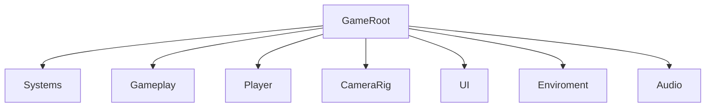

# Auditoria de jerarquia runtime

## Proposito

Este documento define que script debe vivir en cada nodo principal de escena o prefab. Su funcion es evitar contradicciones: dos scripts gobernando el mismo movimiento, tags configurables que compiten con catalogos centrales, boundaries serializados en prefabs, o componentes heredados que ya no tienen responsabilidad.

La ficha completa de la escena principal esta en [ZonaEpipelagica.md](ZonaEpipelagica.md).

## Regla central

Un nodo debe tener un solo propietario por responsabilidad.

- Estado global: `GameSessionController`.
- Progresion macro de run: `RunProgressionDirector`.
- Flujo de escenas: `SceneFlowController`.
- Movimiento del jugador: `PlayerMovement`.
- Ink-Pulse: `InkPulseController` y `RuntimeInkPulseState`.
- Estado runtime del jugador: `PlayerStateController`.
- Colision del jugador: `PlayerCollision`.
- Carga por proximidad: `GrazeDetector`.
- Camara: `CameraController`.
- Movimiento horizontal del mundo y boundaries: `HorizontalTracker`.
- Limpieza de objetos fuera de camara: `DestroyOffscreen`.
- Resolucion de boundaries: `BoundaryReferenceResolver`.
- Spawn de enemigos, camarones, tienda y portales: `LevelSpawner`.
- Tags compartidos: `GameplayTagCatalog`.
- Tags de enemigos: `EnemyTagCatalog`.
- Inventario runtime de gadgets: `PlayerGadgetInventory` y `RuntimeGadgetInventory`.
- Mercancia comprable: `GadgetShopItem`.
- Tienda temporal: `DealerFish` e `InGameShopManager`.
- Portales: `ScenePortal` detecta contacto; `SceneFlowController` decide destino.
- Iluminacion de zona: `ZoneLightingController` gobierna overlay; `LightGrazeProbe` detecta fuentes; `LightGrazeSource` marca entidades.
- Economia runtime: `ShrimpRuntimeWallet`.
- Boss SS Carnage: `BossEventDirector`, `SSCarnageController` y `SSCarnageNetWall`.
- UI de pausa: `PauseMenuManager`.
- UI de game over: `GameOverMenuManager`.
- Animacion de botones de menu: `MenuButtonAnimation`.

## Contrato de boundaries

Toda zona jugable debe contener estas jerarquias exactas:

```text
PlayerBoundaries
├── TopBoundary
└── BottomBoundary

CameraBoundaries
├── TopBoundary
└── BottomBoundary
```

Cada `TopBoundary` y `BottomBoundary` debe tener un `Collider2D`. Los sistemas leen bounds fisicos internos mediante `BoundaryReferenceResolver`.

Reglas de mantenimiento:
- No serializar `topBorder`, `bottomBorder`, `playerTopBorder` ni `playerBottomBorder` en escenas o prefabs.
- No usar `fallbackMinY`, `fallbackMaxY`, `minY`, `maxY` ni offsets manuales de top boundary.
- No usar tags para encontrar boundaries.
- No crear una tercera jerarquia de limites para resolver un caso puntual.
- Si se cambia el tamano del escenario, se ajustan los colliders de `PlayerBoundaries` y `CameraBoundaries`; el codigo debe adaptarse solo.

## Propiedad de configuracion

Campos editables permitidos:
- Parametros de balance en managers o controladores duenos del sistema, por ejemplo `RunProgressionDirector`, `LevelSpawner`, `InGameShopManager`, `SceneFlowController`, `CameraController`, `BossEventDirector` o `SSCarnageController`.
- Referencias tecnicas en managers de escena, cuando el manager es el dueno de la coordinacion.
- Datos propios de prefab, por ejemplo `GadgetShopItem.gadgetId` o `ShrimpValue.amount`.

Campos que no deben existir:
- Tags como strings locales si ya existe catalogo.
- Boundaries como referencias serializadas por componente.
- Parametros de balance en entidades puras como `PufferfishEnemy`, `DealerFish`, `ScenePortal` o `SSCarnageNetWall`.
- Canvas o nodos visuales autogenerados por scripts cuando la escena ya contiene la UI.
- Prefabs de enemigo genericos que compitan con `enemyProfiles`.

## Jerarquia de ZonaEpipelagica

La escena se organiza bajo `GameRoot`:



| Nodo | Script esperado | Responsabilidad |
| --- | --- | --- |
| `GameSession` | `GameSessionController`, `RunProgressionDirector` | Estado de partida y progresion temporal. |
| `SceneFlow` | `SceneFlowController` | Carga de escenas y retorno al menu. |
| `LevelSpawner` | `LevelSpawner` | Spawn de monedas, enemigos, tienda y portales. |
| `Main Camera` | `CameraController` | Seguimiento y eventos de camara. |
| `Boundaries` | `HorizontalTracker` | Mantener boundaries alineados con el avance horizontal. |
| `PlayerBoundaries` | hijos con `Collider2D` | Limites verticales del jugador. |
| `CameraBoundaries` | hijos con `Collider2D` | Limites verticales de camara. |
| `Squid` | `PlayerMovement`, `InkPulseController`, `ShrimpCollector`, `PlayerCollision`, `PlayerGadgetInventory`, `PlayerStateController` | Control completo del jugador. |
| `GrazeZone` | `GrazeDetector` | Carga de Ink-Pulse por proximidad a amenazas. |
| `CleanUp/DestroyZone/GarbageCollector` | `DestroyOffscreen` | Seguir el borde izquierdo de camara y destruir enemigos, camarones, collectibles y portales que ya salieron de pantalla. |
| `SSCarnageManager` | `BossEventDirector` | Disparar y coordinar eventos de boss. |
| `PauseMenuManager` | `PauseMenuManager` | Abrir, cerrar y cablear pausa. |
| `GameOverMenuManager` | `GameOverMenuManager` | Abrir, cerrar y cablear derrota. |
| `InGameShopManager` | `InGameShopManager` | Abrir tienda temporal, calcular oferta/precio y resolver compra. |
| Botones de pausa/game over | `MenuButtonAnimation` | Animacion interactiva visual fija del boton; no expone parametros por boton. |
| Fondo burbujas UI | `MenuBubbles` | Movimiento decorativo compartido. |
| `InkPulseBar` | `ChargeBar` | Representacion visual de carga Ink-Pulse. |
| `ShrimpCounter` | `ShrimpCounterDisplay` | Total persistente de camarones runtime. |
| `GadgetSlots` | `GadgetInventoryHud` | Slots de inventario y teclas de gadgets activos. |

## Jerarquia especifica de ZonaExe

`ZonaExe` comparte el contrato de `ZonaEpipelagica`, pero agrega iluminacion ambiental:

| Nodo | Script esperado | Responsabilidad |
| --- | --- | --- |
| `Enviroment/ZoneLightingController` | `ZoneLightingController` | Oscurecer la zona y revelar luz por proximidad. |
| `Enviroment/ZoneLightingController/DarknessOverlay` | `SpriteRenderer` | Overlay visual oscuro que cubre camara. |

`DarknessOverlay` debe quedar sobre fondos y bajo entidades de gameplay. La escena actual usa sorting order `-1`.

## Prefabs runtime

| Prefab | Script esperado | Tag esperado | Layer esperada |
| --- | --- | --- | --- |
| `PezGlobo` | `PufferfishEnemy`, `LightGrazeSource` | `EnemyPezGlobo` | `Enemy` |
| `Mina` | `LightGrazeSource` | `EnemyMina` | `Enemy` |
| `CanaPescar` | `LightGrazeSource` | `EnemyCanaPescar` | `Enemy` |
| `ShrimpCoin` | `ShrimpValue`, `LightGrazeSource` | `Shrimp` | `Collectible` |
| `ShrimpCoinX10` | `ShrimpValue`, `LightGrazeSource` | `Shrimp` | `Collectible` |
| `ShellShield` | `GadgetShopItem` | `Untagged` | segun UI/prefab |
| `InkBottle` | `GadgetShopItem` | `Untagged` | segun UI/prefab |
| `DealerFish` | `DealerFish`, `LightGrazeSource` | `Collectible` | `Collectible` |
| `ScenePortal` | `ScenePortal`, `LightGrazeSource` | `Portal` | `Collectible` |
| `SSCarnage` | `SSCarnageController`, `LightGrazeSource` | `SSCarnage` | `Enemy` |
| `BossNetWall` | `SSCarnageNetWall`, `LightGrazeSource` | `SSCarnage` | `Enemy` |

La mina y la cana no tienen script propio todavia porque su logica actual vive en el algoritmo de spawn. Cuando reciban comportamiento autonomo, deben incorporarse scripts dedicados en `Assets/Implementation/Code/Enemies/`.

## Spawn de enemigos

`LevelSpawner` no usa un prefab generico heredado. Todo enemigo nace desde `enemyProfiles`, donde cada entrada define:

- `prefab`: prefab concreto a instanciar.
- `enemyTag`: tag logico del enemigo.
- `baseWeight`: peso relativo de aparicion.
- `minIntensity`: intensidad minima de run.
- `spawnIntervalMultiplier`: modificador local del intervalo tras ese spawn.

Despues de instanciar, `LevelSpawner` aplica el tag con `EnemyTagCatalog.ApplyEnemyTag()` y asigna capa `Enemy` de forma recursiva.
Los comportamientos de enemigos reciben `EnemySpawnContext`; sus parametros de balance viven en `LevelSpawner`, no en el prefab.
`LevelSpawner` tambien garantiza `LightGrazeSource` en enemigos, camarones, `DealerFish` y portales instanciados.

## Spawn de tienda

`LevelSpawner` instancia `DealerFish` por intervalo independiente del spawn regular:
- aparece por la derecha de la camara;
- usa capa `Collectible`;
- usa tag `Collectible`;
- se ubica en el cuarto inferior del rango definido por `PlayerBoundaries`;
- abre `InGameShopManager` al colisionar con el jugador.

## Spawn de portales

`LevelSpawner` instancia `ScenePortal` por politica de aparicion:
- aparece por la derecha de la camara;
- usa capa `Collectible`;
- usa tag `Portal`;
- se ubica dentro del rango definido por `PlayerBoundaries`;
- `ScenePortal` detecta la colision y `SceneFlowController` resuelve el destino.

Configuracion actual:
- `ZonaEpipelagica`: `PortalSpawnPolicy.PostBossWindow`, primer portal inmediato durante post-boss.
- `ZonaExe`: `PortalSpawnPolicy.AlwaysInterval`, primer portal a los `20s` y repeticion cada `20s`.

## Light graze visual

`LightGrazeSource` no es un manager y no tiene parametros de balance. Es una declaracion de capacidad de entidad.

Reglas:
- El balance visual vive solo en `ZoneLightingController`.
- El BabySquid debe tener `LightGrazeProbe`.
- El `LightGrazeProbe` ignora fuentes en la misma raiz del jugador.
- La deteccion usa el punto mas cercano de colliders habilitados o bounds visuales, no el pivote de la entidad.
- `GrazeDetector` y `LightGrazeProbe` no deben compartir estado ni cargar el mismo recurso.

## Scripts retirados o reemplazados

| Script anterior | Estado | Motivo |
| --- | --- | --- |
| `CameraFollowHorizontal` | eliminado | Duplicaba responsabilidades de `CameraController` y `HorizontalTracker`. |
| `PauseButtonAnimation` | reemplazado por `MenuButtonAnimation` | Su uso ya no es exclusivo del menu de pausa. |
| `PauseBubbles` | eliminado | `MenuBubbles` cubre la animacion decorativa compartida. |
| `GadgetPickup` | reemplazado | Los gadgets se compran, no se recogen directamente. |
| `ShopPickup` | reemplazado por `DealerFish` | El ente de tienda tiene identidad propia. |

## Invariantes de mantenimiento

- No agregar un segundo script de movimiento a `Main Camera`.
- No agregar un fallback generico de enemigo al spawner si ya existen perfiles.
- No bloquear el spawn regular durante `BossActive`; el evento debe duplicar frecuencia, no detener obstaculos.
- No usar `LevelSpawner` para lanzar anzuelos desde el SS Carnage; los ataques que nacen del boss deben vivir en el controlador/prefab del boss.
- No serializar tags de enemigos en `PlayerCollision`, `GrazeDetector` o `DestroyOffscreen`.
- No declarar tags compartidos (`Player`, `Shrimp`, `Collectible`, `Portal`) como strings locales en scripts de gameplay.
- No posicionar `GarbageCollector` manualmente para balancear limpieza; `DestroyOffscreen` se alinea por camara en runtime.
- No declarar Game Over por colision sin consultar antes `PlayerGadgetInventory` para `Shell Shield`.
- No fijar `W` o `Q` desde el prefab de gadget; el slot visual se asigna por orden de adquisicion.
- Mantener `Gadget1 = Q` y `Gadget2 = W` tanto en HUD como en input.
- No autogenerar nodos visuales de `GadgetSlots` desde `GadgetInventoryHud`; la UI pertenece al canvas de escena.
- No stackear gadgets: cada `GadgetId` existe como posesion unica.
- No comprar desde tienda sin pasar por `ShrimpRuntimeWallet.TrySpend`.
- No autogenerar canvas de tienda desde `InGameShopManager`.
- No entregar gadgets por colision directa: los gadgets se compran desde `InGameShopManager`.
- No permitir activacion manual de Ink-Pulse mientras `InGameShopManager` esta en `ShopEventState.Offering`.
- No usar `LightGrazeSource` para cargar Ink-Pulse; su unica consecuencia es visual y pertenece a `ZoneLightingController`.
- No dejar portales fijos `PortalTo...` en escena; los portales nacen desde `LevelSpawner`.
- No usar tag `Shrimp` ni `Collectible` en portales; deben usar `Portal`.
- No cargar zonas desde scripts de enemigo, tienda o HUD; el contacto pertenece a `ScenePortal`, pero las rutas pertenecen a `SceneFlowController`.
- No activar `Ink-Bottle` si el Ink-Pulse ya esta en `Ready` o `Active`; no debe consumirse sin efecto.
- No poner logica de boss en el prefab de red que ya pertenece a `SSCarnageController`.
- Si un nuevo enemigo necesita comportamiento, debe tener prefab, tag, perfil de spawn y script propio documentados juntos.
