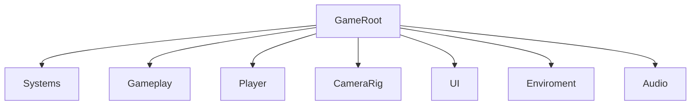

# Auditoría de jerarquía runtime

## Propósito

Este documento define qué script debe vivir en cada nodo principal de escena o prefab. Su función es evitar contradicciones: dos scripts intentando gobernar el mismo movimiento, tags configurables que compiten con el catálogo central, o componentes heredados que siguen serializados aunque ya no tengan responsabilidad.

La ficha completa de la escena principal está en [ZonaEpipelagica.md](ZonaEpipelagica.md).

## Regla central

Un nodo debe tener un solo propietario por responsabilidad.

- Movimiento de cámara: `CameraController`.
- Movimiento horizontal del mundo y boundaries: `HorizontalTracker`.
- Spawn de enemigos: `LevelSpawner` mediante `enemyProfiles`.
- Ritmo macro de spawn: `RunProgressionDirector`.
- Tags compartidos de gameplay: `GameplayTagCatalog`.
- Reconocimiento de enemigos: `EnemyTagCatalog`.
- Colisión física del jugador: `PlayerCollision`.
- Carga por proximidad: `GrazeDetector`.
- Estado runtime del jugador: `PlayerStateController`.
- Ink-Pulse: `InkPulseController`.
- Inventario runtime de gadgets: `PlayerGadgetInventory` y `RuntimeGadgetInventory`.
- Adquisición de gadgets en mundo: `GadgetPickup`.
- Persistencia runtime de camarones: `ShrimpRuntimeWallet`.
- Evento SS Carnage: `BossEventDirector`, `SSCarnageController` y `SSCarnageNetWall`.
- UI de pausa: `PauseMenuManager`.
- UI de game over: `GameOverMenuManager`.
- Animación de botones de menú: `MenuButtonAnimation`.

## Jerarquía de ZonaEpipelágica

La escena se organiza en un conjunto pequeño de raíces de alto nivel. `GameRoot` agrupa la partida completa y de él cuelgan `Systems`, `Gameplay`, `Player`, `CameraRig`, `UI`, `Enviroment` y `Audio`.

| Nodo | Script esperado | Responsabilidad |
| --- | --- | --- |
| `GameSession` | `GameSessionController`, `RunProgressionDirector` | Estado de partida y progresión temporal. |
| `SceneFlow` | `SceneFlowController` | Carga de escenas y retorno al menú. |
| `LevelSpawner` | `LevelSpawner` | Spawn de monedas y enemigos perfilados. |
| `Main Camera` | `CameraController` | Seguimiento y eventos de cámara. |
| `Boundaries` | `HorizontalTracker` | Mantener boundaries alineados con el avance horizontal. |
| `Squid` | `PlayerMovement`, `InkPulseController`, `ShrimpCollector`, `PlayerCollision`, `PlayerGadgetInventory`, `PlayerStateController` | Control completo del jugador. |
| `GrazeZone` | `GrazeDetector` | Carga de Ink-Pulse por proximidad a amenazas. |
| `CleanUp` | `DestroyOffscreen` | Destruir enemigos y camarones que salen del área útil. |
| `SSCarnageManager` | `BossEventDirector` | Disparar y coordinar eventos de boss. |
| `PauseMenuManager` | `PauseMenuManager` | Abrir, cerrar y cablear el menú de pausa. |
| `GameOverMenuManager` | `GameOverMenuManager` | Abrir, cerrar y cablear el panel de derrota. |
| Botones de pausa/game over | `MenuButtonAnimation` | Animación interactiva visual del botón. |
| Fondo burbujas UI | `MenuBubbles` | Movimiento decorativo compartido de burbujas. |
| `InkPulseBar` | `ChargeBar` | Representación visual de carga Ink-Pulse. |
| `ShrimpCounter` | `ShrimpCounterDisplay` | Mostrar total persistente de camarones runtime. |
| `GadgetSlots` | `GadgetInventoryHud` | Mostrar slots de inventario y teclas sólo para gadgets activos. |

## Estructura de la escena

### Systems

- `GameSession` tiene `GameSessionController` y `RunProgressionDirector`.
- `SceneFlow` tiene `SceneFlowController`.

### Gameplay

- `LevelSpawner` concentra el spawn de enemigos y monedas.
- `Boundaries` concentra el seguimiento de las fronteras del juego.
- `CleanUp` concentra la limpieza fuera de pantalla.
- `SSCarnageManager` concentra el disparo del evento de boss.

### Player

- `Squid` reúne movimiento, física, estados, inventario y cola de vigilancia de Ink-Pulse.
- `GrazeZone` añade la carga por proximidad a amenazas.

### UI

- `HUD` muestra el estado persistente de la run.
- `PauseMenuManager` y `GameOverMenuManager` gobiernan sus pantallas sin mezclar navegación global.

### CameraRig y Audio

- `Main Camera` tiene `CameraController` como controlador principal de encuadre.
- `Soundtrack` y `SFX` reproducen el audio de la escena.

### Enviroment

- La rama de fondo usa capas parallax para dar profundidad visual sin interferir con la lectura del gameplay.

## Prefabs runtime

| Prefab | Script esperado | Tag esperado |
| --- | --- | --- |
| `PezGlobo` | `PufferfishEnemy` | `EnemyPezGlobo` |
| `Mina` | ninguno por ahora | `EnemyMina` |
| `CanaPescar` | ninguno por ahora | `EnemyCanaPescar` |
| `ShrimpCoin` | `ShrimpValue` | `Shrimp` |
| `ShrimpCoinX10` | `ShrimpValue` | `Shrimp` |
| `ShellShield` | `GadgetPickup` | `Collectible` |
| `InkBottle` | `GadgetPickup` | `Collectible` |
| `SSCarnage` | `SSCarnageController` | `SSCarnage` |
| `BossNetWall` | `SSCarnageNetWall` | `SSCarnage` |

La mina y la cana no tienen script propio todavía porque su lógica actual vive en el algoritmo de spawn. Cuando reciban comportamiento autónomo, deben incorporarse scripts dedicados en `Assets/Implementation/Code/Enemies/`.

## Spawn de enemigos

`LevelSpawner` ya no usa un `enemyPrefab` genérico heredado. Todo enemigo debe nacer desde `enemyProfiles`, donde cada entrada define:

- `prefab`: prefab concreto a instanciar.
- `enemyTag`: tag logico del enemigo.
- `baseWeight`: peso relativo de aparición.
- `minIntensity`: intensidad mínima de run.
- `spawnIntervalMultiplier`: modificador local del intervalo tras ese spawn.

Despues de instanciar, `LevelSpawner` aplica el tag con `EnemyTagCatalog.ApplyEnemyTag()` y asigna la capa `Enemy` de forma recursiva.

## Tags

Los tags de enemigos tienen una sola fuente de verdad:

- `EnemyTagCatalog.Generic`
- `EnemyTagCatalog.Mine`
- `EnemyTagCatalog.Pufferfish`
- `EnemyTagCatalog.FishingRod`

`PlayerCollision`, `GrazeDetector` y `DestroyOffscreen` no deben exponer campos editables para tags de enemigos. Esto evita que el Inspector contradiga al catálogo central.

Los tags compartidos no enemigos también tienen una fuente central:

- `GameplayTagCatalog.Player`
- `GameplayTagCatalog.Shrimp`
- `GameplayTagCatalog.Collectible`

## Scripts retirados o reemplazados

| Script anterior | Estado | Motivo |
| --- | --- | --- |
| `CameraFollowHorizontal` | eliminado | Duplicaba responsabilidades de `CameraController` y `HorizontalTracker`. |
| `PauseButtonAnimation` | reemplazado por `MenuButtonAnimation` | Su uso ya no es exclusivo del menú de pausa. |
| `PauseBubbles` | eliminado | `MenuBubbles` cubre la animación decorativa compartida. |

## Invariantes de mantenimiento

- No agregar un segundo script de movimiento a `Main Camera`.
- No agregar un fallback genérico de enemigo al spawner si ya existen perfiles.
- No bloquear el spawn regular durante `BossActive`; el evento debe duplicar frecuencia, no detener obstáculos.
- No serializar tags de enemigos en `PlayerCollision` o `GrazeDetector`.
- No declarar tags compartidos (`Player`, `Shrimp`, `Collectible`) como strings locales en scripts de gameplay.
- No declarar Game Over por colisión sin consultar antes `PlayerGadgetInventory` para `Shell Shield`.
- No fijar `W` o `Q` desde el prefab de gadget; el slot visual se asigna por orden de adquisición.
- No stackear gadgets: cada `GadgetId` existe como posesion unica.
- No activar `Ink-Bottle` si el Ink-Pulse ya esta en `Ready` o `Active`; no debe consumirse sin efecto.
- No usar scripts de pausa en nodos de game over.
- No poner lógica de boss en el prefab de red que ya pertenece a `SSCarnageController`.
- Si un nuevo enemigo necesita comportamiento, debe tener prefab, tag, perfil de spawn y script propio documentados juntos.
