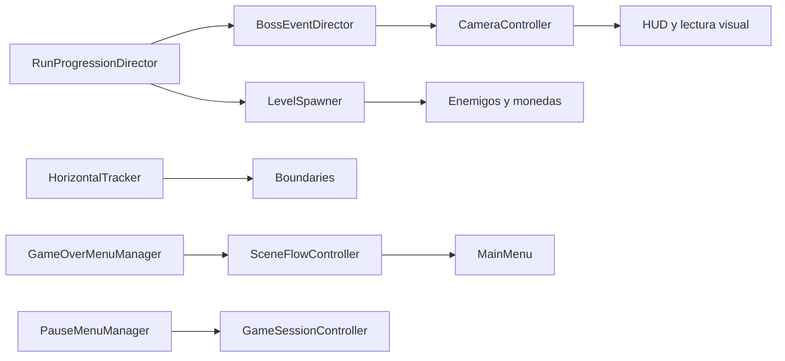

# Zona Epipelágica

## Propósito

Esta escena es el escenario principal de juego. Reúne la progresión de run, el spawner de enemigos, la cámara, la UI, el jugador y los controladores de sesión que coordinan el flujo completo de la partida.

## Estructura general

```mermaid
flowchart TD
    GameRoot[GameRoot]

    GameRoot --> Systems[Systems]
    GameRoot --> Gameplay[Gameplay]
    GameRoot --> Player[Player]
    GameRoot --> CameraRig[CameraRig]
    GameRoot --> UI[UI]
    GameRoot --> Enviroment[Enviroment]
    GameRoot --> Audio[Audio]

    Systems --> GameSession[GameSession]
    Systems --> SceneFlow[SceneFlow]

    Gameplay --> LevelSpawner[LevelSpawner]
    Gameplay --> Boundaries[Boundaries]
    Gameplay --> CleanUp[CleanUp]
    Gameplay --> SSCarnageManager[SSCarnageManager]
    Gameplay --> Portals[Portals]

    Player --> Squid[Squid]
    Squid --> GrazeZone[GrazeZone]
    Squid --> SquidVisual[SquidVisual]

    CameraRig --> MainCamera[Main Camera]

    UI --> HUD[HUD]
    UI --> PauseMenu[PauseMenuManager]
    UI --> GameOverMenu[GameOverMenuManager]
    UI --> EventSystem[EventSystem]

    Enviroment --> Background[Background]
    Enviroment --> Layer1[Layer1]
    Enviroment --> Layer2[Layer2]
    Enviroment --> Layer3[Layer3]
    Enviroment --> Layer4[Layer4]
    Enviroment --> Layer5[Layer5]

    Audio --> Soundtrack[Soundtrack]
    Audio --> SFX[SFX]
```

## Nodos y scripts

| Nodo | Scripts o componentes principales | Función |
| --- | --- | --- |
| `GameRoot` | Ninguno propio | Nodo raíz que agrupa toda la escena. |
| `Systems` | Ninguno propio | Contenedor de sistemas globales de sesión y flujo. |
| `GameSession` | `GameSessionController`, `RunProgressionDirector` | Estado de partida, pausa global e intensidad de la run. |
| `SceneFlow` | `SceneFlowController` | Retorno al menú y cambios de escena. |
| `Gameplay` | Ninguno propio | Agrupación de lógica del nivel y de sus spawns. |
| `LevelSpawner` | `LevelSpawner` | Spawn de monedas y enemigos a partir de perfiles. |
| `Boundaries` | `HorizontalTracker` | Mantener las fronteras alineadas con el avance del mundo. |
| `CleanUp` | `DestroyOffscreen` | Destruir objetos que ya salieron del área útil. |
| `SSCarnageManager` | `BossEventDirector` | Disparar el evento del SS Carnage y su fase amplia de cámara. |
| `Portals` | Sin script propio confirmado | Puntos de transición o portalización de la escena. |
| `Player` | Ninguno propio | Nodo contenedor del jugador. |
| `Squid` | `PlayerMovement`, `InkPulseController`, `ShrimpCollector`, `PlayerCollision`, `PlayerStateController`, `PlayerGadgetInventory`, `Rigidbody2D`, `CircleCollider2D` | Control total del jugador y su física. |
| `GrazeZone` | `GrazeDetector` | Carga del Ink-Pulse por proximidad a amenazas. |
| `SquidVisual` | Componentes visuales del prefab | Representación gráfica del jugador. |
| `CameraRig` | Ninguno propio | Contenedor de la cámara principal. |
| `Main Camera` | `CameraController`, `Camera`, `AudioListener`, datos de URP | Seguimiento, encuadre amplio en eventos y renderizado. |
| `UI` | Ninguno propio | Raíz de interfaz, HUD y menús. |
| `HUD` | `ChargeBar`, `ShrimpCounterDisplay`, `GadgetInventoryHud` | Estado visible del Ink-Pulse, camarones y gadgets. |
| `PauseMenuManager` | `PauseMenuManager` | Apertura, cierre y navegación de pausa. |
| `GameOverMenuManager` | `GameOverMenuManager` | Pantalla de derrota y acciones asociadas. |
| `EventSystem` | Sistema de UI de Unity | Entrada y navegación de interfaz. |
| `Enviroment` | `ParallaxLayer` en los elementos de fondo que se desplazan | Capa de fondo y profundidad visual. |
| `Audio` | `AudioSource` | Reproducción de soundtrack y efectos. |

## Managers y responsabilidades

La escena sigue una regla simple: cada responsabilidad importante tiene un solo dueño.

- `GameSessionController` gobierna el estado global de la partida.
- `RunProgressionDirector` define la progresión de intensidad, velocidad y ritmo de spawn.
- `SceneFlowController` resuelve el retorno al menú y el cambio de escena.
- `LevelSpawner` genera enemigos y monedas sin mezclar esa lógica con la progresión global.
- `BossEventDirector` coordina el momento del SS Carnage y solicita el cue de cámara correspondiente.
- `CameraController` decide el seguimiento normal y la vista amplia de evento.
- `HorizontalTracker` mantiene las fronteras útiles sincronizadas con el mundo.
- `DestroyOffscreen` limpia objetos fuera de pantalla para evitar acumulación innecesaria.
- `PauseMenuManager` y `GameOverMenuManager` sólo gobiernan su capa de interfaz.

## Flujo de escena

## Notas de mantenimiento

- Si se agrega un nuevo nodo con lógica runtime, debe documentarse junto con su script y su responsabilidad.
- Si un nodo sólo agrupa hijos, no necesita script propio.
- Si una responsabilidad empieza a duplicarse, se traslada al manager correcto antes de añadir una excepción nueva.