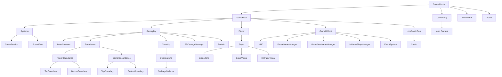
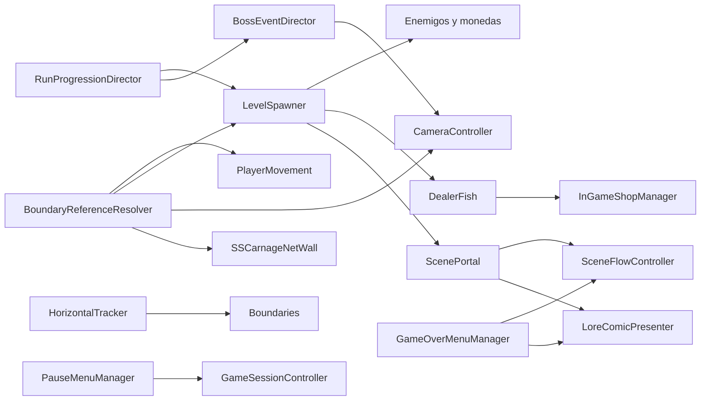

# Zona Epipelagica

## Proposito

Esta escena es el escenario principal de juego. Reune progresión de run, spawner de enemigos, cámara, UI, jugador y controladores de sesión.

## Estructura general



## Nodos y scripts

| Nodo | Scripts o componentes principales | Funcion |
| --- | --- | --- |
| `GameRoot` | ninguno | Root de sistemas jugables y UI. |
| `Systems` | ninguno | Contenedor de sesión y flujo. |
| `GameSession` | `GameSessionController`, `RunProgressionDirector` | Estado de partida e intensidad de run. |
| `SceneFlow` | `SceneFlowController` | Retorno a menú y cambios de escena. |
| `Gameplay` | ninguno | Agrupacion de lógica del nivel. |
| `LevelSpawner` | `LevelSpawner` con `ZoneSpawnProfile` asignado | Spawn de monedas, enemigos, tienda y portales. |
| `Boundaries` | Instancia de `Assets/Content/Prefabs/World/Boundaries.prefab`; `HorizontalTracker` | Mantener fronteras alineadas con el avance del mundo. |
| `PlayerBoundaries` | hijos con `Collider2D` | Limites verticales del jugador. |
| `CameraBoundaries` | hijos con `Collider2D` | Limites verticales de cámara. |
| `CleanUp` | Instancia de `Assets/Content/Prefabs/World/CleanUp.prefab` | Contenedor canónico de limpieza fuera de cámara. |
| `CleanUp/DestroyZone/GarbageCollector` | `DestroyOffscreen` | Limpiar objetos que quedan detras del borde izquierdo de cámara, con alto adaptado a `CameraBoundaries`. |
| `SSCarnageManager` | `BossEventDirector` | Disparar evento del SS Carnage y cue de cámara. |
| `Portals` | ninguno | Contenedor para instancias runtime de `ScenePortal`. |
| `Player` | ninguno | Contenedor del jugador. |
| `Squid` | Instancia de `Assets/Content/Prefabs/Player/BabySquid.prefab`; scope de input, `PlayerMovement`, `InkPulseController`, `ShrimpCollector`, `PlayerCollision`, `PlayerStateController`, `PlayerGadgetInventory`, `PlayerVisualStateController`, `Rigidbody2D`, `CircleCollider2D` | Control completo del jugador sin copia manual por escena. |
| `GrazeZone` | `GrazeDetector` | Carga del Ink-Pulse por proximidad. |
| `SquidVisual` | `SpriteRenderer`, `Animator` con `Squid.controller` | Cuerpo visible del jugador y animación de movimiento. |
| `InkPulseVisual` | `SpriteRenderer`, `Animator` con `InkPulseVisual.controller` | Efecto largo de Ink-Pulse, visible solo cuando `PlayerVisualStateController` selecciona Ink-Pulse. |
| `PortalVisual` | `SpriteRenderer`, `Animator` con `PortalEffect.controller` | Transicion visual previa al cambio de escena por portal. |
| `Main Camera` | `CameraController`, `Camera`, `AudioListener`, URP | Seguimiento, eventos de cámara y render. |
| `GameUIRoot` | `GameUIRoot` | Contrato de composicion de UI jugable. |
| `LoreComicRoot` | `LoreComicPresenter` | Overlay narrativo para portales y derrota usando el nodo visual `Comic`. |
| `Comic` | `Canvas`, `CanvasGroup` | Canvas ocultable para vineta, dimmer y boton de continuar. |
| `HUD` | `ChargeBar`, `ShrimpCounterDisplay`, `GadgetInventoryHud` | Ink-Pulse, camarones y gadgets. |
| `PauseMenuManager` | `PauseMenuManager` | Pausa. |
| `GameOverMenuManager` | `GameOverMenuManager` | Derrota. |
| `InGameShopManager` | `InGameShopManager` | Tienda temporal. |
| `EventSystem` | sistema UI Unity | Entrada de interfaz. |
| `Enviroment` | `ParallaxLayer` en capas de fondo | Profundidad visual. |
| `Audio` | `AudioSource` | Soundtrack y efectos. |

## Contrato de boundaries

La escena debe mantener nombres exactos:

```text
Boundaries
|-- PlayerBoundaries
|   |-- TopBoundary
|   `-- BottomBoundary
`-- CameraBoundaries
    |-- TopBoundary
    `-- BottomBoundary
```

Reglas:
- `Boundaries` debe ser instancia de `Assets/Content/Prefabs/World/Boundaries.prefab`.
- Cada `TopBoundary` y `BottomBoundary` debe tener `Collider2D`.
- El jugador usa `PlayerBoundaries`.
- La cámara usa `CameraBoundaries`.
- `LevelSpawner` usa ambos dominios segun lo que este posicionando.
- No se ajustan límites desde scripts individuales.
- Al cambiar dimensiones del escenario, se actualizan estos colliders y no campos sueltos.

## Contrato de coordenadas

Las zonas jugables usan una composicion centrada alrededor del origen:

- `CameraRig/Main Camera` inicia en `(0, 0, -10)`.
- `GameRoot/Player/Squid` inicia en `(-5, 0, 0)` respecto del mundo, manteniendo su desplazamiento visual frente a cámara.
- `Enviroment/Background` inicia en `(0, 0, 0)` y sus capas quedan cerca del area visible.
- `Boundaries` queda cerca del origen, pero la dimension real sigue determinada por `PlayerBoundaries` y `CameraBoundaries`.
- No se escala un root para corregir tamano. Si se requiere un escalado global, debe hacerse como tarea de balance completa.

La revision de mantenimiento debe confirmar estos valores directamente en la jerarquía de escena.

## Managers y responsabilidades

- `GameSessionController` gobierna el estado global.
- `RunProgressionDirector` define intensidad, velocidad y ritmo de spawn.
- `SceneFlowController` resuelve retorno al menú y cambios de escena.
- `LevelSpawner` genera enemigos, camarones, tienda y portales usando el `ZoneSpawnProfile` de la zona, sin mezclar progresión global.
- `ScenePortal` gobierna el cambio entre `ZonaEpipelagica` y `ZonaAbisopelagica`, pero nace desde `LevelSpawner`.
- `LoreComicPresenter` muestra viñetas de portal y derrota si hay entradas configuradas; no decide rutas ni crea UI.
- `BossEventDirector` coordina el momento del SS Carnage y solicita el cue de cámara.
- `InGameShopManager` gobierna la oferta temporal de gadgets sin mezclarse con pausa ni game over.
- `GadgetInventoryHud` muestra `Q` en `Gadget1` y `W` en `Gadget2` cuando el gadget del slot es activo.
- `CameraController` decide seguimiento normal, vista amplia de evento y feedback de Ink-Pulse.
- `HorizontalTracker` mantiene fronteras utiles sincronizadas con el mundo.
- `Boundaries` debe ser instancia de `Assets/Content/Prefabs/World/Boundaries.prefab`; las medidas propias de zona viven como overrides de colliders, no como copias locales.
- `DestroyOffscreen` sigue la cámara y limpia enemigos, camarones, collectibles y portales que quedan fuera de pantalla.
- `CleanUp` debe ser instancia de `Assets/Content/Prefabs/World/CleanUp.prefab`; no se dimensiona ni se balancea a mano en escena.
- El alto efectivo del `GarbageCollector` es la distancia interna entre `CameraBoundaries/BottomBoundary` y `CameraBoundaries/TopBoundary`.
- `PauseMenuManager` y `GameOverMenuManager` gobiernan solo su capa de interfaz.

## Flujo de escena



## ZonaAbisopelagica

`ZonaAbisopelagica` comparte la base estructural mientras sea una zona referencial:
- debe tener la misma jerarquía obligatoria de boundaries;
- usa portales con `PortalSpawnPolicy.PostBossWindow`, igual que la zona base;
- conserva gadgets e Ink-Pulse al entrar o salir;
- tiene `EnviromentRoot_ZonaAbisopelagica/ZoneLightingController` y `LayerBlack` para oscuridad ambiental;
- revela localmente `LayerBlack` mediante el overlay compuesto de `ZoneLightingController` y las posiciones declaradas por `LightGrazeSource`;
- usa `DealerFish_ZonaAbisopelagica.prefab` como variante visual oscurecida, sin cambiar la lógica de tienda;
- puede diferenciar arte, enemigos y parámetros de spawner sin romper el contrato comun.

## Notas de mantenimiento

- Si se agrega un nuevo nodo con lógica runtime, debe documentarse junto con su script y responsabilidad.
- Si un nodo solo agrupa hijos, no necesita script propio.
- Si una responsabilidad empieza a duplicarse, se traslada al manager correcto antes de agregar una excepción.
- Los managers pueden exponer parámetros de balance; los prefabs no deben exponer dependencias de escena que puedan resolverse por contrato.
- Los cambios estructurales del jugador se aplican en `BabySquid.prefab`; la escena solo conserva posición, nombre de instancia y overrides realmente especificos de zona.
- `GarbageCollector` debe quedar en posición neutra de editor; su posición efectiva y su alto se calculan en runtime desde la cámara y `CameraBoundaries`.
