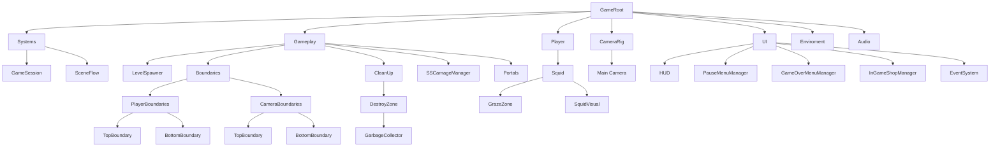
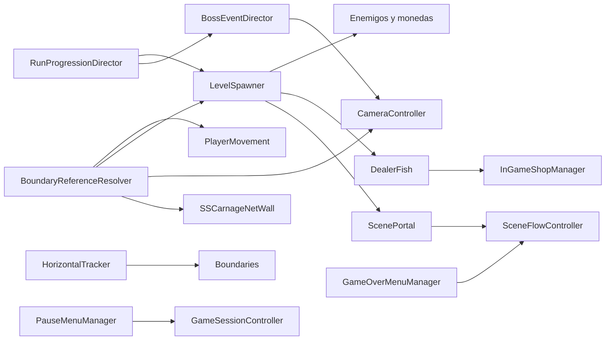

# Zona Epipelagica

## Proposito

Esta escena es el escenario principal de juego. Reune progresion de run, spawner de enemigos, camara, UI, jugador y controladores de sesion.

## Estructura general



## Nodos y scripts

| Nodo | Scripts o componentes principales | Funcion |
| --- | --- | --- |
| `GameRoot` | ninguno | Nodo raiz de escena. |
| `Systems` | ninguno | Contenedor de sesion y flujo. |
| `GameSession` | `GameSessionController`, `RunProgressionDirector` | Estado de partida e intensidad de run. |
| `SceneFlow` | `SceneFlowController` | Retorno a menu y cambios de escena. |
| `Gameplay` | ninguno | Agrupacion de logica del nivel. |
| `LevelSpawner` | `LevelSpawner` | Spawn de monedas, enemigos, tienda y portales. |
| `Boundaries` | `HorizontalTracker` | Mantener fronteras alineadas con el avance del mundo. |
| `PlayerBoundaries` | hijos con `Collider2D` | Limites verticales del jugador. |
| `CameraBoundaries` | hijos con `Collider2D` | Limites verticales de camara. |
| `CleanUp/DestroyZone/GarbageCollector` | `DestroyOffscreen` | Limpiar objetos que quedan detras del borde izquierdo de camara. |
| `SSCarnageManager` | `BossEventDirector` | Disparar evento del SS Carnage y cue de camara. |
| `Portals` | ninguno | Contenedor para instancias runtime de `ScenePortal`. |
| `Player` | ninguno | Contenedor del jugador. |
| `Squid` | `PlayerMovement`, `InkPulseController`, `ShrimpCollector`, `PlayerCollision`, `PlayerStateController`, `PlayerGadgetInventory`, `Rigidbody2D`, `CircleCollider2D` | Control completo del jugador. |
| `GrazeZone` | `GrazeDetector` | Carga del Ink-Pulse por proximidad. |
| `Main Camera` | `CameraController`, `Camera`, `AudioListener`, URP | Seguimiento, eventos de camara y render. |
| `HUD` | `ChargeBar`, `ShrimpCounterDisplay`, `GadgetInventoryHud` | Ink-Pulse, camarones y gadgets. |
| `PauseMenuManager` | `PauseMenuManager` | Pausa. |
| `GameOverMenuManager` | `GameOverMenuManager` | Derrota. |
| `InGameShopManager` | `InGameShopManager` | Tienda temporal. |
| `EventSystem` | sistema UI Unity | Entrada de interfaz. |
| `Enviroment` | `ParallaxLayer` en capas de fondo | Profundidad visual. |
| `Audio` | `AudioSource` | Soundtrack y efectos. |

## Contrato de boundaries

La escena debe mantener nombres exactos:

```text
Boundaries
├── PlayerBoundaries
│   ├── TopBoundary
│   └── BottomBoundary
└── CameraBoundaries
    ├── TopBoundary
    └── BottomBoundary
```

Reglas:
- Cada `TopBoundary` y `BottomBoundary` debe tener `Collider2D`.
- El jugador usa `PlayerBoundaries`.
- La camara usa `CameraBoundaries`.
- `LevelSpawner` usa ambos dominios segun lo que este posicionando.
- No se ajustan limites desde scripts individuales.
- Al cambiar dimensiones del escenario, se actualizan estos colliders y no campos sueltos.

## Managers y responsabilidades

- `GameSessionController` gobierna el estado global.
- `RunProgressionDirector` define intensidad, velocidad y ritmo de spawn.
- `SceneFlowController` resuelve retorno al menu y cambios de escena.
- `LevelSpawner` genera enemigos, camarones, tienda y portales sin mezclar progresion global.
- `ScenePortal` gobierna el cambio entre `ZonaEpipelagica` y `ZonaExe`, pero nace desde `LevelSpawner`.
- `BossEventDirector` coordina el momento del SS Carnage y solicita el cue de camara.
- `InGameShopManager` gobierna la oferta temporal de gadgets sin mezclarse con pausa ni game over.
- `GadgetInventoryHud` muestra `Q` en `Gadget1` y `W` en `Gadget2` cuando el gadget del slot es activo.
- `CameraController` decide seguimiento normal, vista amplia de evento y feedback de Ink-Pulse.
- `HorizontalTracker` mantiene fronteras utiles sincronizadas con el mundo.
- `DestroyOffscreen` sigue la camara y limpia enemigos, camarones, collectibles y portales que quedan fuera de pantalla.
- `PauseMenuManager` y `GameOverMenuManager` gobiernan solo su capa de interfaz.

## Flujo de escena



## ZonaExe

`ZonaExe` comparte la base estructural mientras sea una zona referencial:
- debe tener la misma jerarquia obligatoria de boundaries;
- usa portales con `PortalSpawnPolicy.AlwaysInterval`;
- conserva gadgets e Ink-Pulse al entrar o salir;
- tiene `Enviroment/ZoneLightingController` y `LayerBlack` para oscuridad ambiental;
- perfora localmente `LayerBlack` mediante `LightGrazeSource` en BabySquid y entidades spawneadas;
- puede diferenciar arte, enemigos y parametros de spawner sin romper el contrato comun.

## Notas de mantenimiento

- Si se agrega un nuevo nodo con logica runtime, debe documentarse junto con su script y responsabilidad.
- Si un nodo solo agrupa hijos, no necesita script propio.
- Si una responsabilidad empieza a duplicarse, se traslada al manager correcto antes de agregar una excepcion.
- Los managers pueden exponer parametros de balance; los prefabs no deben exponer dependencias de escena que puedan resolverse por contrato.
- `GarbageCollector` debe quedar en posicion neutra de editor; su posicion efectiva se calcula en runtime desde la camara.
