

  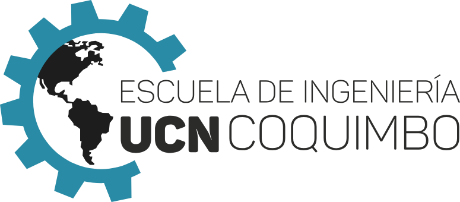
  &nbsp;&nbsp;&nbsp;
  

# Squid Ink-Pulse

<strong>Proyecto Integrador Programación Avanzada</strong>

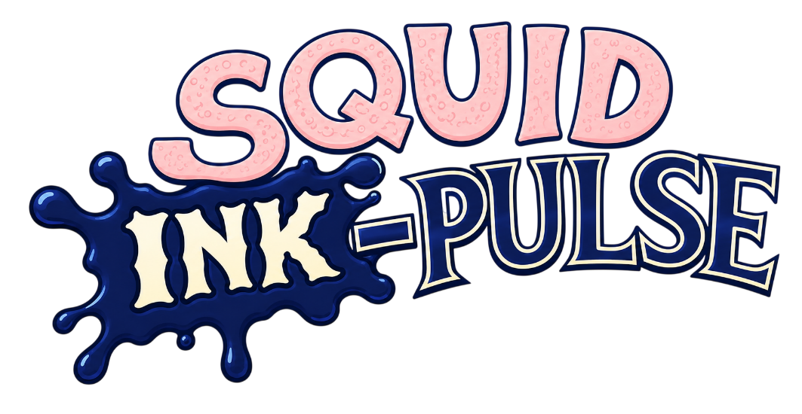

| Antecedente | Información |
|---|---|
| **Equipo** | Yeco Works |
| **Integrantes** | Inti Santibáñez (ICCI) Mauricio Muñoz (ICCI) Matías Palacios (ITI) Pablo Guzmán (ICCI) Rodrigo Cortés (ICCI) |
| **Profesor** | Bastián Braulio Ruiz Garay |
| **Fecha de entrega** | 6 de julio de 2026 |
| **Lugar** | Coquimbo, 2026 |

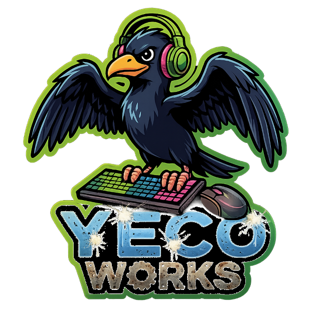

## Índice

- [Notas de actualización final](#notas-de-actualización-final)
  - [Cambios implementados desde el Informe n.º 2](#cambios-implementados-desde-el-informe-nº-2)
  - [Títulos y subtítulos mantenidos](#títulos-y-subtítulos-mantenidos)
  - [Títulos y subtítulos actualizados](#títulos-y-subtítulos-actualizados)
  - [Títulos y subtítulos agregados](#títulos-y-subtítulos-agregados)
  - [Elementos visuales agregados o actualizados](#elementos-visuales-agregados-o-actualizados)
  - [Elementos que dejaron de ser pendientes respecto del Informe n.º 2](#elementos-que-dejaron-de-ser-pendientes-respecto-del-informe-nº-2)
- [Glosario](#glosario)
- [Resumen Ejecutivo](#resumen-ejecutivo)
- [Ficha de Desarrollo](#ficha-de-desarrollo)
  - [Información general](#información-general)
  - [Especificaciones](#especificaciones)
- [Repositorio e instrucciones](#repositorio-e-instrucciones)
- [Adición para la feria](#adición-para-la-feria)
- [Descripción general del equipo](#descripción-general-del-equipo)
  - [Tabla de integrantes](#tabla-de-integrantes)
  - [Compromisos del equipo](#compromisos-del-equipo)
- [Descripción general del videojuego](#descripción-general-del-videojuego)
  - [Diseño y estilo](#diseño-y-estilo)
  - [Narrativa y contexto](#narrativa-y-contexto)
    - [Secuestro percibido](#secuestro-percibido)
    - [Giro argumental y ciclo narrativo](#giro-argumental-y-ciclo-narrativo)
  - [Ambientación](#ambientación)
    - [Mundo submarino](#mundo-submarino)
    - [Amenazas](#amenazas)
  - [Personajes](#personajes)
    - [Protagonista: Baby Squid](#protagonista-baby-squid)
    - [Madre: Mommy Squid](#madre-mommy-squid)
    - [Enemigos y amenazas](#enemigos-y-amenazas)
    - [Camarones](#camarones)
    - [Gadgets](#gadgets)
    - [Pez comerciante](#pez-comerciante)
  - [Público objetivo](#público-objetivo)
    - [Clasificación](#clasificación)
  - [Referencias](#referencias)
- [Jugabilidad](#jugabilidad)
  - [Objetivo del jugador](#objetivo-del-jugador)
    - [Objetivo principal](#objetivo-principal)
    - [Objetivo identitario](#objetivo-identitario)
    - [Objetivos complementarios](#objetivos-complementarios)
  - [Mecánicas](#mecánicas)
    - [Principal](#principal)
    - [Diferenciadora](#diferenciadora)
    - [Bosses y eventos críticos](#bosses-y-eventos-críticos)
    - [Portales](#portales)
    - [Gadgets y desbloqueables](#gadgets-y-desbloqueables)
    - [Tienda permanente (metagame)](#tienda-permanente-metagame)
    - [Tienda durante la partida (in-run)](#tienda-durante-la-partida-in-run)
    - [Menú de opciones](#menú-de-opciones)
  - [Enemigos y obstáculos](#enemigos-y-obstáculos)
    - [Tabla de enemigos](#tabla-de-enemigos)
    - [SS Carnage (barco pesquero humano)](#ss-carnage-barco-pesquero-humano)
    - [Anguila](#anguila)
  - [Gadgets](#gadgets-1)
    - [Tabla de gadgets](#tabla-de-gadgets)
  - [Estados del juego](#estados-del-juego)
    - [Condiciones](#condiciones)
  - [Ciclo de juego](#ciclo-de-juego)
  - [Diagrama de flujo final](#diagrama-de-flujo-final)
- [Sistema de progresión](#sistema-de-progresión)
  - [Progresión interna (in-run)](#progresión-interna-in-run)
  - [Progresión externa (metaprogresión)](#progresión-externa-metaprogresión)
  - [Controles](#controles)
  - [Retención del jugador](#retención-del-jugador)
- [Estado de cumplimiento final](#estado-de-cumplimiento-final)
  - [Resumen de cumplimiento por componente](#resumen-de-cumplimiento-por-componente)
- [Avances finales](#avances-finales)
- [Desarrollo](#desarrollo)
  - [Programación](#programación)
  - [Arquitectura](#arquitectura)
    - [Persistencia](#persistencia)
  - [Documentación](#documentación)
  - [Testing](#testing)
- [Análisis de costos](#análisis-de-costos)
  - [Escenarios considerados](#escenarios-considerados)
  - [Resumen comparativo de costos](#resumen-comparativo-de-costos)
    - [Elementos considerados en ambos escenarios](#elementos-considerados-en-ambos-escenarios)
    - [Criterios utilizados para la estimación](#criterios-utilizados-para-la-estimación)
    - [Desglose de costos: MVP](#desglose-de-costos-mvp)
    - [Elementos no considerados en el MVP](#elementos-no-considerados-en-el-mvp)
    - [Posibles fondos o vías de financiamiento](#posibles-fondos-o-vías-de-financiamiento)
- [Metodología de trabajo y planificación](#metodología-de-trabajo-y-planificación)
  - [Carta Gantt actualizada](#carta-gantt-actualizada)
    - [Hitos](#hitos)
    - [Áreas y detalle](#áreas-y-detalle)
  - [Herramientas de trabajo](#herramientas-de-trabajo)
  - [Sprints ejecutados y bitácora](#sprints-ejecutados-y-bitácora)
    - [Sprint 1 — S1: Definiciones](#sprint-1-s1-definiciones)
    - [Sprint 2 — S2: Base Visual y Técnica](#sprint-2-s2-base-visual-y-técnica)
    - [Sprint 3 — S3: Prototipo Jugable](#sprint-3-s3-prototipo-jugable)
    - [Sprint 4 — S4: Mecánicas clave MVP](#sprint-4-s4-mecánicas-clave-mvp)
    - [Sprint 5 — S5: Tienda y Portales](#sprint-5-s5-tienda-y-portales)
    - [Sprint 6 — S6: Presentación y segunda escena](#sprint-6-s6-presentación-y-segunda-escena)
    - [Sprint 7 — S7: Últimas implementaciones](#sprint-7-s7-últimas-implementaciones)
    - [Sprint 8 — S8: Finalización del MVP y preparación para la feria](#sprint-8-s8-finalización-del-mvp-y-preparación-para-la-feria)
- [Conclusiones](#conclusiones)
  - [Alcance final del proyecto](#alcance-final-del-proyecto)
  - [Viabilidad del proyecto](#viabilidad-del-proyecto)
  - [Implementación final alcanzada](#implementación-final-alcanzada)
  - [Aporte de Scrum al desarrollo](#aporte-de-scrum-al-desarrollo)
  - [Cierre general](#cierre-general)
- [Referencias bibliográficas](#referencias-bibliográficas)

## Notas de actualización final

El presente documento corresponde al tercer y último informe de Squid Ink-Pulse, desarrollado por el equipo Yeco Works para la asignatura Proyecto Integrador Programación Avanzada. A diferencia del Informe n.º 2, que presentaba el proyecto como un MVP funcional en proceso de cierre, este informe formaliza el estado final de entrega del videojuego y considera la integración de sus sistemas principales, la consolidación de la versión ejecutable, la actualización del repositorio y la preparación del proyecto para su exposición.

El Informe n.º 3 se construye sobre la base del Informe n.º 2 y mantiene su estructura general, pero actualiza el contenido para reflejar el avance real alcanzado durante la etapa final de desarrollo. En consecuencia, se corrigen secciones que antes describían funcionalidades como pendientes o parciales, pues varias se implementaron posteriormente: persistencia local, tienda permanente, skins, mejoras, menús de opciones, tutorial, cómics narrativos, segunda zona jugable, jefe abisal, audio dinámico y cierre de sprints.

### Cambios implementados desde el Informe n.º 2

- Se completó la persistencia local mediante archivos JSON, permitiendo guardar camarones, récords, skins compradas, skin equipada, mejoras permanentes, catálogo de desbloqueables y ranking local.

- Se implementó la tienda permanente o ShopMenu, accesible desde el menú principal, destinada a la compra de skins y mejoras permanentes.

- Se integró un sistema de skins comprables y equipables, con persistencia entre sesiones.

- Se incorporaron mejoras permanentes asociadas al Ink-Pulse, economía de camarones y puntaje.

- Se consolidó la tienda temporal in-run mediante DealerFish, enfocada en la compra de gadgets durante la partida.

- Se reforzó el sistema de gadgets, manteniendo la diferencia entre gadgets de run y mejoras permanentes.

- Se completó la integración de portales entre Zona Epipelágica y Zona Abisopelágica.

- La Zona Abisopelágica dejó de ser únicamente referencial y pasó a formar parte del flujo jugable final.

- Se incorporó un boss abisal asociado a la Anguila, complementando al SS Carnage como evento crítico de la Zona Epipelágica.

- Se agregó un cómic tutorial accesible desde el menú principal mediante el botón «Cómo jugar».

- Se integraron cómics narrativos para eventos relevantes, como el inicio de la partida, los portales, la tienda y la derrota.

- Se implementaron menús de opciones y configuración básica, incluyendo control de volumen y ajustes de pantalla.

- Se consolidó el HUD, la pantalla de pausa, el Game Over, la tienda temporal y la tienda permanente como parte del flujo final de juego.

- Se incorporó audio dinámico, incluyendo transición musical durante Ink-Pulse y ajustes de volumen global.

- Se amplió la documentación técnica del repositorio mediante documentos sobre arquitectura, jugabilidad, persistencia, interfaz de usuario, portales, enemigos, jefes, cómics, iluminación, estructura del proyecto y feria.

- Se añadió un complemento opcional para la feria, basado en un servidor local que muestra una tabla de clasificación en la red local desde un computador anfitrión.

- Se cerró el Sprint 7 y se agregó el Sprint 8 como sprint final de cierre, integración y preparación para feria.

- Se actualizó la sección de testing para incluir las nuevas funcionalidades implementadas.

- Se actualizó la sección de conclusiones para reflejar el estado final alcanzado por el proyecto.

### Títulos y subtítulos mantenidos

Se mantienen los apartados principales del Informe n.º 2, ya que siguen siendo pertinentes para explicar el proyecto: Glosario, Resumen ejecutivo, Ficha de desarrollo, Descripción general del equipo, Descripción general del videojuego, Jugabilidad, Sistema de progresión, Desarrollo, Programación, Arquitectura, Persistencia, Documentación, Pruebas, Análisis de costos, Metodología de trabajo y planificación, Herramientas de trabajo, Sprints ejecutados, Conclusiones y Referencias bibliográficas.

### Títulos y subtítulos actualizados

Se actualizaron apartados ya existentes para ajustarlos al estado final de entrega:

- Resumen Ejecutivo: se reformuló para presentar el proyecto como una entrega final académica funcional, evitando describirlo como un MVP incompleto.

- Glosario: se amplió con términos técnicos y de producción incorporados durante el cierre, como JSON, leaderboard, add-on, crossfade, skins, endpoints, prefabs, state machine y data-driven.

- Descripción general del videojuego: se ajustó para reflejar la versión final de Squid Ink-Pulse, incorporando el alcance real de sus zonas, personajes, amenazas, progresión y sistemas de juego.

- Jugabilidad: se actualizó para explicar el funcionamiento final del loop principal, incluyendo Ink-Pulse, graze, camarones, gadgets, tienda temporal, tienda permanente, bosses, portales y cambio de zona.

- Estado de cumplimiento final: se actualizó para reflejar los sistemas efectivamente implementados, reemplazando descripciones parciales o pendientes por el estado final alcanzado.

- Desarrollo: se ajustó para incluir la evolución del proyecto hacia una estructura más completa, con persistencia, tienda permanente, cómics, opciones, documentación técnica y feria.

- Programación y arquitectura: se actualizó la descripción de la organización por dominios, considerando los nuevos sistemas presentes en el repositorio final.

- Persistencia: se modificó para dejar de presentarla como una funcionalidad en fase de implementación y describirla como un sistema local implementado mediante JSON.

- Documentación: se amplió para incorporar los nuevos archivos técnicos añadidos al repositorio.

- Pruebas: se actualizó el apartado para considerar nuevas validaciones asociadas a la tienda permanente, las skins, las mejoras, los cómics, la persistencia, las opciones y la feria.

- Diagrama de flujo: se reemplazó por un diagrama final más simple, visible y coherente con el flujo real del juego, incorporando menú, tienda, partida, loop principal, eventos críticos, persistencia y reintento.

- Metodología y planificación: se actualizó para cerrar el Sprint 7 y añadir el Sprint 8 como etapa final de implementación y preparación de feria.

- Conclusiones: se modificaron para presentar una evaluación final del proyecto, diferenciando entre entrega académica funcional y mejoras futuras.

- Figuras y tablas: se corrigió la numeración correlativa de figuras y tablas, eliminando referencias provisionales y ajustando las leyendas al formato final del informe.

### Títulos y subtítulos agregados

Se incorporan los siguientes apartados para completar el informe final:

- Repositorio e instrucciones de ejecución.

- Requisitos técnicos del proyecto.

- Escenas incluidas en la build.

- Add-on de feria.

- Alcance real del leaderboard de feria.

- Diagrama de flujo final.

- Implementación final alcanzada.

- Elementos proyectados para versiones futuras.

### Elementos visuales agregados o actualizados

Además de los cambios técnicos y de contenido, se incorporaron imágenes y componentes visuales correspondientes al juego terminado para evidenciar con mayor claridad el estado final del proyecto. Estos recursos complementan la explicación de los elementos del juego, su jugabilidad y sus sistemas principales.

Se añadieron o actualizaron capturas y figuras asociadas al menú principal, las zonas jugables, la activación del Ink-Pulse, la aparición de jefes, los portales, los espacios de gadgets, la tienda durante la partida, la tienda permanente, el menú de opciones, los enemigos, los ataques críticos, los cómics narrativos, el menú de pausa, el diagrama de flujo final y la carta Gantt. De esta forma, el informe no solo describe las funcionalidades implementadas, sino que también muestra evidencia visual del producto final.

Estos recursos visuales cumplen una función explicativa dentro del informe, ya que ayudan a relacionar las mecánicas descritas con su representación concreta en el videojuego. En particular, refuerzan las secciones de Descripción general del videojuego, Jugabilidad, Enemigos y obstáculos, Sistema de progresión, Estado de cumplimiento final y Metodología de trabajo y planificación.

### Elementos que dejaron de ser pendientes respecto del Informe n.º 2

En el Informe n.º 2 se mencionaban como pendientes o incompletos sistemas que actualmente se encuentran implementados o integrados dentro de la entrega final. Entre ellos se encuentran:

- Persistencia local.

- Tienda global o tienda out-of-game.

- Sistema de skins.

- Mejoras permanentes.

- Tutorial.

- Menú de opciones.

- Segunda zona jugable.

- Boss abisal.

- Cómics narrativos.

- Integración de audio dinámico.

- Cierre de sprints finales.

- Documentación técnica ampliada.

- Evidencia visual del estado final del juego.

## Glosario

**Endless runner:** Subgénero de videojuego caracterizado por el desplazamiento continuo del personaje. El objetivo suele ser sobrevivir el mayor tiempo posible o recorrer la mayor distancia frente a una dificultad creciente.

**Gameplay loop (ciclo de juego):** Secuencia recurrente de acciones que define la experiencia del jugador. En este proyecto consiste en avanzar, esquivar, asumir riesgos, cargar el Ink-Pulse, utilizarlo en momentos críticos y repetir el ciclo.

**Game over (fin de partida):** Estado que marca el término de una partida cuando el jugador pierde.

**Side-scrolling (desplazamiento lateral):** Desplazamiento continuo del escenario o del personaje, característico de juegos 2D cuyo avance principal ocurre en dirección horizontal.

**Singleplayer (un jugador):** Modalidad de juego diseñada para una sola persona.

**Roguelite:** Enfoque de diseño basado en partidas repetibles con reinicios frecuentes y algún grado de progresión persistente entre intentos.

**Cooldown (tiempo de reutilización):** Intervalo mínimo que debe transcurrir antes de que un evento, una habilidad o un sistema pueda volver a activarse.

**Run (partida o intento):** Partida individual desde su inicio hasta el game over.

**In-run / in-game (durante la partida):** Expresiones utilizadas para indicar que una acción, recurso o sistema opera mientras la partida está en curso.

**Out-of-run / out-of-game (fuera de la partida):** Expresiones utilizadas para indicar que una acción, recurso o sistema opera desde los menús o entre partidas.

**Skill upgrade / skills upgrade (mejora de habilidad):** Mejora permanente o progresiva de una característica del personaje.

**Dash (impulso rápido):** Desplazamiento breve y veloz que permite evadir peligros o superar eventos críticos.

**Ink-Pulse:** Mecánica central del juego que permite ejecutar un impulso o dash después de cargar una barra mediante la proximidad controlada a amenazas. Constituye el eje del sistema de riesgo-recompensa.

**Graze / graze zone (zona de proximidad):** Interacción en la que el jugador se aproxima a un obstáculo o enemigo sin colisionar. En este proyecto, dicha proximidad recarga el Ink-Pulse.

**Time-based (basado en tiempo):** Evento o comportamiento cuya activación, duración o progresión depende de intervalos temporales.

**Progresión in-run:** Evolución de la dificultad y de las condiciones de juego dentro de una misma partida, mediante variables como velocidad, densidad de enemigos o aparición de eventos.

**Metaprogresión / metagame / metagaming (progresión externa):** Sistema de avance persistente entre partidas, basado en la acumulación de recursos y el desbloqueo de mejoras permanentes. En este informe, metagame se usa para referirse a los sistemas externos a la partida.

**Gadget:** Recurso de uso situacional que otorga ventajas temporales durante la partida e introduce decisiones tácticas en tiempo real.

**Gadget pasivo:** Gadget que se activa automáticamente cuando se cumple una condición específica, sin intervención directa del jugador.

**Gadget activo:** Gadget que requiere activación manual mediante un control asignado.

**Hitbox (zona de colisión):** Área definida de un objeto o personaje que determina la detección de impactos dentro del juego.

**Spawn / spawning (aparición o generación):** Proceso mediante el cual aparecen enemigos, obstáculos, recursos o eventos dentro del entorno, de acuerdo con reglas de generación.

**Scrum:** Marco de trabajo ágil basado en iteraciones breves llamadas sprints, planificación continua y revisión periódica del progreso. Scrum no es una sigla, por lo que no se escribe completamente en mayúsculas.

**UI / HUD:** UI significa User Interface o interfaz de usuario: conjunto de menús, botones y elementos interactivos. HUD significa Heads-Up Display: información mostrada durante la partida, como barras, puntaje y recursos.

**Slot (espacio):** Posición disponible dentro de un inventario para almacenar un objeto o recurso.

**Pacing (ritmo de juego):** Forma en que el juego distribuye tensión, descanso, intensidad y eventos a lo largo de la experiencia.

**Zoom out (alejamiento de cámara):** Movimiento de cámara que amplía el campo visible y mejora la lectura de la escena.

**Sprite:** Recurso gráfico bidimensional utilizado para representar personajes, objetos, efectos o elementos de interfaz.

**QA (Quality Assurance / aseguramiento de calidad):** Conjunto de tareas orientadas a verificar que el producto cumpla estándares funcionales, técnicos y de experiencia de usuario.

**Testing (pruebas):** Proceso sistemático de evaluación del juego para detectar errores, revisar el equilibrio y validar el funcionamiento de las mecánicas.

**Build (versión ejecutable):** Versión compilada y ejecutable de un programa o videojuego, generada a partir del código fuente en un momento determinado del desarrollo.

**Boss (jefe):** Enemigo o evento especial de mayor complejidad que interrumpe el flujo habitual del juego y exige una respuesta diferente del jugador.

**MVP (Minimum Viable Product / producto mínimo viable):** Versión mínima funcional de un proyecto que permite validar su propuesta central con el menor alcance suficiente.

**Plot twist (giro argumental):** Revelación inesperada que modifica la interpretación de la historia; en este proyecto, corresponde a la posibilidad de que el secuestro no haya ocurrido como lo percibe el protagonista.

**Ultimate / ulti (ataque definitivo):** Ataque especial o más poderoso de un jefe o enemigo, que suele exigir una respuesta específica del jugador.

**Indie (independiente):** Término aplicado a un estudio o videojuego desarrollado con un equipo pequeño y sin el respaldo de una gran distribuidora comercial.

**Skin / skins (apariencia o aspecto alternativo):** Cambio visual del personaje o de otros elementos que cumple una función estética y no altera las mecánicas del juego.

**Dealer (comerciante):** Mercader o intermediario que ofrece ventajas y recursos al jugador a cambio de moneda del juego.

**Add-on (complemento):** Contenido adicional o extensión opcional que se incorpora al producto principal.

**Bug / bugs (errores):** Fallos de programación o problemas técnicos que deben corregirse.

**Score (puntaje):** Valor numérico obtenido por el jugador durante una partida.

**Asset / assets (recursos digitales):** Elementos que componen el juego, como imágenes, modelos, pistas de audio, animaciones o scripts.

**Prefab / prefabs (objetos prefabricados):** Objetos configurados en Unity que pueden instanciarse y reutilizarse varias veces de manera eficiente.

**Script / scripts:** Archivos de código, en este caso C#, que contienen instrucciones lógicas para el funcionamiento del juego.

**Issue / issues (incidencia o tarea):** Tarea, problema o requisito de trabajo registrado en una plataforma de gestión, como Jira.

**Story points (puntos de historia):** Unidad relativa utilizada en metodologías ágiles para estimar el esfuerzo o la complejidad de una tarea.

**Branch / merge (rama / fusión):** En control de versiones, una branch o rama permite trabajar de forma separada sin alterar el código principal; merge o fusión es la integración de ese trabajo en otra rama.

**Crossfade (transición cruzada):** Transición gradual entre dos pistas de audio en la que una disminuye su volumen mientras la otra lo aumenta, evitando cortes bruscos.

**API / endpoint:** API significa Application Programming Interface o interfaz de programación de aplicaciones. Un endpoint es una ruta concreta mediante la cual un sistema envía o recibe datos.

**Equity-free (sin cesión de participación):** Financiamiento que no exige entregar a la institución un porcentaje de propiedad o acciones del proyecto.

**Zona epipelágica / zona abisopelágica:** La zona epipelágica corresponde a la parte superficial del océano donde penetra la luz solar; la zona abisopelágica o abisal corresponde a regiones profundas, oscuras y de alta presión.

**Paralarva:** Etapa inicial de desarrollo de ciertos moluscos marinos, como los calamares, después de eclosionar.

**State machine (máquina de estados):** Modelo de programación en el que un sistema se encuentra en un estado definido y cambia a otro según reglas explícitas.

**Parallax (paralaje):** Efecto visual en juegos 2D en el que las capas del fondo se mueven a diferentes velocidades para producir una ilusión de profundidad.

**Boundaries (límites o fronteras):** Barreras invisibles que impiden que el personaje o la cámara salgan del área permitida.

**Tags / layers (etiquetas / capas):** Sistemas de Unity para clasificar objetos. Las etiquetas permiten identificarlos y las capas permiten controlar colisiones, cámaras y orden de representación.

**JSON:** Formato de texto ligero utilizado para guardar y organizar datos del juego, como perfiles, puntajes o monedas.

**Refactorización:** Reestructuración del código para mejorar su claridad, mantenimiento o eficiencia sin modificar su comportamiento externo.

**Facade (fachada):** Patrón de diseño que ofrece una interfaz simplificada para ocultar la complejidad de un sistema interno.

**Data-driven (orientado por datos):** Enfoque en el que el comportamiento del juego se configura mediante archivos o datos externos, en lugar de quedar fijado directamente en el código.

**Backlog (lista de trabajo pendiente):** Lista centralizada y priorizada de tareas, requisitos y funcionalidades que deben desarrollarse.

**Feature / features (funcionalidad / funcionalidades):** Característica, mecánica o elemento nuevo incorporado al videojuego.

**Feedback (retroalimentación):** Respuesta visual o sonora que el juego entrega al jugador, o comentarios recibidos de personas que prueban el producto.

**Leaderboard / ranking (tabla de clasificación):** Listado público o local que ordena los mejores puntajes obtenidos por los jugadores.

**Press kit (kit de prensa):** Paquete de materiales promocionales, como imágenes, logotipos y descripciones, preparado para periodistas y creadores de contenido.

**Cartoon (caricaturesco):** Estilo visual inspirado en la caricatura, con formas simplificadas, colores expresivos y rasgos exagerados.

**Mouse (ratón):** Dispositivo apuntador utilizado para controlar el cursor y, en este proyecto, el movimiento del personaje y la interacción con menús.

**Host / PC host (computador anfitrión):** Computador que ejecuta un servicio y lo pone a disposición de otros dispositivos de la misma red.

**Runtime (tiempo de ejecución):** Período en el que el programa está funcionando; también puede referirse a datos temporales que existen solo mientras se ejecuta una partida.

**Online / web (en línea / web):** Online indica que un servicio funciona mediante una red. Web se refiere a contenidos o aplicaciones accesibles desde un navegador.

**Core (núcleo):** Módulo central que agrupa responsabilidades transversales del sistema, como sesión, flujo de escenas o progresión.

**Manager / controller / director (administrador / controlador / director):** Nombres habituales de componentes de software que coordinan un sistema, gobiernan su flujo o centralizan decisiones.

**Spawner (generador):** Componente encargado de instanciar o hacer aparecer objetos, enemigos, recursos o eventos.

**Input (entrada):** Señal entregada por el jugador mediante teclado, mouse u otro dispositivo de control.

**Display (elemento de visualización):** Componente de interfaz que muestra información al usuario, como puntaje, recursos o estados.

**Roadmap (hoja de ruta):** Plan que organiza hitos, objetivos y funcionalidades futuras del proyecto.

**Soundtrack (banda sonora):** Conjunto de piezas musicales que acompañan al videojuego.

**Cleanup (limpieza):** Proceso automático de eliminación o desactivación de objetos que ya no son necesarios, por ejemplo, aquellos que salen de pantalla.

**Lore (trasfondo narrativo):** Información sobre el mundo, los personajes y los acontecimientos que sustentan la historia del juego.

**Brand (marca):** Identidad visual y conceptual mediante la cual se reconoce un producto o equipo.

**Trailer (tráiler o avance promocional):** Pieza audiovisual breve utilizada para presentar y promocionar un videojuego.

**Startup (empresa emergente):** Empresa joven orientada a desarrollar un producto escalable y a validar rápidamente su modelo de negocio.

**Package Manager (administrador de paquetes):** Herramienta de Unity utilizada para instalar, actualizar y administrar dependencias del proyecto.

**Universal Render Pipeline (URP):** Canal de renderizado de Unity diseñado para ofrecer gráficos configurables y compatibles con distintas plataformas.

**Input System:** Paquete de Unity que gestiona entradas provenientes de teclado, mouse, controles y otros dispositivos.

**TextMesh Pro:** Sistema de Unity para representar y configurar texto con mayor calidad y control tipográfico.

**UGUI:** Sistema clásico de interfaz de usuario de Unity, utilizado para construir menús, botones, paneles y HUD.

**Inspector:** Panel de Unity que permite configurar componentes, referencias y propiedades de los objetos sin modificar directamente el código.

**Comandos de Unity en inglés:** Las expresiones Add project from disk, Play, Build Profiles, Build Settings, Switch Platform, Build y Build And Run son etiquetas oficiales de la interfaz de Unity y se conservan sin traducir para que coincidan con el programa.

**Scrum Master:** Rol encargado de facilitar Scrum, eliminar impedimentos y promover que el equipo aplique correctamente el marco de trabajo.

**Product Owner:** Rol responsable de definir el valor del producto, priorizar el backlog y orientar los objetivos de desarrollo.

**Gameplay Programmer:** Programador especializado en implementar la jugabilidad, las mecánicas y la lógica interactiva.

**Visual & Sound Designer:** Diseñador responsable de los elementos visuales y sonoros del producto.

**Tester:** Persona encargada de probar el producto, registrar errores y comprobar el cumplimiento de criterios de calidad.

**Idle / Charging / Ready / Active:** Nombres de estados internos: inactivo, cargando, listo y activo, respectivamente.

**Shell Shield / Ink Bottle:** Nombres de gadgets del juego. Shell Shield es un escudo automático e Ink Bottle recarga la barra del Ink-Pulse.

**SFX (Sound Effects / efectos de sonido):** Efectos sonoros breves asociados a acciones, impactos, interfaz o eventos del juego.

**PC (Personal Computer / computador personal):** Computador de uso general que constituye la plataforma objetivo del proyecto.

**Nombres internos de código en inglés:** Los nombres de clases, escenas, carpetas y archivos, como MainMenu, ShopMenu, DealerFish, LevelSpawner o FairServer, se mantienen en inglés porque deben coincidir exactamente con los identificadores del repositorio.

## Resumen Ejecutivo

El presente informe expone el diseño, el desarrollo y el cierre de Squid Ink-Pulse, un videojuego 2D del género endless runner desarrollado en Unity por el equipo Yeco Works. La propuesta se basa en una experiencia de avance continuo, evasión de amenazas y toma de decisiones rápidas, e incorpora como mecánica diferenciadora el Ink-Pulse: un impulso que se carga al aproximarse al peligro sin colisionar.

Desde el punto de vista narrativo, el juego sigue a Baby Squid, un calamar bebé que persigue a su madre tras una aparente captura en un entorno submarino hostil. Esta premisa se integra con el ciclo de reintento del género, ya que cada derrota se vincula con el rescate del protagonista por parte de su madre, reforzando una idea de aprendizaje, crecimiento y adaptación.

En su estado final, Squid Ink-Pulse consolida los sistemas principales comprometidos para la entrega académica: movimiento continuo, Ink-Pulse, graze, enemigos, camarones, gadgets, tienda temporal durante la partida, tienda permanente fuera de la partida, portales, dos zonas jugables, eventos de jefe, cómics narrativos, tutorial, HUD, menús, opciones, audio dinámico y persistencia local mediante archivos JSON.

En el ámbito técnico, el proyecto se organiza mediante una arquitectura modular por dominios, apoyada en Unity, C#, GitHub, Jira y Scrum. El repositorio final incorpora documentación técnica, estructura de escenas, perfiles de configuración, sistemas de persistencia, lógica de jugabilidad y herramientas auxiliares para la feria. Además, incluye un complemento opcional para la exposición presencial, basado en un servidor local que permite mostrar una tabla de clasificación en la red local desde un computador anfitrión.

En conjunto, Squid Ink-Pulse se presenta como una propuesta coherente, viable y cerrada en términos académicos, con una versión ejecutable funcional capaz de demostrar su núcleo jugable, su sistema de progresión y su identidad de riesgo-recompensa. Las mejoras restantes corresponden principalmente al ajuste fino del equilibrio, el pulido audiovisual, la ampliación de contenido y la proyección comercial futura, no a requisitos críticos de funcionamiento.

## Ficha de Desarrollo

### Información general

| Nombre del juego | Squid Ink-Pulse |
| --- | --- |
| Equipo de desarrollo | Yeco Works |
| Género | Endless runner |
| Estilo | 2D lateral con side-scrolling |
| Plataforma objetivo | PC |
| Motor de juego | Unity |
| Lenguaje | C# |
| Modalidad | Singleplayer |
| Clasificación | E |
| Metodología | Scrum con sprints semanales |
| Herramientas de apoyo | Unity, GitHub, Jira, Canva y Discord |
| Carátula preliminar | Figura 1. Portada de Squid Ink-Pulse. Generada con ChatGPT. 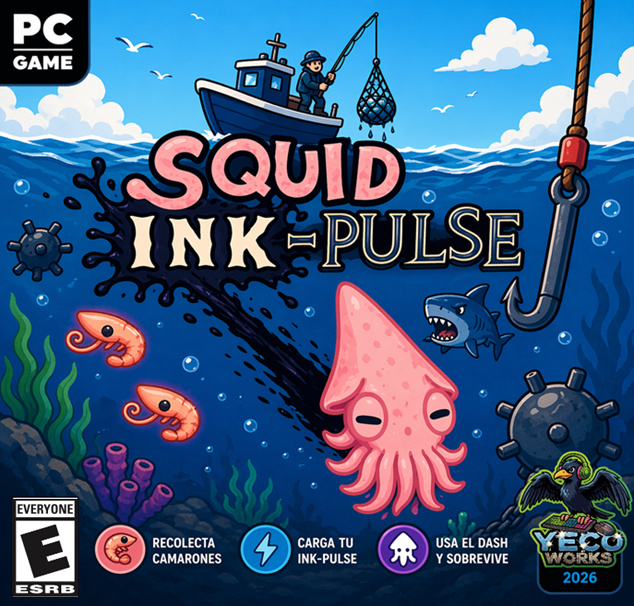 |

*Tabla 1. Información general de Squid Ink-Pulse. Elaboración propia.*

### Especificaciones

| Público objetivo | Jugadores casuales orientados a reflejos y precisión Jugadores competitivos que buscan romper récords |
| --- | --- |
| Premisa | Un calamar bebé persigue a su madre en un entorno submarino hostil, enfrentando peligros crecientes. |
| Objetivo del jugador | Sobrevivir el mayor tiempo posible evitando obstáculos y optimizando el uso de habilidades. |
| Mecánica principal | Movimiento continuo con esquiva de obstáculos. |
| Mecánica diferenciadora | Ink-Pulse: dash que se carga al asumir riesgos mediante la proximidad a peligros. |
| Condición de derrota | Colisión con obstáculos o fallo en el uso obligatorio del dash. |
| Recursos del juego | Camarones como moneda para mejoras. |
| Sistema de progresión | Durante la partida: aumento de la dificultad según el tiempo o la distancia y mejoras mediante la tienda temporal. Fuera de la partida: mejoras de habilidades y bonificaciones generales. |
| Enemigos/obstáculos | Entidades con comportamiento lineal, dinámico —como el ataque definitivo de un jefe— o estático. |
| Ciclo de juego | Evadir → Arriesgar → Cargar Ink-Pulse → Usar → Repetir |
| Controles | Mouse y teclado: movimiento, dash y gadgets. |

*Tabla 2. Especificaciones de Squid Ink-Pulse. Elaboración propia.*

## Repositorio e instrucciones

El código fuente de la entrega final se encuentra disponible en el siguiente repositorio público:

| <https://github.com/NicoCG32/Squid-Ink-Pulse-Public-Version> |
| --- |

El repositorio contiene el proyecto de Unity, sus escenas principales, el código fuente, los recursos digitales, los prefabs, la configuración del proyecto, la documentación técnica, las semillas de persistencia local y las herramientas auxiliares para la demostración en feria.

**Requisitos técnicos**

  - Motor: Unity 6000.3.11f1.

  - Lenguaje principal: C#.

  - Plataforma objetivo recomendada: Windows.

  - Dependencias administradas mediante Unity Package Manager.

  - Uso de paquetes como Universal Render Pipeline, Input System, TextMesh Pro, UGUI y herramientas 2D de Unity.

**Escenas incluidas en la versión ejecutable**

Para que el juego funcione correctamente, la versión ejecutable debe conservar las escenas habilitadas en el siguiente orden:

1. Assets/Scenes/MainMenu/MainMenu.unity

2. Assets/Scenes/Game/ZonaEpipelagica.unity

3. Assets/Scenes/Game/ZonaAbisopelagica.unity

4. Assets/Scenes/ShopMenu/ShopMenu.unity

La escena MainMenu funciona como punto de entrada del juego. Desde ella se accede a la partida, al cómic tutorial «Cómo jugar», a la tienda permanente, al menú de opciones y a la salida del juego.

**Ejecución local en Unity**

Para ejecutar el proyecto desde Unity, se deben seguir los siguientes pasos:

1. Abrir Unity Hub.

2. Seleccionar la opción “Add project from disk”.

3. Elegir la carpeta raíz del repositorio.

4. Abrir el proyecto con Unity 6000.3.11f1.

5. Esperar la importación inicial de assets y paquetes.

6. Abrir la escena Assets/Scenes/MainMenu/MainMenu.unity.

7. Presionar Play.

**Generación de la versión ejecutable**

Para generar una versión ejecutable local del proyecto:

1. Abrir File > Build Profiles o File > Build Settings.

2. Seleccionar plataforma Windows.

3. Ejecutar Switch Platform si Unity lo solicita.

4. Verificar que las escenas principales estén habilitadas en el orden indicado.

5. Elegir una carpeta de salida fuera de Assets/.

6. Presionar Build o Build And Run.

7. Distribuir la carpeta completa generada, no únicamente el archivo .exe.

La carpeta de la versión ejecutable debe conservar el ejecutable, la carpeta de datos generada por Unity, UnityPlayer.dll y los demás archivos asociados. Si se mueve únicamente el archivo .exe, el juego no podrá encontrar sus datos de ejecución.

**Advertencias conocidas**

Durante la ejecución o compilación pueden aparecer advertencias relacionadas con la ausencia del servidor de feria. Estas advertencias no afectan la prueba local del juego normal, siempre que no existan errores de compilación C# ni referencias rotas de escena. Solo deben revisarse si el objetivo de la prueba es validar específicamente el add-on de feria.

## Adición para la feria

Como complemento para la exposición presencial, se desarrolló un módulo opcional para la feria. Este componente no forma parte del núcleo obligatorio del juego, ya que Squid Ink-Pulse funciona localmente sin depender de servicios externos.

El módulo permite levantar un servidor local desde la carpeta Tools/FairServer/ en un computador anfitrión. El servidor utiliza Python y SQLite para registrar datos del evento y mostrar una tabla de clasificación web accesible desde la red local. Su propósito es apoyar la demostración pública del juego y permitir la visualización de puntajes en una pantalla o dispositivo conectado a la misma red.

El alcance real del módulo debe entenderse de forma acotada: el resultado confiable corresponde a la tabla de clasificación almacenada y mostrada desde el computador anfitrión. Otros dispositivos pueden visualizarla mediante un navegador, pero no se considera implementada una sincronización completa de progreso, compras, skins, mejoras o recuperación integral entre computadores.

Por esta razón, la persistencia oficial de Squid Ink-Pulse sigue siendo local en cada dispositivo mediante archivos JSON. El módulo de feria funciona como una herramienta de apoyo para la presentación, no como un sistema completo en línea ni como una infraestructura comercial permanente.

## Descripción general del equipo

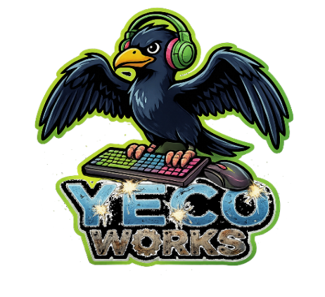

*Figura 2. Logo de empresa. Elaboración propia.*

Yeco Works es un equipo de desarrollo independiente que trabaja con la metodología ágil Scrum.

El equipo Yeco Works está conformado por cinco integrantes del área de informática, organizados mediante una estructura de trabajo basada en la metodología ágil Scrum. Esta metodología permite desarrollar el proyecto de manera iterativa, con una distribución clara de responsabilidades y una comunicación constante entre los miembros.

Cada integrante cumple un rol específico dentro del equipo.

### Tabla de integrantes

| Integrante | Rol | TAREAS | Carrera |
| --- | --- | --- | --- |
| Inti Santibáñez | QA / Tester | Realiza pruebas y verifica la calidad del producto. | ICCI |
| Mauricio Muñoz | Gameplay Programmer | Desarrolla las mecánicas y la lógica del juego, con énfasis en la implementación de la jugabilidad. | ICCI |
| Matías Palacios | Visual & Sound Designer | Diseña e implementa los elementos visuales y sonoros. | ITI |
| Pablo Guzmán | Scrum Master | Coordina el equipo y asegura el cumplimiento de la metodología y los tiempos. | ICCI |
| Rodrigo Cortés | Product Owner | Define los objetivos del producto y prioriza las tareas del desarrollo. | ICCI |

*Tabla 3. Integrantes del equipo. Elaboración propia.*

- ICCI: Ingeniería Civil en Computación e Informática.

- ITI: Ingeniería en Tecnologías de la Información.

El equipo trabaja de forma colaborativa, manteniendo comunicación constante y cumpliendo con los compromisos definidos, como respetar plazos, revisar entregas y compartir avances de manera clara.

### Compromisos del equipo

1. Cumplir con los horarios establecidos para las reuniones y entregar los trabajos en las fechas acordadas, demostrando respeto por el tiempo del equipo.

2. Mantener un diálogo abierto y constante, compartiendo avances, inquietudes y dificultades de forma clara y oportuna.

3. Garantizar que cada entrega cumpla con los estándares esperados, revisando cuidadosamente el trabajo antes de presentarlo.

## Descripción general del videojuego

Squid Ink-Pulse es un endless runner 2D en el que el jugador controla a un calamar bebé que persigue a su madre tras su aparente captura. El personaje avanza constantemente mientras esquiva enemigos y obstáculos en un entorno submarino cada vez más peligroso. Su rasgo distintivo es el Ink-Pulse: una habilidad que solo se recarga al pasar cerca del peligro, lo que obliga a asumir riesgos. La dificultad aumenta progresivamente e introduce situaciones que exigen utilizar esta mecánica, generando un ciclo dinámico de riesgo, reacción y mejora continua.

### Diseño y estilo

El juego adopta un estilo visual caricaturesco, caracterizado por formas simples, colores saturados y alto contraste, lo que favorece la legibilidad en pantalla y la identificación rápida de amenazas. Este enfoque prioriza la claridad por encima del detalle, en coherencia con un endless runner en el que la toma de decisiones es inmediata. No se incluyen representaciones explícitas de violencia, como sangre o daño gráfico; sin embargo, existe una sensación constante de hostilidad generada por el entorno y las amenazas, transmitida mediante animaciones, ritmo y composición visual, sin comprometer la accesibilidad.

### Narrativa y contexto

#### Secuestro percibido

La narrativa se construye a partir de un conflicto inicial aparente: el protagonista, un calamar bebé, presencia cómo su madre es capturada por un pescador y reacciona instintivamente persiguiéndola. Esta premisa activa el juego y justifica el desplazamiento constante, dotando de sentido a la urgencia del avance y a la toma de riesgos por parte del jugador.

#### Giro argumental y ciclo narrativo

Sin embargo, el cierre de cada partida introduce un quiebre en la interpretación de los hechos: al perder, el calamar queda inconsciente y es rescatado por su madre, lo que sugiere que el «secuestro» no era tal, o al menos no en los términos en que el protagonista lo percibe. Esta situación configura un ciclo narrativo en el cual la madre le permite continuar para acompañar su proceso de crecimiento y evolución, marcado por el tránsito de paralarva a calamar. Como el protagonista no comprende plenamente lo ocurrido, reinicia su acción bajo la misma premisa inicial, lo que refuerza la coherencia entre la narrativa y la lógica de reintento propia del género endless runner.

### Ambientación

#### Mundo submarino

La ambientación se sitúa en un mundo submarino dinámico, caracterizado por variaciones de profundidad, iluminación y densidad de elementos en pantalla, lo que aporta diversidad visual y refuerza la progresión del juego. Este entorno no es meramente decorativo: condiciona la jugabilidad mediante obstáculos naturales y artificiales que emergen de forma continua.

##### Zona Epipelágica

Corresponde al nivel inicial del juego, ubicado en las capas más superficiales del océano. Se caracteriza por una alta visibilidad, colores más vivos y una menor densidad de amenazas, lo que facilita la adaptación del jugador al ritmo y a los controles. Desde el punto de vista del diseño, funciona como una zona de introducción progresiva en la que se presentan las mecánicas base. A medida que avanza la partida, el jugador se ve forzado a cambiar de profundidad debido a la presión de los enemigos y obstáculos, integrando la verticalidad como elemento de decisión.

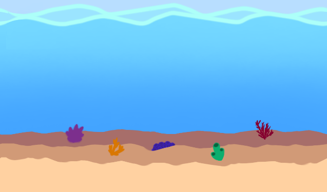

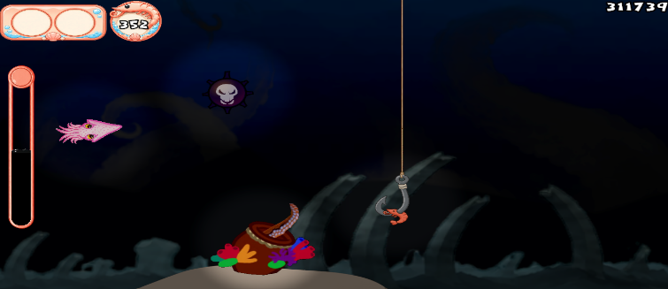

*Figura 3. Fondo Zona Epipelágica. Elaboración propia.*

*Figura 4. Zona abisopelágica y OctoDealer.*

##### Zona Abisopelágica

Es la segunda zona considerada para el MVP y representa un salto en complejidad y atmósfera. Predominan la oscuridad, la iluminación puntual y una mayor sensación de peligro. Este cambio no es solo estético: condiciona la jugabilidad al reducir la anticipación visual y aumentar la dependencia de reflejos y memoria de patrones. Además, permite enriquecer la experiencia mediante efectos de luz y contraste, reforzando la tensión del entorno.

#### Amenazas

La ambientación del juego no solo define el aspecto visual, sino también la naturaleza de los desafíos que enfrenta el jugador. En este sentido, las amenazas se estructuran en tres categorías complementarias que aportan coherencia al mundo y variedad a la jugabilidad.

##### Amenaza humana

Las actividades humanas asociadas a la pesca se presentan como el principal agente externo de peligro. Elementos como ganchos, redes, residuos y artefactos irrumpen en el ecosistema marino introduciendo una lógica ajena y agresiva. Estas amenazas funcionan como obstáculos críticos y enemigos indirectos, estableciendo una tensión constante entre el entorno natural y la intervención humana, lo que además aporta sentido al contexto narrativo.

##### Amenazas submarinas

El ecosistema marino en sí mismo es hostil. La presencia de depredadores y condiciones adversas configura un entorno donde la supervivencia depende de la evasión, la reacción y la adaptación continua. Estas amenazas representan la lógica natural del mundo del juego, reforzando la vulnerabilidad del protagonista y evitando que la dificultad se perciba como arbitraria.

##### Amenazas del entorno

A lo anterior se suman elementos propios del escenario, como derrumbes, géiseres submarinos, formaciones rocosas o estructuras que bloquean el paso. Estas amenazas introducen restricciones espaciales y variabilidad en el recorrido, obligando al jugador a modificar su trayectoria y tomar decisiones rápidas en función del entorno inmediato.

En conjunto, estas tres dimensiones configuran un sistema de amenazas coherente, donde cada tipo cumple un rol específico en la experiencia: presión externa (humana), supervivencia natural (biológica) y condicionamiento del espacio (ambiental).

### Personajes

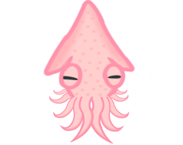

*Figura 5. Baby Squid. Elaboración propia.*

#### Protagonista: Baby Squid

Es un calamar bebé que actúa impulsado por una reacción instintiva más que racional. Su comportamiento refleja urgencia y vulnerabilidad, lo que se traduce en una jugabilidad centrada en reflejos y toma de riesgos. Mecánicamente, es el eje del sistema: su movilidad constante y la gestión del Ink-Pulse definen la experiencia del jugador.

#### Madre: Mommy Squid

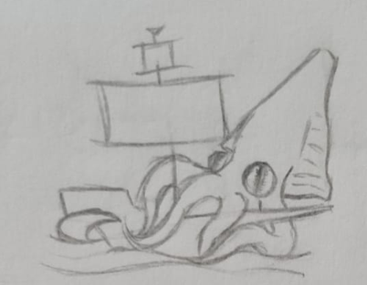

*Figura 6. Boceto de Mommy Squid. Elaboración propia.*

Cumple un rol principalmente narrativo. Es el detonante del conflicto inicial y, a la vez, quien cierra el ciclo en cada derrota al rescatar al protagonista. Su presencia refuerza el ciclo narrativo y aporta coherencia al sistema de reintento, sin intervenir directamente en la jugabilidad.

#### Enemigos y amenazas

##### Comunes

Conforman el núcleo del desafío y se dividen en distintos tipos según su comportamiento:

- Peces globo: obstáculos móviles que ocupan espacio y limitan rutas de escape.

- Cañas de pesca y anzuelos: amenazas externas que irrumpen desde fuera del entorno natural, con trayectorias variables.

- Minas submarinas: elementos estáticos que castigan la falta de precisión.

##### Enemigos especiales

Los enemigos especiales cumplen una función estructural dentro del diseño: forzar el uso del Ink-Pulse en momentos críticos. A diferencia de los obstáculos convencionales, no están diseñados para esquivarse mediante la habilidad básica, sino para introducir una condición obligatoria de decisión en la que el jugador debe haber gestionado correctamente su recurso de adrenalina.

- SS Carnage: es la manifestación principal de esta lógica. Representa la embarcación asociada al supuesto secuestro y aparece como un evento de alta presión que altera el flujo normal de la partida. Su mecánica central consiste en generar una «pared» o situación ineludible mediante un ataque masivo que cierra el espacio navegable y que solo puede superarse mediante el Ink-Pulse.

Desde el punto de vista de diseño, el SS Carnage:

- Valida la mecánica principal al exigir el uso efectivo del Ink-Pulse.

- Penaliza la pasividad, ya que un jugador que no haya asumido riesgos previamente no dispondrá del recurso necesario.

- Introduce variación en el ritmo y funciona como un punto de clímax dentro del ciclo de juego.

De este modo, no solo actúa como enemigo, sino como un mecanismo de control del comportamiento del jugador, asegurando que la experiencia se alinee con la identidad del juego basada en riesgo y recompensa.

En conjunto, estos elementos configuran un sistema de amenazas diverso que obliga a una adaptación constante y refuerza la identidad del juego basada en el riesgo.

#### Camarones

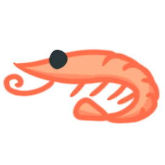

*Figura 7. Camarón. Elaboración propia.*

Funcionan como la moneda principal del juego. Se obtienen durante la partida y permiten realizar compras tanto *in-run* (durante la ejecución) como fuera de ella, vinculando la experiencia inmediata con la progresión del jugador.

#### Gadgets

Son elementos almacenados en el inventario durante la partida que introducen variabilidad y toma de decisiones estratégicas. Su función es complementar las mecánicas base, ofreciendo ventajas situacionales y adaptabilidad frente a distintos escenarios.

##### Pasivos

Se activan automáticamente bajo condiciones específicas, sin intervención directa del jugador. Están orientados a mitigar errores y extender la supervivencia.

- Shell Shield: al recibir un impacto, se activa automáticamente y genera una protección que evita la derrota inmediata. Funciona como un mecanismo de segunda oportunidad.

***Condición: solo puede aparecer una vez que el jugador supera los cinco minutos de partida, lo que incentiva el progreso.***

##### Activos

Requieren activación manual mediante las teclas «Q» y «W», lo que introduce decisiones tácticas en tiempo real.

- Ink Bottle: rellena instantáneamente la barra de adrenalina del Ink-Pulse, lo que permite responder a eventos críticos o preparar situaciones de riesgo.

#### Pez comerciante

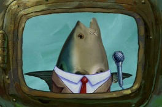

*Figura 8. Imagen de Realistic Fish Head,Utilizado en la presentación para representar al pez dealer. Propiedad de Nickelodeon (Bob Esponja)*

Actúa como el intermediario entre el jugador y los gadgets durante la partida. Ofrece mejoras y recursos a cambio de camarones, incorporando una capa de decisión económica en tiempo real. Su presencia introduce pausas estratégicas pero limitadas dentro del flujo de juego, sin romper la dinámica general.

### Público objetivo

El diseño del juego permite abarcar dos subgrupos bien definidos:

- Jugadores casuales: atraídos por la simplicidad de control y sesiones cortas, donde el desafío se basa en reflejos y adaptación progresiva.

- Jugadores competitivos: motivados por la superación de récords, optimización de rutas y dominio del sistema de riesgo asociado al Ink-Pulse.

#### Clasificación

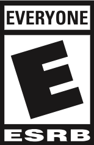

*Figura 9. E. Extraída de Wikipedia*

En coherencia con su contenido y enfoque, el juego se alinea con una clasificación E (Everyone), al presentar situaciones de tensión y peligro sin elementos gráficos explícitos. La ausencia de violencia directa, junto con su estilo visual accesible, lo posiciona como una experiencia apta para todo tipo de audiencias.

### Referencias

**Subway Surfers:**

Referente directo en estructura de endless runner: avance automático, aumento progresivo de dificultad y énfasis en reflejos. Sirve como base para el ritmo de juego y la claridad en los objetivos inmediatos del jugador.

**Flappy Bird:**

Aporta el enfoque de control simple pero exigente, donde pequeñas decisiones tienen consecuencias inmediatas. Influye en la precisión requerida y en la naturaleza punitiva del error.

**Deltarune (mecánica de graze):**

Inspira la mecánica central de riesgo: la idea de obtener beneficios al acercarse al peligro sin colisionar. Este principio se traduce directamente en la recarga del Ink-Pulse, siendo clave en la identidad del juego.

**The Binding of Isaac:**

Referencia para la estructura roguelite ligera, especialmente en la progresión mediante mejoras y reintentos constantes. Influye en el sistema de recompensas, la tienda y la rejugabilidad.

## Jugabilidad

A grandes rasgos, consiste en una experiencia de avance continuo en la que el jugador debe sobrevivir el mayor tiempo posible dentro de un entorno submarino dinámico y progresivamente más desafiante. A través de un control centrado en el posicionamiento y la evasión, se enfrenta a una serie de obstáculos y amenazas que exigen respuestas rápidas y precisas en tiempo real.

### Objetivo del jugador

#### Objetivo principal

El objetivo principal es alcanzar la mayor distancia posible sin colisionar, manteniéndose con vida en un entorno que incrementa progresivamente su dificultad. Este propósito se traduce en una ejecución constante de decisiones rápidas, donde el jugador debe equilibrar evasión, posicionamiento y anticipación frente a amenazas dinámicas.

#### Objetivo identitario

De forma complementaria, el jugador busca optimizar la gestión del Ink-Pulse, recargando la habilidad mediante la exposición controlada al peligro y utilizándola estratégicamente en eventos críticos. Este sistema redefine el objetivo tradicional del endless runner, ya que no basta con evitar riesgos, sino que es necesario asumirlos de manera calculada para sostener el progreso.

#### Objetivos complementarios

Finalmente, existe un objetivo secundario: acumular recursos, representados por camarones, y desbloquear utilidades. Estos elementos permiten acceder a mejoras y refuerzan la progresión entre partidas, lo que incentiva la repetición y el perfeccionamiento continuo del desempeño.

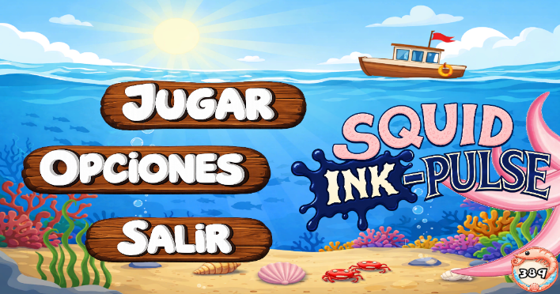

*Figura 10. Menú Principal.*

### Mecánicas

#### Principal

El juego se estructura sobre un desplazamiento automático continuo. A esto se suma la recolección de recursos (camarones) y la adaptación constante a patrones de amenazas. La dificultad escala progresivamente en función del tiempo y la distancia recorrida, aumentando la densidad y complejidad de los desafíos.

##### Funcionalidad técnica

El sistema de dificultad del juego no se modela como un crecimiento continuo simple, sino como una progresión segmentada en fases, donde variables clave se alternan y se reinician parcialmente ante eventos críticos.

###### Movimiento del jugador

El calamar se desplaza verticalmente en función de la posición del mouse, siguiendo un vector dependiente del eje Y. Este enfoque permite un control fluido y preciso, centrado en la evasión y el posicionamiento.

La cámara sigue al jugador con libertad vertical, reforzando la sensación de exploración y evitando una experiencia rígida.

###### Velocidad del entorno

La velocidad del escenario sigue una progresión creciente acotada, partiendo desde un valor mínimo y acercándose gradualmente a un límite superior. Este crecimiento es suave y progresivo, permitiendo al jugador adaptarse en las primeras etapas y evitando aumentos bruscos de dificultad.

###### Densidad de enemigos

La frecuencia de aparición de enemigos también presenta una tendencia creciente acotada, pero su evolución no es completamente paralela a la velocidad. En particular, su incremento se encuentra desfasado o regulado, de modo que no coincida constantemente con los momentos de mayor velocidad.

###### Interacción y control dinámico de la dificultad

Si bien ambas variables aumentan con el tiempo, no deben entenderse como curvas independientes fijas, sino como parte de un sistema dinámico e interdependiente. En términos de diseño:

- La velocidad y la densidad de enemigos se ajustan entre sí para evitar picos simultáneos de dificultad.

- El sistema debe prevenir escenarios de saturación en los que una velocidad elevada y una alta densidad de amenazas se mantengan simultáneamente durante períodos prolongados.

- Puede priorizarse el aumento de una variable mientras la otra se mantiene o crece más lentamente.

Este enfoque implica que la dificultad no responde únicamente a curvas asintóticas predefinidas, sino a una curva global dinámica, capaz de adaptarse al estado del juego en cada momento.

Finalmente, este sistema de progresión conjunta se ve alterado por la aparición del jefe basado en tiempo, que actúa como elemento regulador del ritmo y de la acumulación de dificultad.

###### Sistema de recursos (camarones)

Los camarones recolectados se almacenan en un estado persistente del juego, permitiendo su uso tanto dentro como fuera de la partida, conectando progresión interna y externa.

###### Sistema de puntaje

El puntaje se basa en el tiempo de supervivencia, medido en centésimas de segundo, y cumple dos funciones:

- Medición del desempeño del jugador.

- Desbloqueo de contenido permanente.

#### Diferenciadora

El núcleo identitario del juego es el sistema Ink-Pulse, una habilidad tipo dash que se recarga únicamente al exponerse al peligro (pasar cerca de amenazas sin colisionar). Esta lógica invierte el comportamiento tradicional del género: el progreso no se basa en evitar riesgos, sino en gestionarlos activamente.

Además, existen eventos que exigen su uso, integrando la mecánica dentro del ritmo del juego y evitando comportamientos pasivos. De este modo, el Ink-Pulse no es una ventaja opcional, sino un recurso central de supervivencia y decisión.

##### Funcionalidad técnica

###### Sistema de carga (graze zone)

El Ink-Pulse se modela mediante una barra de carga que se llena cuando el jugador permanece dentro de una zona de proximidad a amenazas, denominada graze zone.

- Esta zona corresponde a una colisión superpuesta al personaje.

- No produce daño, pero detecta cercanía a enemigos/obstáculos.

- El tiempo acumulado dentro de esta zona incrementa la carga de la barra.

Esto permite cuantificar el riesgo asumido por el jugador de forma continua.

###### Activación del Ink-Pulse

Cuando la barra está completa, el jugador puede activar el Ink-Pulse (dash) mediante clic izquierdo.

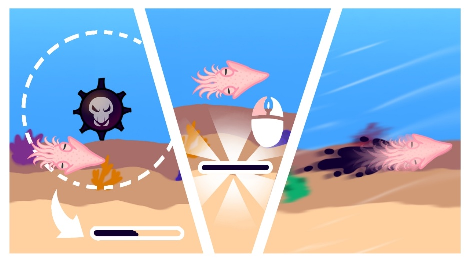

*Figura 11. Activación del Ink-Pulse. Viñeta de tutorial*

El Ink-Pulse produce:

- Aumento temporal de velocidad (a través de la cámara de seguimiento).

- Duración fija de tres segundos, ampliable mediante mejoras.

- Inmunidad a colisiones durante el efecto.

Funciona como una herramienta tanto de evasión como de superación de eventos críticos.

###### Impacto en la dificultad (sistema adaptativo)

El uso del Ink-Pulse no es neutro: tiene un efecto directo sobre el comportamiento del entorno.

**Uso consistente y oportuno: **

- Permite mantener el flujo del juego bajo control.

- Facilita la gestión de eventos críticos y densidad de amenazas.

**Uso excesivamente conservador, es decir, no activarlo:**

- El sistema incrementa la presión del entorno (mayor densidad o complejidad).

- Se generan situaciones donde el dash pasa de ser útil a obligatorio.

Esto introduce una penalización implícita a la pasividad.

#### Bosses y eventos críticos

En la entrega final, los eventos críticos se estructuran mediante jefes diferenciados por zona. SS Carnage cumple esta función en la zona epipelágica, mientras que la Anguila, o jefe abisal, introduce un desafío equivalente en la zona abisopelágica. Ambos eventos buscan validar el uso estratégico del Ink-Pulse en momentos de alta presión y transforman la mecánica principal del juego en una herramienta necesaria para superar situaciones límite.

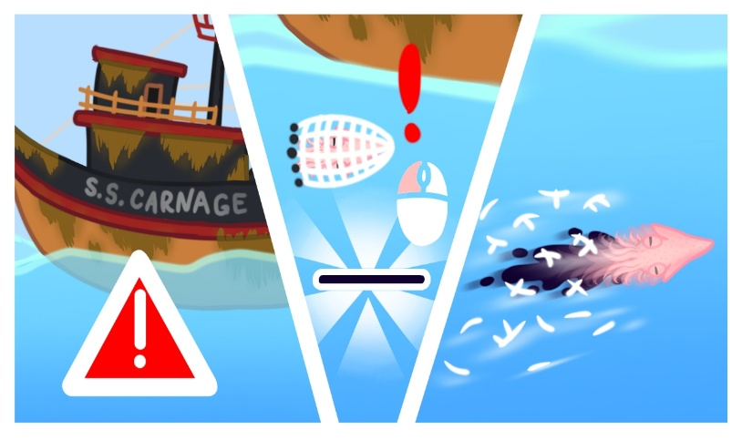

*Figura 12. Aparición de SS Carnage. Viñeta tutorial*

Estos eventos representan momentos de clímax dentro de la partida, interrumpiendo el flujo continuo del endless runner para introducir desafíos estructurados. Su propósito no es únicamente aumentar la dificultad, sino reforzar el aprendizaje del jugador, obligándolo a gestionar el riesgo, cargar Ink-Pulse y usarlo de manera oportuna.

Estos eventos permiten al jugador:

- Reconocer un punto crítico del ciclo de juego.

- Prepararse mentalmente para una decisión obligatoria.

- Validar el aprendizaje previo, especialmente en la gestión del riesgo.

El jefe no es solo un obstáculo, sino también un mecanismo rítmico que organiza la experiencia en fases de tensión y resolución.

##### Funcionalidad técnica

###### Aparición controlada (basada en tiempo)

La aparición del jefe basado en tiempo se rige por un intervalo base que se ajusta dinámicamente según el nivel de presión acumulada durante la partida.

En condiciones normales, el jefe aparece después de un intervalo mínimo predefinido. Sin embargo, este intervalo se reduce progresivamente cuando el entorno se vuelve más exigente, en particular según los siguientes factores:

1. Aumento de la velocidad del juego, que incrementa la dificultad de reacción.

2. Mayor densidad de enemigos u obstáculos, que eleva la carga cognitiva y mecánica del jugador.

Este sistema debe cumplir las siguientes condiciones:

- Intervalo base mínimo: el jefe no puede aparecer antes de un tiempo mínimo, lo que garantiza estabilidad en el ritmo inicial.

- Ajuste dinámico: a medida que la dificultad acumulada aumenta, el tiempo entre apariciones disminuye.

- Dependencia del estado del juego: la frecuencia de aparición responde directamente a variables del entorno (velocidad, densidad, intensidad).

- Control del ritmo: la aparición del jefe interrumpe deliberadamente la escalada continua de dificultad mediante un evento estructurado.

- Equilibrio entre predictibilidad y adaptación: no es completamente fijo ni aleatorio, sino coherente con la progresión del juego.

Este enfoque permite que el jefe funcione como un mecanismo de regulación del ritmo, evita la saturación progresiva y aporta variedad controlada a la experiencia.

###### Cámara dinámica (zoom out)

Durante el evento, la cámara realiza un alejamiento controlado:

- Permite visualizar completamente al boss.

- Mejora la legibilidad de patrones y ataques.

- Refuerza la percepción de enfrentamiento significativo.

Tras el evento, la cámara retorna a su estado normal.

**Sistema de ataque definitivo (ultimate o «pared»)**

El ataque principal del boss se estructura en tres fases claramente diferenciadas:

- Carga: el jefe anticipa el ataque mediante señales visuales de advertencia.

Estas señales permiten al jugador prepararse y completar la carga del Ink-Pulse.

- Lanzamiento: se abre una ventana breve, de aproximadamente dos a tres segundos, durante la cual el jugador debe activar el dash.

Corresponde al momento de ejecución crítica.

- Resolución: se despliega la «pared».

A continuación, el jefe es retirado de la escena al ser arrastrado por la cámara y el juego retoma su flujo normal.

###### Impacto en la progresión (reset dinámico)

El time-based boss actúa como un punto de reinicio parcial del sistema de dificultad:

- Reduce la velocidad del entorno a un valor intermedio.

- Disminuye o reinicia la densidad de enemigos.

- Reinicia el “tiempo efectivo” de progresión.

Esto genera un ciclo estructural:

Acumulación de dificultad → clímax (jefe) → liberación → reconstrucción.

#### Portales

Tras superar un evento de jefe basado en tiempo, el jugador puede atravesar un portal de transición que permite cambiar de zona o profundidad. Este sistema introduce variabilidad en el entorno, evita la repetición prolongada de un mismo escenario y refuerza el dinamismo de la experiencia.

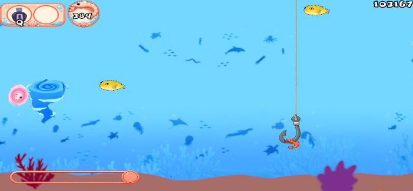

*Figura 13. Portales en forma de remolinos.*

Narrativamente, el portal se justifica como una consecuencia del desbordamiento de amenazas, donde la presión acumulada obliga al protagonista a desplazarse hacia otra zona del ecosistema.

##### Funcionalidad técnica

###### Aparición condicionada y probabilística

La aparición del portal está sujeta a dos reglas:

- Solo puede ocurrir inmediatamente después de un boss.

- Su generación responde a una función probabilística aleatoria, representada por p.

###### Uso del portal

El acceso al portal requiere una acción deliberada:

- Posicionarse dentro de la zona del portal.

- Activar el Ink-Pulse para atravesarlo.

###### Efecto en el sistema de juego

Al atravesar el portal:

- Se produce un cambio de escenario o profundidad.

- Se reinician parcialmente variables del entorno (velocidad, densidad).

- Se inicia un nuevo ciclo de progresión.

#### Gadgets y desbloqueables

Los gadgets son elementos obtenidos durante la partida a través del pez comerciante y tienen una duración limitada a la partida en la que se adquieren. Su función es añadir valor inmediato a cada intento e introducir ventajas situacionales que obligan al jugador a tomar decisiones rápidas bajo presión.

A diferencia de las mejoras permanentes, los gadgets refuerzan la idea de que cada partida es única, ya que el jugador debe adaptarse a los recursos disponibles en ese momento.

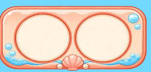

*Figura 14. Slots para gadgets disponibles.*

##### Funcionalidad técnica

###### Sistema de inventario

El jugador dispone de un inventario limitado a dos espacios o slots, en los que puede almacenar gadgets distintos. La gestión del inventario implica decisiones de reemplazo o conservación.

###### Sistema de obtención (pez dealer)

Los gadgets se obtienen mediante interacciones con el pez dealer:

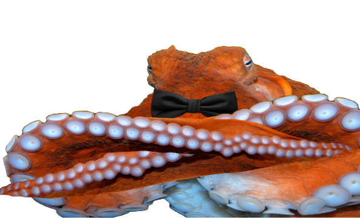

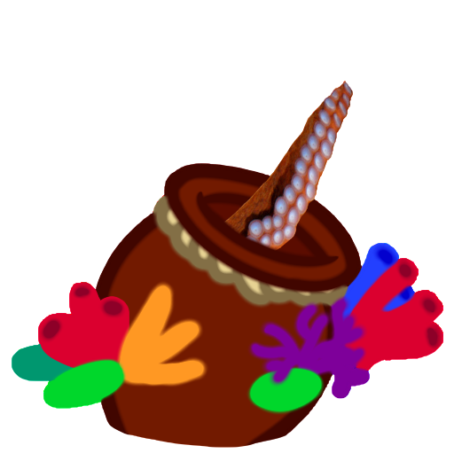

*Figura 15. DealerFish -> OctoDealer. Elaboración propia.*

- El jugador no conoce de antemano qué gadget recibirá.

- La asignación responde a un sistema aleatorio controlado.

Esto introduce incertidumbre y obliga a adaptarse a cada situación.

###### Sistema de desbloqueo progresivo

No todos los gadgets están disponibles desde el inicio:

- Algunos gadgets permanecen bloqueados.

- Se habilitan únicamente cuando el jugador alcanza ciertos umbrales de puntaje.

Esto vincula el rendimiento del jugador con la variedad de opciones disponibles.

#### Tienda permanente (metagame)

Permite al jugador invertir los camarones acumulados en bonificaciones permanentes o cosméticas. Entre ellas se incluyen la duplicación de recursos, el aumento de la duración del Ink-Pulse y las skins que modifican la apariencia del personaje o de los enemigos. Se accede a esta tienda después de finalizar una partida, sin restricciones de tiempo y con disponibilidad constante de los objetos.

#### Tienda durante la partida (in-run)

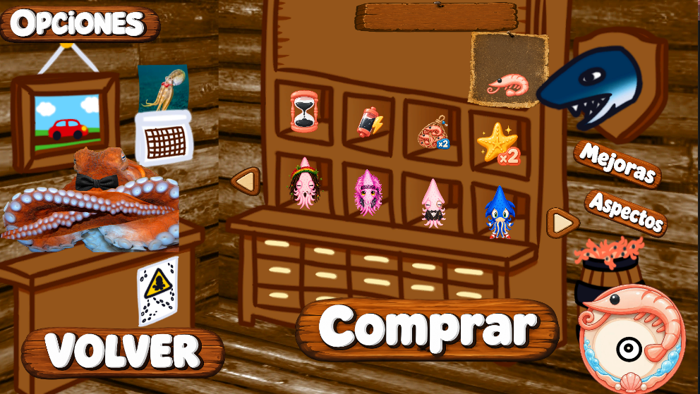

*Figura 16. Tienda metagame.*

Durante la partida puede aparecer de manera no determinista un pez comerciante, condicionado por el progreso del jugador, ya sea por distancia o puntaje. Este personaje permite comprar o intercambiar gadgets en tiempo real mediante un menú de duración limitada, lo que obliga a tomar decisiones rápidas y a evaluar el riesgo de desviarse de la trayectoria.

Su aparición no debe ser periódica ni predecible. En su lugar, debe cumplir las siguientes condiciones:

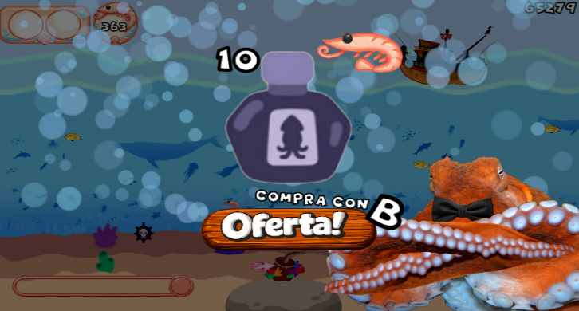

*Figura 17. Menú de tienda in-run.*

- Cooldown mínimo: no puede aparecer inmediatamente después de una aparición anterior.

- Probabilidad creciente: una vez superado ese umbral, la probabilidad de aparición aumenta gradualmente con el tiempo.

- Frecuencia acotada: existe un límite máximo para evitar apariciones excesivas.

- Dependencia del progreso: puede ajustarse según el desempeño del jugador.

- Imprevisibilidad controlada: evita tanto apariciones demasiado tempranas como esperas excesivas.

Este diseño mantiene el equilibrio entre el ritmo, la economía y la toma de decisiones bajo presión.

#### Menú de opciones

Permite ajustar parámetros del juego y resulta clave para la accesibilidad y la personalización. Incluye controles de volumen y la selección del modo de pantalla, completa o en ventana.

### Enemigos y obstáculos

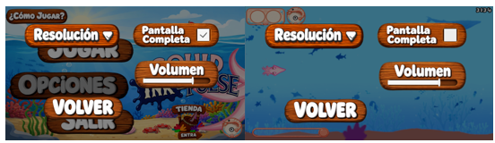

*Figura 18. Menú de opciones.*

Se consideran distintas amenazas principales que estructuran el desafío del juego: pez globo, caña de pesca (anzuelo), mina submarina y SS Carnage. Cada una responde a un tipo de comportamiento distinto, generando variedad en la toma de decisiones del jugador.

#### Tabla de enemigos

| Elemento | Tipo de comportamiento | Función en jugabilidad | Característica clave | Prediseño |
| --- | --- | --- | --- | --- |
| Pez globo | Móvil (expansivo) | Condiciona el espacio de desplazamiento | Reduce rutas de escape al aumentar su volumen | 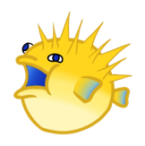 |
| Anzuelo | Externo (dinámico) | Introduce imprevisibilidad | Irrumpe con trayectorias variables desde fuera del entorno | 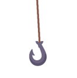 |
| Mina submarina | Estático | Castiga la imprecisión | Requiere control fino del movimiento en proximidad |  |

*Tabla 4. Enemigos del juego. Elaboración propia.*

#### SS Carnage (barco pesquero humano)

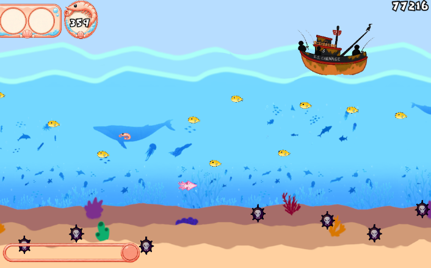

*Figura 19. Aparición del Carnage*

##### Rol narrativo

Es la principal amenaza desde la perspectiva del protagonista, quien lo interpreta como el responsable del secuestro de su madre. Representa la intervención humana en el ecosistema marino y actúa como símbolo de explotación y peligro externo.

##### Composición

Está conformado por un grupo de pescadores que buscan capturar fauna marina. Va acompañado por un pato yeco (Yeico), que funciona como mascota y elemento distintivo del barco.

##### Apariencia

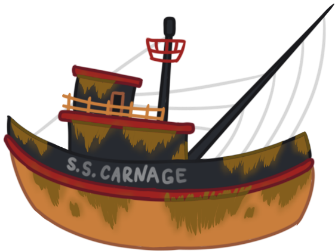

*Figura 20. SS Carnage. Elaboración propia.*

Barco pesquero grande, oxidado y deteriorado, cubierto de redes, arpones y herramientas de pesca. Los pescadores se ubican en la cubierta, visibles durante los ataques. Su tamaño es dominante, ocupando el borde superior de la pantalla.

##### Participación en juego

Funciona como un evento de alta presión que interrumpe el flujo normal de la partida, aumentando la intensidad del desafío.

##### Ataque especial (ultimate o «pared»)

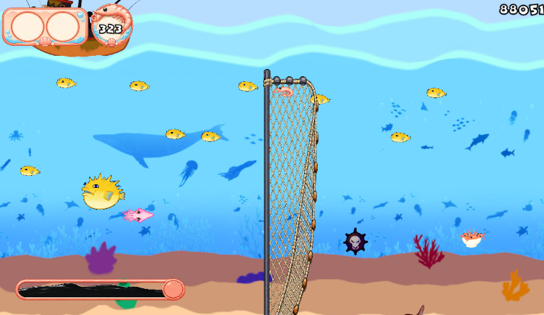

*Figura 21. Evento de “pared” del SS Carnage.*

Despliega una red de gran tamaño imposible de esquivar mediante movimiento convencional, obligando al uso del Ink-Pulse.

##### Función de diseño

Valida la mecánica central del juego al exigir el uso estratégico del Ink-Pulse, penalizando la falta de preparación y reforzando la identidad basada en riesgo y decisión.

#### Anguila

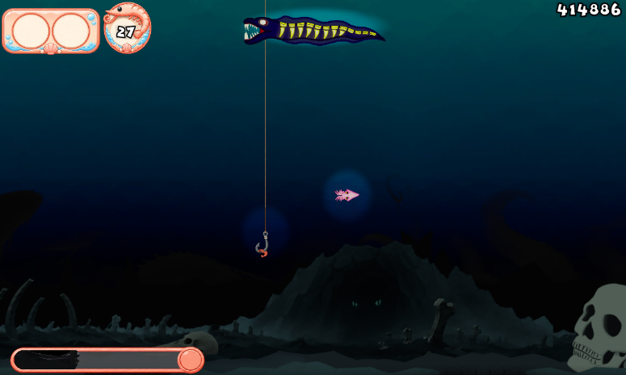

*Figura 22. Aparición de Anguila / Eel*

##### Rol narrativo

Es la principal amenaza de la zona abisopelágica y uno de los enemigos que el protagonista debe superar.

##### Composición

Se trata de una anguila eléctrica cuya principal amenaza son los rayos que genera.

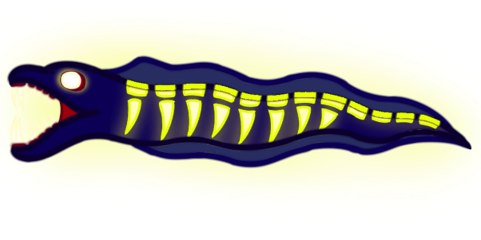

*Figura 23. Apariencia de Eel / Anguila eléctrica*

##### Apariencia

Es una anguila gigante de colores azul marino y amarillo, lo que le proporciona un aspecto luminiscente. Se posiciona en la zona central superior de la pantalla mientras ataca al jugador y luego huye rápidamente.

##### Participación en juego

En la zona abisopelágica, actúa como un evento de alta presión que altera el patrón de desplazamiento habitual y aumenta la intensidad del desafío mediante ataques eléctricos.

##### Ataque especial (ultimate o «pared»)

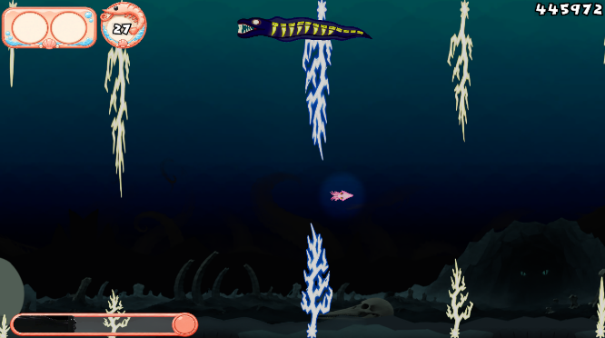

*Figura 24. Ataque de Anguila*

Genera de forma constante rayos eléctricos desde los bordes inferior y superior de la pantalla, dejando solo un espacio reducido para atravesarlos. El último rayo forma una pared que únicamente puede superarse mediante el Ink-Pulse.

##### Función de diseño

Obliga al jugador a interpretar patrones de ataque, conservar espacio de maniobra y reservar el Ink-Pulse para el momento final, diferenciándose así del enfrentamiento contra SS Carnage.

### Gadgets

Se implementaron dos gadgets.

#### Tabla de gadgets

| Gadget | Tipo | Activación | Efecto principal | Condición de aparición | Prediseño |
| --- | --- | --- | --- | --- | --- |
| Shell Shield | Pasivo | Automática al recibir daño | Evita la derrota inmediata al absorber el impacto | Disponible después de superar los cinco minutos de partida |  |
| Ink Bottle | Activo | Manual, mediante las teclas Q o W | Rellena instantáneamente la barra de Ink-Pulse | Siempre disponible |  |

*Tabla 5. Gadgets implementados. Elaboración propia.*

### Estados del juego

El sistema se organiza en distintos estados que estructuran la experiencia y delimitan las interacciones del jugador:

- Inicio o menú principal: acceso al juego, configuración básica y entrada a la partida.

- Partida (gameplay): estado principal en el que ocurren el desplazamiento continuo, la evasión de amenazas, la recolección de recursos y la gestión del Ink-Pulse.

- Tienda durante la partida (in-game): espacio de tiempo limitado que permite adquirir gadgets.

- Fin de partida (Game Over) o inconsciencia: estado posterior a una colisión o fallo, acompañado de una breve resolución narrativa, correspondiente al rescate por parte de la madre.

- Reintento: transición rápida que permite reiniciar el ciclo sin fricción, reforzando la continuidad del juego.

#### Condiciones

##### Condición de progreso:

- El jugador avanza indefinidamente mientras logre evitar colisiones y gestionar correctamente sus recursos (Ink-Pulse y gadgets).

##### Condición de derrota:

- Se produce al colisionar con un enemigo u obstáculo, o al no poder responder a eventos críticos que requieren el uso del Ink-Pulse. El resultado es el estado de inconsciencia del protagonista.

##### Condición de uso crítico:

- Existen situaciones donde el uso del Ink-Pulse es obligatorio para continuar (por ejemplo, eventos tipo “pared”), lo que introduce una validación directa de la mecánica central.

### Ciclo de juego

El ciclo de juego se basa en una secuencia repetitiva de acciones: avanzar, esquivar, asumir riesgos para recargar el Ink-Pulse, utilizarlo en momentos críticos, fallar o continuar y reiniciar mediante el sistema de reintento.

### Diagrama de flujo final

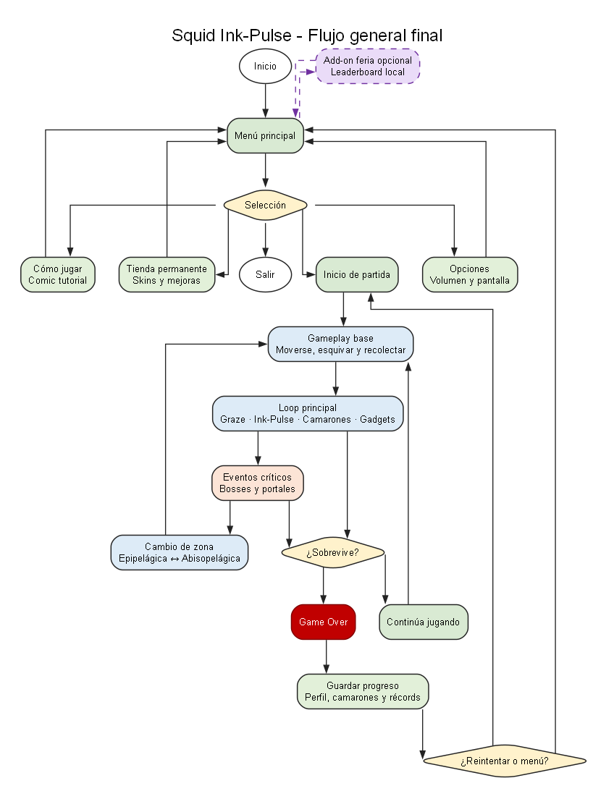

*Figura 25. Diagrama de flujo. Elaboración propia.*

## Sistema de progresión

La experiencia de juego está diseñada como un ciclo continuo de riesgo, recompensa y mejora, donde cada partida representa una oportunidad de superación. El jugador avanza enfrentando amenazas crecientes, recolectando recursos y tomando decisiones en tiempo real, lo que genera una sensación constante de tensión y dinamismo. Este ciclo se refuerza con el sistema de *Ink-Pulse*, que obliga a interactuar activamente con el peligro, evitando una jugabilidad pasiva.

### Progresión interna (in-run)

Durante cada partida, la progresión se manifiesta a través de un aumento gradual de la dificultad:

- Incremento en la velocidad del juego.

- Mayor densidad y variedad de enemigos y obstáculos.

- Aparición de eventos críticos, como SS Carnage.

Paralelamente, el jugador mejora su desempeño mediante:

- Recolección de camarones.

- Obtención y uso de gadgets.

Esta progresión genera una curva de aprendizaje inmediata, en la que el jugador mejora dentro de la misma partida.

### Progresión externa (metaprogresión)

Fuera de la partida, el jugador progresa mediante sistemas que incentivan la repetición:

- Uso de camarones como moneda acumulable.

- Acceso a mejoras y skins.

Este nivel de progresión no solo mejora las capacidades del jugador, sino que también refuerza el compromiso a largo plazo al conectar múltiples partidas entre sí. Además, permite que el jugador decida cómo quiere verse.

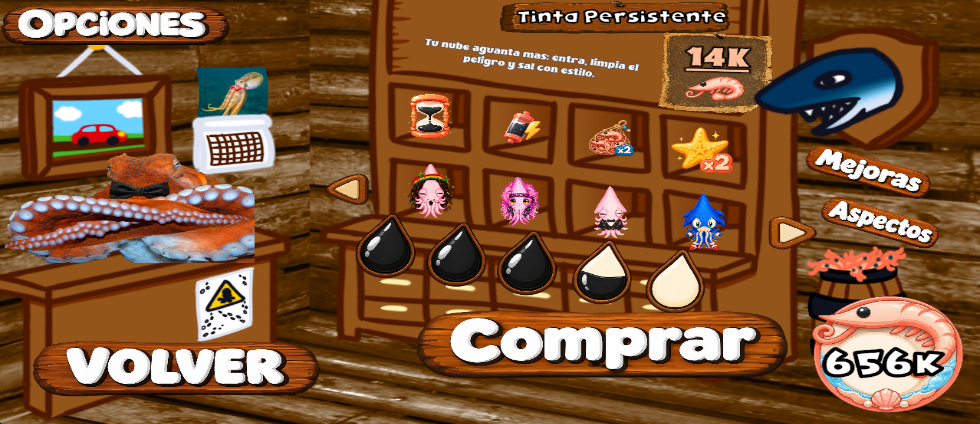

*Figura 26. Tienda metagame, permite comprar skins y mejorar habilidades de Baby Squid*

### Controles

El esquema de control es simple pero funcional, orientado a la rapidez de respuesta:

- Movimiento: Baby Squid sigue la posición del mouse, lo que permite un desplazamiento vertical fluido.

- Dash (Ink-Pulse): activación con clic izquierdo, condicionado a la carga de la barra de adrenalina.

- Gadgets:

  - Pasivos: efectos que se activan automáticamente ante determinados eventos durante la partida.

  - Activos: uso manual asignado a las teclas «Q» y «W», lo que permite tomar decisiones tácticas en tiempo real.

- Otros:

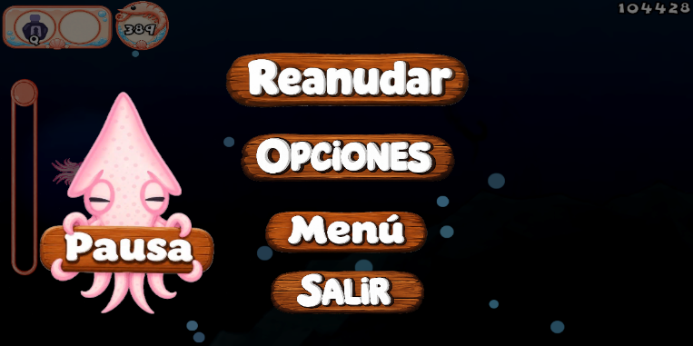

*Figura 27. Menú de Pausa.*

  - Pausa: el menú de pausa se activa con las teclas «P» o «Esc».

  - Manejo de tiendas: la interacción se realiza mediante el mouse y el clic; en la tienda durante la partida también puede utilizarse la tecla «B».

Este diseño mantiene una baja barrera de entrada, concentrando la complejidad en la gestión de recursos y la toma de decisiones bajo presión.

### Retención del jugador

La retención se basa en tres pilares principales:

- Reintento inmediato: la estructura del juego permite volver a jugar rápidamente tras perder, reduciendo la fricción.

- Loop narrativo: la intervención de la madre tras cada derrota justifica el reinicio, integrando narrativa y mecánica.

- Progresión y dominio: el jugador es incentivado a mejorar continuamente, ya sea superando su récord, optimizando el uso de recursos o dominando las mecánicas.

En conjunto, estos elementos generan una experiencia adictiva, coherente y orientada a la repetición, característica fundamental del género *endless runner*.

## Estado de cumplimiento final

El estado final del proyecto puede describirse como una entrega académica completa y funcional. Squid Ink-Pulse cuenta con un núcleo jugable operativo compuesto por movimiento continuo, control del jugador, sistema Ink-Pulse, detección de proximidad o graze, recolección de camarones, gadgets, tienda temporal, tienda permanente, enemigos, portales, eventos de jefe, compra de mejoras, skins, tutorial, cómics narrativos, HUD, menús y opciones.

Este conjunto de sistemas permite validar la propuesta central del juego: avanzar, esquivar, asumir riesgos, cargar Ink-Pulse y utilizarlo en momentos críticos. Además, la implementación final incorpora progresión persistente, economía local, tienda out-of-game y dos zonas jugables conectadas por portales, lo que amplía la experiencia más allá del prototipo inicial presentado en informes anteriores.

La entrega actual cumple con el objetivo académico de presentar una versión jugable, coherente y demostrable del videojuego.

### Resumen de cumplimiento por componente

| Componente del MVP | Estado | Evidencia de avance | Observación |
| --- | --- | --- | --- |
| Movimiento del jugador | Cumplido | Movimiento continuo, control vertical mediante mouse y límites de desplazamiento. | Sistema funcional para la experiencia base. |
| Ink-Pulse | Cumplido | Sistema de carga, activación, estados, duración, bloqueo contextual y reinicio en Game Over. | Es la mecánica identitaria del proyecto. |
| Graze Zone / proximidad | Cumplido | La cercanía a amenazas permite cargar Ink-Pulse sin requerir colisión. | Valida el sistema de riesgo-recompensa. |
| Camarones | Cumplido | Recolección, visualización y uso como moneda. | La economía se guarda mediante persistencia local. |
| Gadgets e inventario | Cumplido | Inventario por slots, gadgets activos y pasivos, activación mediante Q o W, o de forma automática según el tipo. | Los gadgets se reinician al finalizar la partida. |
| Tienda temporal in-run | Cumplido | DealerFish, oferta temporal, precio, contador y compra con camarones. | Permite decisiones económicas durante la partida. |
| Tienda permanente / ShopMenu | Cumplido | Tienda accesible desde menú principal para comprar skins y mejoras. | Representa la progresión externa del juego. |
| Sistema de mejoras permanentes | Cumplido | Mejoras comprables que afectan Ink-Pulse, camarones y puntaje. | Se guardan entre sesiones. |
| Skins | Cumplido con limitación visual | Skins comprables, equipables y persistentes. | Funcionan como personalización estética; no todas requieren animación propia. |
| Enemigos comunes | Cumplido | Pez globo, mina y caña de pescar implementados en el flujo de juego. | Existen enemigos adicionales preparados para futuras iteraciones. |
| SS Carnage | Cumplido | Boss de la Zona Epipelágica con fases, advertencia, red y resolución. | Cumple la función de evento crítico. |
| Anguila / boss abisal | Cumplido | Boss de la Zona Abisopelágica con ataques eléctricos y patrón de evasión. | Amplía los eventos críticos a la segunda zona. |
| Portales | Cumplido | Transición entre Zona Epipelágica y Zona Abisopelágica. | Conservan la continuidad de la partida. |
| Zona Epipelágica | Cumplido | Zona inicial, clara y visible. | Presenta las mecánicas base. |
| Zona Abisopelágica | Cumplido | Zona oscura con mayor tensión visual y boss propio. | Amplía la variedad de la experiencia. |
| HUD y menús | Cumplido | HUD, pausa, Game Over, tienda temporal, tienda permanente y opciones. | Consolidan el flujo completo de usuario. |
| Tutorial | Cumplido | Cómic “Cómo Jugar” accesible desde el menú principal. | Facilita la entrada de nuevos jugadores. |
| Cómics narrativos | Cumplido | Cómics para inicio, portales, tienda y derrota. | Refuerzan narrativa y eventos clave. |
| Persistencia local | Cumplido | Datos guardados mediante archivos JSON. | Conserva economía, récords, skins, mejoras y ranking local. |
| Audio dinámico | Cumplido | Música, SFX, volumen global y transición musical durante Ink-Pulse. | Mejora el feedback del jugador. |
| Add-on de feria | Cumplido como extensión opcional | Servidor local con tabla de clasificación web en un computador anfitrión. | No reemplaza la persistencia local ni sincroniza el progreso completo entre computadores. |

*Tabla 6. Elaboración propia.*

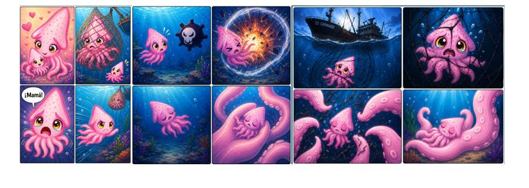

*Figura 28. Cómics que sirven como apoyo de relato durante la partida*

## Avances finales

El proyecto presenta un avance final significativo respecto del Informe n.º 2. La propuesta pasó de un MVP funcional con sistemas aún pendientes a una entrega académica completa, jugable y demostrable. Durante la etapa final se consolidaron sistemas clave, como la persistencia local, la tienda permanente, las skins, las mejoras, el tutorial, los cómics narrativos, las opciones, la segunda zona jugable, el jefe abisal y la preparación para la feria.

El resultado final representa con mayor fidelidad la visión original del equipo: un endless runner submarino donde el jugador no solo evita el peligro, sino que debe acercarse a él para progresar. Esta lógica de riesgo-recompensa se mantiene como el centro de la experiencia y se ve reforzada por la progresión, los bosses, los portales, la economía y la narrativa.

## Desarrollo

El desarrollo de Squid Ink-Pulse se estructura como un proyecto de videojuego 2D desarrollado en Unity y orientado al género endless runner, con énfasis en la acción, el riesgo y la progresión. El proyecto no se limita a implementar una escena jugable aislada, sino que organiza sus sistemas principales en torno a un ciclo de juego persistente: el jugador controla a Baby Squid, avanza de forma continua, esquiva amenazas, recolecta camarones, carga el recurso Ink-Pulse mediante la exposición al riesgo y utiliza dicho impulso para sobrevivir o superar eventos críticos.

Desde el punto de vista del desarrollo, el repositorio evidencia una evolución desde una idea base de juego rápido y reactivo hacia una implementación más estructurada. El proyecto incorpora sistemas de sesión, progresión de partida, movimiento del jugador, enemigos, tienda temporal, gadgets, portales entre zonas, HUD, menús, persistencia local, tienda permanente, mejoras, skins, tutoriales, cómics, opciones funcionales y documentación técnica. Esto permite considerar el MVP finalizado, pues tanto las mecánicas principales como las secundarias se completaron.

La estructura general del proyecto diferencia claramente entre implementación técnica, contenido de juego y documentación. Esta separación favorece el mantenimiento, ya que evita mezclar código fuente, assets visuales, prefabs, escenas y documentos técnicos en un mismo nivel de responsabilidad. En consecuencia, el desarrollo puede ser comprendido como un trabajo modular: cada sistema se implementa, prueba y documenta dentro de su propio dominio.

| Área | Función dentro del desarrollo |
| --- | --- |
| Assets/Implementation/ | Contiene el código C#, configuraciones técnicas y herramientas de editor. |
| Assets/Content/ | Agrupa prefabs, arte, audio y animaciones utilizados durante la ejecución. |
| Assets/Scenes/ | Contiene las escenas jugables y de menú. |
| Assets/Implementation/Resources/PersistentDbSeeds/ | Almacena la fuente única de semillas JSON utilizadas para perfil, catálogo y récords. |
| Docs/ | Contiene la documentación técnica viva del proyecto. |
| Packages/ y ProjectSettings/ | Mantienen la configuración base del proyecto Unity. |

*Tabla 7. Elaboración propia.*

En términos de avance, el proyecto presenta un desarrollo orientado a sistemas reutilizables. En lugar de resolver cada mecánica con scripts aislados, se observa una tendencia a centralizar responsabilidades: la sesión global se controla desde un sistema de sesión; la progresión de dificultad, desde un director de partida; los cambios de escena, desde un controlador de flujo; y la generación de objetos, desde un generador o spawner. Esta organización reduce la duplicación de lógica y permite que las escenas compartan reglas comunes.

### Programación

La programación del proyecto está realizada principalmente en C# sobre Unity. El código se organiza bajo Assets/Implementation/Code/, donde cada carpeta representa un dominio funcional del juego. Esta decisión permite que el proyecto sea más legible y mantenible, ya que cada módulo concentra una responsabilidad específica.

| Carpeta | Responsabilidad principal |
| --- | --- |
| Core/ | Sesión global, progresión de la partida, control de escenas, cámara, límites e infraestructura transversal. |
| Player/ | Movimiento, Ink-Pulse, colisiones, interacción, inventario, visuales y perfil persistente. |
| Spawning/ | Generación de enemigos, camarones, portales y tienda temporal. |
| Enemies/ | Comportamientos específicos de enemigos. |
| Bosses/ | Lógica de eventos de jefe y comportamientos asociados al boss. |
| UI/ | HUD, pausa, game over, tienda, elementos de visualización y animación de interfaz. |
| World/ | Elementos de mundo como portales, tienda in-game e iluminación por zona. |
| Audio/ | Música dinámica, efectos sonoros y transiciones de audio. |
| Background/ | Parallax y fondos. |
| MainMenu/ | Navegación del menú principal. |
| Tutorial/ | Flujo y pasos del tutorial. |

*Tabla 8. Elaboración propia.*

El sistema del jugador está dividido en componentes especializados para evitar que un solo script concentre demasiadas responsabilidades. PlayerMovement gestiona el desplazamiento y la respuesta al mouse; InkPulseController controla la carga, la activación y la duración del Ink-Pulse; GrazeDetector permite cargar el recurso al pasar cerca de amenazas; y PlayerCollision resuelve las interacciones con enemigos, camarones, portales u otros objetos relevantes.

La mecánica de Ink-Pulse se programa mediante una máquina de estados con fases como Idle, Charging, Ready y Active. Esto permite controlar con mayor claridad cuándo el recurso puede cargarse, activarse o bloquearse por situaciones como tienda abierta, transición de portal, muerte o Game Over.

Por otro lado, la progresión de la partida se separa del movimiento del jugador mediante RunProgressionDirector, que regula la intensidad, la velocidad, el ritmo de aparición de obstáculos y los eventos de jefe. La generación de entidades queda a cargo de LevelSpawner, que instancia enemigos, camarones, DealerFish y portales según perfiles de zona, y delega parte de su lógica en servicios internos para mantener el sistema ordenado y extensible.

### Arquitectura

La arquitectura de software de *Squid Ink-Pulse* se organiza como una arquitectura modular por dominios, implementada sobre el modelo de componentes propio de Unity. Esto significa que el proyecto no se estructura como un único bloque de scripts dependientes entre sí, sino como un conjunto de dominios funcionales separados, cada uno con una responsabilidad clara dentro del videojuego.

En este contexto, el término dominio se entiende como una agrupación técnica y funcional dentro de Assets/Implementation/Code/. Cada dominio concentra un área específica del sistema: Core contiene la lógica transversal de sesión, escenas, cámara y progresión; Player agrupa movimiento, Ink-Pulse, colisiones, inventario, visuales y perfil persistente; Spawning administra la aparición de enemigos, camarones, portales y tienda temporal; UI contiene el HUD, los menús y los elementos de visualización; World reúne entidades del entorno, como portales, DealerFish e iluminación; y otros dominios, como Audio, Background, Enemies, Bosses, Tutorial y MainMenu, aíslan responsabilidades complementarias.

La decisión de organizar el código por dominios permite que el proyecto sea más mantenible y escalable. Si se modifica el sistema de aparición de enemigos, el cambio se concentra principalmente en Spawning; si se ajusta el comportamiento del jugador, el trabajo se realiza en Player; si se modifica el HUD o los menús, la responsabilidad corresponde a UI. Esta organización reduce el acoplamiento entre sistemas y evita que la lógica de juego quede dispersa en scripts genéricos o en prefabs sin responsabilidad definida.

La jerarquía arquitectónica principal puede representarse de la siguiente forma:

| Nivel | Rol dentro de la arquitectura | Ejemplos |
| --- | --- | --- |
| Dominio | Agrupa una responsabilidad funcional del juego. | Core, Player, Spawning, UI, World, Audio. |
| Orquestadores o controladores | Gobiernan un sistema, coordinan referencias, ejecutan transiciones y exponen parámetros de balance. | RunProgressionDirector, InkPulseController. |
| Estados formales | Representan fases discretas del sistema sin depender directamente de Unity ni de prefabs. | GameSessionState, PlayerRuntimeState, InkPulseState. |
| Especializaciones | Implementan comportamientos concretos y limitados dentro de un dominio. | PufferfishEnemy, ScenePortal. |
| Datos, catálogos y servicios | Almacenan configuración, persistencia, reglas de selección, cálculo o adaptación. | GadgetCatalog, EnemySpawnSelector. |

*Tabla 9. Elaboración propia.*

La dirección correcta de dependencia parte desde el dominio hacia sus componentes internos. El dominio actúa como contenedor conceptual; dentro de él, los orquestadores concentran la autoridad del sistema. Los estados formales no ejecutan por sí mismos la lógica de Unity, sino que describen la fase en la que se encuentra un sistema. Luego, las especializaciones ejecutan comportamientos concretos, pero no deberían tomar decisiones globales. Finalmente, los datos, catálogos, perfiles, repositorios y servicios entregan información o cálculos auxiliares sin apropiarse del flujo principal del juego.

Por ejemplo, LevelSpawner funciona como orquestador del dominio Spawning: decide cuándo y dónde instanciar enemigos, camarones, portales o eventos de tienda. Sin embargo, no debería contener el comportamiento particular de cada enemigo. Esa lógica corresponde a especializaciones como PufferfishEnemy o FishingRodEnemy. De la misma forma, un ScenePortal puede detectar una interacción con el jugador, pero no debe decidir por sí mismo toda la política de flujo de escenas; esa responsabilidad pertenece a los controladores de escena y sesión.

El proyecto evidencia patrones de diseño como State Machine, utilizado para representar estados formales del juego, y Facade, aplicado en objetos raíz que agrupan referencias y simplifican la composición de escena. Además, incorpora servicios internos y una lógica data-driven mediante selectores, servicios de resolución, calculadores, perfiles y catálogos. Esto permite reducir la carga de los orquestadores, ajustar parámetros de equilibrio sin modificar la lógica central y mantener una separación clara entre autoridad, estado, comportamiento y configuración.

#### Persistencia

La persistencia local quedó implementada mediante archivos JSON, lo que permite conservar información relevante del jugador entre partidas y sesiones. Este sistema separa con claridad el estado de ejecución del estado permanente.

El estado de ejecución corresponde a elementos propios de una partida individual, como los gadgets comprados durante la partida, la carga de Ink-Pulse, el puntaje temporal y las condiciones activas del jugador. Estos elementos pueden reiniciarse al entrar en Game Over o al iniciar una nueva partida.

El estado permanente, en cambio, conserva información asociada al perfil del jugador, como camarones acumulados, récords, mejor puntaje, skins compradas, skin equipada, niveles de mejoras permanentes, catálogo de desbloqueables y ranking local.

Esta separación permite que el jugador mantenga su progreso general sin romper el equilibrio de cada partida. De este modo, los gadgets siguen funcionando como recursos temporales, mientras que las skins, las mejoras, los camarones y los récords forman parte de la progresión externa o metagame.

### Documentación

El repositorio presenta una documentación técnica amplia y organizada en la carpeta Docs/. Esta documentación funciona como contrato vivo del proyecto, ya que describe la arquitectura, la estructura de carpetas, los sistemas de jugabilidad, los enemigos, la interfaz de usuario, el aseguramiento de calidad, la persistencia, los portales, la cámara, el mundo y la hoja de ruta. Su existencia permite que el informe no dependa únicamente de una descripción externa, sino también de documentos internos que explican cómo debe crecer el código.

La documentación cumple tres funciones principales. Primero, registra decisiones de arquitectura, como la separación entre dominios, estados y especializaciones. Segundo, define contratos técnicos de escena y prefab, indicando qué nodos deben existir, qué scripts pertenecen a cada sistema y qué referencias deben resolverse por Inspector o por contrato. Tercero, permite orientar el testing, ya que identifica parámetros ajustables, reglas no balanceables y condiciones que deben validarse antes de considerar estable una escena.

| Documento técnico | Aporte al proyecto |
| --- | --- |
| GAMEPLAYSYSTEMS.MD | Agrupa los sistemas que definen la experiencia directa del jugador, incluyendo movimiento, recolección de camarones, mecánicas de Ink-Pulse, uso de inventario/gadgets e interacción con la tienda temporal. |
| LORECOMICS.MD | Define el sistema encargado de mostrar viñetas narrativas durante las transiciones clave de la partida (inicio, portales, tienda in-game y derrota) sin necesidad de instanciar interfaz gráfica por código en tiempo real. |
| PERSISTENTPROFILE.MD | Establece la arquitectura de persistencia de datos locales en base a archivos JSON, encargada de gestionar de forma permanente el progreso del jugador, economía acumulada, compra de mejoras y récords. |
| PORTALS.MD | Explica las mecánicas, responsabilidades y políticas de aparición de los portales, que permiten cambiar de escenario y mantener activos los gadgets, el puntaje y los recursos de la partida en curso. |
| PROJECTOVERVIEW.MD | Proporciona un resumen general del videojuego, detalla sus pilares centrales de diseño, los elementos logrados para la entrega final y el orden de lectura sugerido para comprender la documentación. |
| PROJECTREPORT.MD | Presenta un informe breve y ejecutivo del estado del MVP, resume el núcleo jugable y enumera las implementaciones funcionales de la versión actual. |
| ANIMATIONSTANDARDS.MD | Establece los estándares, ubicaciones, convenciones de nomenclatura y normas de integración (prefabs y skins) de todas las animaciones del proyecto, protegiendo la lógica de colisiones y movimiento. |
| ASSETFLOW.MD | Describe las reglas organizativas, jerarquías y flujos de los recursos de Unity, como audio, arte, prefabs y perfiles de aparición por zona, e incluye el funcionamiento de la banda sonora dinámica y su mezcla. |
| CORESYSTEMS.MD | Documenta la capa de orquestación (núcleo), detallando los controladores encargados de la sesión global del juego, el ritmo/progresión de la dificultad y el flujo de carga entre las diferentes escenas. |
| PROJECTSTRUCTURE.MD | Explica la organización de carpetas y la responsabilidad de cada dominio. |
| README.MD | Funciona como índice organizativo de toda la documentación de entrega, categorizando los archivos en la base del proyecto, sistemas de juego y cierre. |
| ROADMAP.MD | Formaliza el cierre de la entrega final, detalla el alcance principal integrado, el complemento opcional para la feria y las extensiones futuras. |
| RUNTIMEHIERARCHYAUDIT.MD | Define qué script debe vivir en cada nodo principal de escena o prefab, asegurando la regla de un solo propietario por responsabilidad para evitar conflictos lógicos. |
| SOFTWAREARCHITECTURE.MD | Define la arquitectura, capas, dependencias, reglas de nomenclatura y criterios de refactorización. |
| UIANDMENU.MD | Agrupa la lógica y los flujos del menú principal, las pantallas de pausa y game over, la tienda permanente fuera de la partida, la tienda temporal de gadgets y la composición estructural del HUD general. |
| WORLDANDCAMERA.MD | Cubre los controladores de cámara suave y sus efectos, la resolución centralizada de límites verticales, la limpieza de objetos fuera de pantalla y el desplazamiento de fondos mediante paralaje. |
| WORLDSCALE.MD | Fija la relación canónica entre los píxeles del arte —100 px equivalen a una unidad de Unity—, los límites físicos utilizables por el jugador y el escalado uniforme de los prefabs en el mundo. |
| ZONAEPIPELAGICA.MD | Detalla la estructura jerárquica de nodos, la configuración de coordenadas en el origen y las responsabilidades específicas de cada administrador dentro del escenario principal. |
| ZONELIGHTING.MD | Documenta el funcionamiento de la oscuridad ambiental en la zona abisal, coordinando la generación de la textura compuesta y el registro visual de halos de luz suaves mediante fuentes locales. |
| STATEMACHINES.MD | Registra las máquinas de estado formales implementadas en el proyecto (sesión, run, jugador, recurso e interacciones), detallando sus prioridades visuales y efectos sobre los sistemas. |
| FAIREVENTSETUPGUIDE.MD | Es una guía operativa para configurar y probar el complemento opcional de eventos. Explica cómo levantar el servidor en un computador anfitrión, mostrar la tabla de clasificación web y administrar la base de datos. |
| ENEMIESANDBOSSES.MD | Reúne el sistema de instanciación (LevelSpawner), el catálogo de etiquetas y el comportamiento específico de los enemigos (pez globo, mina, raya, medusa y caña de pescar), además de detallar la orquestación de los jefes SS Carnage y el jefe abisal. |
| FAIRSERVER.MD | Documenta la estructura y el propósito del servidor local de feria, su implementación en Python y SQLite, los endpoints disponibles y la limitación de su alcance a la visualización de la clasificación. |

*Tabla 10. Elaboración propia.*

Desde una perspectiva académica, la documentación de Squid Ink-Pulse evidencia prácticas sólidas de ingeniería de software: separación estricta de responsabilidades mediante dominios y orquestadores, trazabilidad de las reglas de mantenimiento documental y criterios claros para evaluar futuras refactorizaciones arquitectónicas. Además, el archivo QATESTER.MD no solo describe cómo funciona el proyecto, sino que también define los parámetros de prueba, las validaciones y la metodología exacta que debe seguirse.

Esta documentación también cumple una función metodológica fundamental. A través de guías estructuradas y un orden recomendado de lectura, permite que los integrantes del equipo **Yeco Works** comprendan el funcionamiento del juego sin depender exclusivamente de comunicación oral o de la revisión manual de los nodos y jerarquías en las escenas de Unity. Esto resulta crítico en un proyecto multidisciplinario donde los flujos de programación, diseño, arte, animaciones y sonido deben coordinarse de forma estricta sobre una misma base técnica.

### Testing

El testing del proyecto debe entenderse como un proceso de validación funcional, técnica y de balance. No basta con comprobar que el juego “abre” o que el jugador se mueve; es necesario verificar que cada sistema respete su contrato y que los cambios de balance no rompan la arquitectura general.

El primer nivel de prueba corresponde a la validación de los contratos de escena. Antes de equilibrar la dificultad, los enemigos o las recompensas, debe comprobarse que las escenas contengan los nodos obligatorios: límites del jugador y de la cámara, prefabs correctos, etiquetas, capas, HUD, administradores, generador, portales y referencias necesarias. Si una escena está mal configurada, el error debe corregirse como un problema técnico antes de interpretarlo como un problema de jugabilidad.

El segundo nivel corresponde al testing funcional. Aquí se revisa que cada mecánica responda correctamente:

| Sistema probado | Criterio de validación |
| --- | --- |
| Movimiento | El jugador avanza correctamente, responde al mouse y respeta límites verticales. |
| Ink-Pulse | Se carga mediante graze, pasa a Ready, se activa con una entrada válida y se reinicia en Game Over. |
| Colisiones | Las amenazas producen derrota salvo que exista protección válida. |
| Camarones | Se recolectan, actualizan el HUD y persisten en la economía. |
| Gadgets | Se compran, ocupan slots, se activan con Q/W si corresponde y se reinician al perder. |
| Tienda temporal | Aparece mediante DealerFish, muestra oferta, calcula precio y cierra. |
| Spawning | Genera enemigos, camarones, tienda y portales según intensidad y perfil de zona. |
| Portales | Cambian de zona, conservan gadgets e Ink-Pulse y no provocan Game Over. |
| UI | Muestra la barra de Ink-Pulse, el puntaje, los camarones, los gadgets, la pausa y la derrota, sin gobernar la jugabilidad. |
| Cómics | Se muestra un cómic al iniciar la partida, morir, entrar en la tienda temporal o usar un portal. Los cómics no bloquean el juego y se presentan correctamente. |
| Tienda fuera de la partida | La tienda es accesible; todas las mejoras y skins pueden comprarse; los camarones se descuentan correctamente y la interfaz se presenta de forma adecuada. |
| Mejoras | Las mejoras funcionan y producen cambios perceptibles según la mejora que se esté probando. |
| Skins | Las skins funcionan y no afectan la jugabilidad más allá de su efecto puramente visual. |

*Tabla 11. Elaboración propia.*

El tercer nivel corresponde a las pruebas de equilibrio. En este caso, se deben modificar los parámetros uno por uno y registrar el valor anterior, el nuevo y el efecto observado. Esto es fundamental, porque si se alteran varios valores simultáneamente no es posible atribuir el resultado a una causa específica. Los parámetros más relevantes son la velocidad de progresión, los intervalos de aparición, la frecuencia de enemigos, la probabilidad de camarones, la aparición de la tienda, la duración de las ofertas, los precios, la duración del Ink-Pulse y las ventanas de portal.

El cuarto nivel corresponde a las pruebas de persistencia. Debe verificarse que los datos permanentes se mantengan entre sesiones y que los datos de ejecución se limpien cuando corresponda. Por ejemplo, los camarones y los récords deben conservarse, pero los gadgets comprados durante una partida no deben permanecer después del Game Over. Esta distinción es clave para evitar errores económicos o ventajas no previstas.

Finalmente, las pruebas deben incluir regresiones cada vez que se modifique una escena, un prefab o un sistema central. Una modificación en el jugador puede afectar el movimiento, la colisión, el graze, el Ink-Pulse, los portales, el HUD y el Game Over. Del mismo modo, un cambio en LevelSpawner puede afectar a los enemigos, la tienda, los camarones, los portales y el equilibrio de la dificultad. Por ello, el proyecto requiere pruebas cruzadas entre sistemas, no solo pruebas aisladas por script.

En síntesis, el testing de *Squid Ink-Pulse* debe seguir una lógica ordenada: primero validar contratos técnicos, luego comprobar funcionamiento, después ajustar balance y finalmente verificar persistencia y regresión. Esta metodología reduce errores acumulativos y permite que el proyecto avance de forma controlada hacia una versión más estable.

## Análisis de costos

Para analizar la viabilidad económica del proyecto, se elaboraron dos planillas de costos: una correspondiente al MVP académico y otra al proyecto ideal comercial. Esta separación permite diferenciar el alcance real del trabajo desarrollado durante el semestre de una proyección más amplia orientada a una eventual publicación del videojuego.

El MVP académico considera el período real de desarrollo, desde marzo de 2026 hasta la primera semana de julio de 2026. Este escenario estima el valor del trabajo necesario para construir una versión mínima funcional del juego. En cambio, el proyecto ideal comercial considera un ciclo anual de desarrollo, con una mayor cantidad de contenido, un nivel de pulido superior, publicación, difusión comercial y pruebas más extensas.

### Escenarios considerados

| Escenario | Plazo considerado | Propósito |
| --- | --- | --- |
| MVP académico | Marzo de 2026 – primera semana de julio de 2026 | Escenario ideal para validar una versión mínima funcional del videojuego |
| Proyecto ideal comercial | 12 meses estimados | Proyectar una versión completa, pulida y publicable |

*Tabla 12. Elaboración propia.*

### Resumen comparativo de costos

| Escenario | Total estimado | Descripción |
| --- | --- | --- |
| MVP académico | $6.389.625 CLP | Valor referencial del trabajo y recursos necesarios para una versión mínima funcional |
| Proyecto ideal comercial | $211.810.220 CLP | Estimación de una versión comercial completa con mayor producción, publicación y marketing |
| Diferencia | $205.420.595 CLP | Aumento asociado al mayor alcance, duración y especialización del proyecto ideal |

*Tabla 13. Elaboración propia.*

#### Elementos considerados en ambos escenarios

En ambas planillas se consideraron costos asociados al desarrollo del videojuego, pero ajustados al alcance de cada escenario. La diferencia principal está en la profundidad con que se aborda cada área.

| Área | Consideración en MVP | Consideración en proyecto ideal |
| --- | --- | --- |
| Programación | Mecánicas centrales funcionales | Sistemas completos, optimizados y escalables |
| Arte 2D | Assets básicos para representar el juego | Arte final, animaciones y mayor coherencia visual |
| Diseño de juego | Mecánica principal, flujo básico y dificultad inicial | Balance completo, progresión y economía interna |
| Audio | Efectos básicos o recursos simples | Música y efectos originales |
| Testing | Pruebas funcionales mínimas | QA sistemático, pruebas de balance y rendimiento |
| Documentación | Informe, planificación y respaldo técnico | Documentación de producción y preparación comercial |

*Tabla 14. Elaboración propia.*

#### Criterios utilizados para la estimación

Las estimaciones consideran principalmente los recursos humanos involucrados en el desarrollo, además de las tareas asociadas a programación, diseño, arte, pruebas y documentación. En ambos escenarios se estima el valor del tiempo de trabajo requerido para desarrollar el videojuego y se ajusta el presupuesto según el alcance esperado.

Para el cálculo del MVP se consideraron únicamente los elementos necesarios para construir una versión funcional capaz de demostrar la propuesta principal del juego. Esto incluye el desarrollo de las mecánicas centrales, la implementación de una interfaz básica, la creación de recursos visuales mínimos, pruebas funcionales y la documentación requerida para el proyecto académico.

Por otro lado, el proyecto ideal incorpora una visión más amplia del desarrollo, considerando una mayor duración del proyecto, un nivel superior de producción artística y sonora, procesos de prueba más completos, actividades de publicación y acciones de difusión orientadas a una eventual comercialización.

#### Desglose de costos: MVP

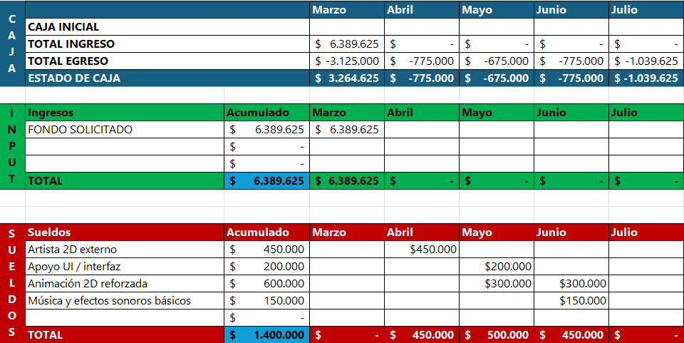

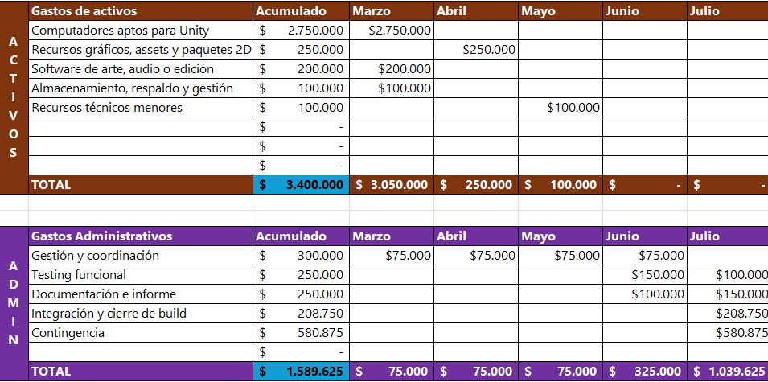

*Tabla 15. Desglose de costos. Elaboración propia.*

Estos costos están fundamentados en las referencias adjuntas al final del informe.

#### Elementos no considerados en el MVP

El MVP académico no incorpora ciertos costos debido a que su objetivo es validar la jugabilidad principal del proyecto dentro del contexto del semestre. Por esta razón, se excluyeron elementos que no son indispensables para demostrar el funcionamiento del videojuego.

Esta decisión permite mantener una estimación coherente con los objetivos académicos del proyecto y evita incorporar costos que no aportan directamente a la validación de la propuesta jugable.

| Elemento excluido del MVP | Motivo de exclusión |
| --- | --- |
| Publicación comercial | La entrega académica no requiere lanzamiento en plataformas digitales |
| Marketing y publicidad | No forman parte de los objetivos de validación del proyecto |
| Servidores o infraestructura online | El alcance actual no contempla funcionalidades multijugador |
| Actores de voz o doblaje | No son necesarios para la experiencia principal |
| Licencias profesionales de alto costo | Se prioriza el uso de herramientas gratuitas o disponibles institucionalmente |
| QA profesional externo | Las pruebas son realizadas por el propio equipo |
| Contratación de personal externo | El desarrollo es realizado por los integrantes del proyecto |
| Campañas de lanzamiento | Corresponden a una etapa posterior de comercialización |

*Tabla 16. Elaboración propia.*

El proyecto ideal comercial corresponde a una proyección ampliada de Squid Ink-Pulse y considera una versión completa, pulida y preparada para una eventual publicación. A diferencia del MVP académico, este escenario incorpora una mayor duración del desarrollo, un equipo profesional, apoyo externo especializado, equipamiento, herramientas, difusión comercial y contingencia.

| Bloque de costo | Monto estimado | Explicación breve |
| --- | --- | --- |
| Equipo profesional y desarrollo técnico | $105.180.000 CLP | Corresponde al equipo base necesario para desarrollar el juego de forma profesional: productor, diseñadores, programadores y QA. Este bloque cubre la construcción de mecánicas, tienda, gadgets, enemigos, interfaz, pruebas y estabilidad general. |
| Producción visual, animación y audio | $35.420.000 CLP | Incluye la creación de identidad visual y sonora del juego: arte 2D, animaciones, UI, música y efectos. Permite que el juego no solo funcione, sino que tenga una presentación más pulida y coherente. |
| Equipamiento, herramientas y licencias | $26.110.000 CLP | Considera computadores, periféricos, software, licencias y recursos técnicos necesarios para trabajar en Unity, producir assets, respaldar archivos y desarrollar de forma formal. |
| Publicación, marketing y comunidad | $17.472.800 CLP | Agrupa los costos necesarios para preparar el lanzamiento comercial: publicación en plataformas, tráiler, kit de prensa, redes sociales, publicidad y gestión de comunidad. |
| Otros / contingencia | $27.627.420 CLP | Margen reservado para imprevistos, retrabajo, ajustes técnicos, cambios de alcance o variaciones de costos durante el desarrollo. |
| Total proyecto ideal comercial | $211.810.220 CLP | Presupuesto estimado para transformar el MVP en una versión completa, pulida y publicable del videojuego. |

*Tabla 17. Elaboración propia.*

En síntesis, el mayor costo del proyecto ideal se concentra en el equipo profesional y el desarrollo técnico, ya que esta área sostiene la construcción completa del videojuego. Los demás bloques complementan esta base mediante producción audiovisual, herramientas de trabajo, preparación para publicación y un margen de contingencia necesario para enfrentar riesgos durante el desarrollo.

#### Posibles fondos o vías de financiamiento

En caso de que el proyecto avance más allá del contexto académico, podrían evaluarse fondos o programas de apoyo orientados a emprendimiento, industrias creativas, innovación o internacionalización. Estos fondos no forman parte directa del MVP, pero sí podrían ser relevantes para una etapa posterior de crecimiento.

| FONDO O PROGRAMA | INSTITUCIÓN | FUNDAMENTO DE PERTINENCIA | APORTE REFERENCIAL |
| --- | --- | --- | --- |
| Fondo Audiovisual / Línea Videojuegos | Ministerio de las Culturas, las Artes y el Patrimonio | Squid Ink-Pulse podría calzar en este fondo porque corresponde a un videojuego con propuesta artística, narrativa y técnica propia. El proyecto no se limita a una demostración mecánica, sino que integra identidad visual, narrativa de crecimiento, diseño de personajes, ambientación submarina y una mecánica diferenciadora basada en riesgo-recompensa. | Entre $25.000.000 y $70.000.000 |
| Capital Semilla Emprende | Sercotec | El proyecto podría postular en una etapa inicial si el equipo decide formalizarlo como emprendimiento. Squid Ink-Pulse tiene potencial de transformarse en un producto comercial independiente, con un MVP validable, público objetivo definido y posibilidad de crecimiento mediante nuevas zonas, skins, mejoras y publicación digital. | $3.500.000 |
| Semilla Inicia | Corfo | Squid Ink-Pulse podría ser pertinente porque posee una base de prototipo/MVP y requeriría validación técnica y comercial para avanzar hacia un producto real. Su propuesta presenta elementos de innovación dentro del género endless runner al incorporar una mecánica central basada en exposición controlada al peligro, lo que permite diferenciarlo frente a otros juegos casuales. | Hasta $15.000.000 |
| Start-Up Chile Build | Start-Up Chile / Corfo | El proyecto podría calzar si se proyecta como una startup de entretenimiento digital o videojuego indie con potencial de escalamiento. Squid Ink-Pulse posee una idea validable, un MVP en desarrollo y posibilidades de expansión comercial mediante publicación en plataformas, contenido adicional y una identidad de marca propia. | $15.000.000 equity-free |

*Tabla 18. Elaboración propia.*

En síntesis, Squid Ink-Pulse podría optar a estos fondos porque combina tres dimensiones financiables: creación audiovisual interactiva, emprendimiento digital e innovación temprana. Su valor no está solo en ser un videojuego, sino en presentar una propuesta con identidad visual, narrativa, mecánica diferenciadora y proyección comercial.

## Metodología de trabajo y planificación

El desarrollo del proyecto se organiza mediante la metodología ágil Scrum. El trabajo se estructura en sprints semanales con objetivos claros y entregables definidos. Cada sprint contempla planificación, ejecución y revisión, lo que permite una iteración constante del producto.

El equipo se organiza en roles funcionales, manteniendo comunicación continua para detectar problemas y ajustar el rumbo del desarrollo. Este enfoque facilita la adaptación a cambios, la priorización de tareas críticas y la entrega progresiva de funcionalidades, alineándose con un desarrollo incremental del videojuego.

### Carta Gantt actualizada

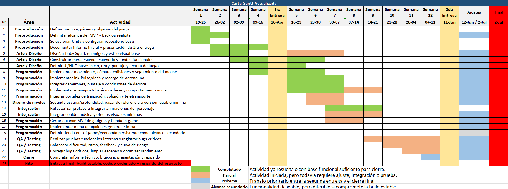

*Figura 29. Carta Gantt. Elaboración propia.*

La planificación general del proyecto se apoya en una Carta Gantt, que define las etapas principales del desarrollo y su distribución temporal. Esta herramienta permite visualizar:

- Fases del proyecto.

- Dependencias entre tareas.

- Plazos estimados de entrega.

La carta Gantt funciona como una guía de planificación general, mientras que Scrum gestiona el trabajo semanal, lo que asegura coherencia entre la planificación a largo plazo y la ejecución diaria.

La carta se divide en las siguientes fases:

#### Hitos

- Primera entrega: concepto del juego (20/04) — cumplida.

- Segunda entrega: MVP completo (11/06) — cumplida.

- Tercera entrega: versión ejecutable estable, código ordenado y respaldo del proyecto — cumplida.

#### Áreas y detalle

- Preproducción: completada.

  - Definir la premisa, el género y el objetivo del juego.

  - Delimitar el alcance del MVP y las mecánicas prioritarias.

  - Seleccionar el motor de juego.

  - Documentar el proyecto en el informe.

- Arte y diseño: completados.

  - Bocetar al personaje principal y a los enemigos.

  - Diseñar el escenario y los fondos base.

  - Definir el estilo visual de la interfaz y del HUD.

- Programación: completada.

  - Implementar el movimiento, la cámara y las colisiones.

  - Implementar la mecánica principal y la interacción base.

  - Implementar el sistema de vida, daño y puntaje.

  - Implementar los enemigos.

  - Integrar la interfaz, el HUD y el flujo del juego.

- Diseño de niveles: completado.

  - Construir el nivel base.

  - Montar el nivel completo y la progresión del juego.

- Integración: completada.

  - Integrar las animaciones del personaje y de los enemigos.

  - Integrar el sonido, la música y los efectos visuales.

- Pruebas y aseguramiento de calidad (QA).

  - Realizar pruebas funcionales internas.

  - Equilibrar la dificultad y el ritmo, y recopilar la retroalimentación del jugador.

  - Corregir errores y optimizar el rendimiento.

- Cierre.

  - Preparar la demostración para la feria.

  - Completar la documentación técnica y la presentación.

  - Aplicar ajustes según la retroalimentación.

**Nota: las etapas de arte y diseño, programación, diseño de niveles e integración fueron iterativas, por lo que se trabajó en ellas de manera cíclica.**

### Herramientas de trabajo

| Herramienta | Función |
| --- | --- |
| Jira | Plataforma de gestión de tareas alineada con Scrum. Se emplea para organizar el flujo de trabajo en columnas —por hacer, en progreso, en revisión y hecho—, asignar responsabilidades y seguir el avance de cada sprint. |
| Unity | Motor de desarrollo utilizado para la implementación del videojuego. Permite integrar programación (C#), diseño de niveles, físicas, animaciones y UI en un entorno unificado, facilitando la creación del prototipo jugable. |
| GitHub | Sistema de control de versiones utilizado para administrar el código fuente, conservar el historial de cambios y facilitar el trabajo colaborativo mediante ramas y fusiones. Garantiza la trazabilidad y el respaldo del desarrollo. |
| Canva | Herramienta utilizada para organizar, editar y adaptar recursos gráficos, como sprites y material de presentación. |
| Discord | Medio oficial de comunicación del equipo. En sus canales se realizan reuniones de seguimiento y se organiza la información. El canal de voz «Programando» permite indicar cuándo un integrante está trabajando y facilita la coordinación de tareas paralelas. |

*Tabla 19. Herramientas de trabajo. Elaboración propia.*

En conjunto, esta combinación de metodología y herramientas permite un desarrollo ordenado, iterativo y controlado, asegurando tanto la calidad del producto como el cumplimiento de los plazos establecidos.

### Sprints ejecutados y bitácora

#### Sprint 1 — S1: Definiciones

| CATEGORÍA | DETALLE |
| --- | --- |
| PERÍODO | 19-03-2026 al 26-03-2026 |
| ESTADO | Cerrado |
| OBJETIVO | Definir el proyecto y el MVP, dejando el juego conceptual y organizativamente listo para iniciar el prototipo. |
| RESULTADO | Objetivo cumplido: se definieron el MVP, el ciclo de jugabilidad, la narrativa, la identidad y la configuración de herramientas como Jira, la carta Gantt, el repositorio y el motor. |
| MÉTRICAS | 9 de 9 incidencias funcionales completadas → 100 % de cumplimiento real. |
| ACLARACIÓN | Se excluyeron 6 incidencias por corresponder a la definición de roles y no a tareas funcionales del sprint. |
| PUNTOS DE HISTORIA | No registrados → no es posible medir la velocidad ni la precisión de la planificación. |
| TRABAJO REALIZADO | Base conceptual del MVP, ciclo, trasfondo narrativo y marca; además, base operativa mediante herramientas, repositorio y motor. |
| OBSERVACIONES | Roles modelados como incidencias y uso incompleto de métricas de Scrum. |
| RIESGOS | Bajo impacto: desalineación metodológica, no técnica. |
| CONCLUSIÓN | Sprint exitoso: proyecto definido y preparado para iniciar desarrollo. |

*Tabla 20. Sprint 1. Elaboración propia, apoyada en Rovo, IA integrada en Jira.*

#### Sprint 2 — S2: Base Visual y Técnica

| CATEGORÍA | DETALLE |
| --- | --- |
| PERÍODO | 27-03-2026 al 09-04-2026 |
| ESTADO | Cerrado |
| OBJETIVO | Definir el estilo visual del juego y construir la infraestructura mínima de un primer prototipo jugable. |
| RESULTADO | Objetivo mayoritariamente cumplido: base visual consolidada, incluyendo identidad, personaje, UI, escenarios y enemigos; además de una base técnica funcional en Unity, mecánicas base, menú y repositorio. |
| MÉTRICAS | 11 de 13 incidencias completadas → aproximadamente 85 % de cumplimiento. |
| ACLARACIÓN | Las incidencias de rol no se consideraron tareas funcionales; 2 incidencias quedaron en proceso y continuaron en el Sprint 3. |
| PENDIENTES | Documentación técnica y testing del prototipo. |
| OBSERVACIONES | Ausencia de puntos de historia; avance desbalanceado hacia el desarrollo por encima del aseguramiento de calidad y la documentación. |
| RIESGOS | Deuda de documentación y validación → posible retrabajo o inconsistencias. |
| CONCLUSIÓN | Sprint exitoso en términos de prototipo y base visual; requiere fortalecer la documentación y las pruebas en las siguientes iteraciones. |

*Tabla 21. Sprint 2. Elaboración propia, apoyada en Rovo, IA integrada en Jira.*

#### Sprint 3 — S3: Prototipo Jugable

| CATEGORÍA | DETALLE |
| --- | --- |
| PERÍODO | 09-04-2026 al 16-04-2026 |
| ESTADO | Activo, no cerrado en Jira |
| OBJETIVO | Construir un prototipo jugable mínimo con el ciclo base: jugar → enfrentar amenaza → perder o sobrevivir → reintentar. |
| RESULTADO | Objetivo parcialmente logrado: hubo avances en la interfaz, el menú de pausa, la identidad y las definiciones; sin embargo, el ciclo jugable aún no estaba completamente implementado. |
| MÉTRICAS | 5 de 14 incidencias en «Hecho» → aproximadamente 36 % de cumplimiento, más 1 incidencia en revisión. |
| AVANCES CLAVE | Menú de pausa, diseño e implementación, definición de enemigos, presentación inicial y logo. |
| PENDIENTES CRÍTICOS | Mecánicas centrales de la jugabilidad, enemigos, jefe, menú de opciones y cierre del ciclo jugable. |
| ARRASTRE | La documentación y las pruebas continuaron desde el Sprint 2. |
| OBSERVACIONES | Progreso centrado en la interfaz y el diseño; desarrollo del núcleo jugable rezagado. |
| RIESGOS | Prototipo incompleto, deuda de QA y documentación, posible desalineación del diseño. |
| CONCLUSIÓN | Sprint incompleto; se requiere priorizar las mecánicas centrales y cerrar el ciclo jugable para cumplir el objetivo. |

*Tabla 22. Sprint 3. Elaboración propia, apoyada en Rovo, IA integrada en Jira.*

#### Sprint 4 — S4: Mecánicas clave MVP

| CATEGORÍA | DETALLE |
| --- | --- |
| PERÍODO | 07-05-2026 al 28-05-2026 |
| ESTADO | Finalizado, con 1 incidencia pendiente |
| OBJETIVO | Cumplir las mecánicas comprometidas en el MVP presentado, priorizando la implementación de sistemas jugables centrales. |
| RESULTADO | Objetivo mayoritariamente cumplido: se implementaron y refinaron mecánicas clave del MVP, incluyendo enemigos, jefe, ataque tipo “pared”, pez dealer y menú de tienda. Quedó pendiente la implementación general del menú de opciones. |
| MÉTRICAS | 8 de 9 incidencias funcionales completadas → aproximadamente 89 % de cumplimiento real. |
| ACLARACIÓN | Se excluyeron 6 incidencias constantes correspondientes a roles del equipo, ya que no representaban tareas funcionales del sprint. |
| AVANCES CLAVE | Implementación de enemigos, mecánica de jefe con alejamiento de cámara, ataque tipo «pared», refinamiento de SS Carnage, pez comerciante, menú de tienda, diseño del menú de opciones y evaluación mediante pruebas. |
| PENDIENTES | Implementación general del menú de opciones. |
| OBSERVACIONES | El sprint se concentró principalmente en funcionalidades asociadas al MVP, con 5 de 9 incidencias funcionales orientadas a mecánicas. También incorporó tareas de diseño y pruebas, lo que permitió validar parcialmente las implementaciones. |
| RIESGOS | Persistencia de una deuda funcional menor asociada al menú de opciones. Riesgo moderado de integración si esta funcionalidad se posterga demasiado respecto del cierre del MVP. |
| CONCLUSIÓN | Sprint exitoso en términos de avance técnico: se completaron las mecánicas centrales comprometidas para el MVP y se fortaleció el núcleo jugable. Se requiere cerrar el menú de opciones para consolidar el flujo completo del producto. |

*Tabla 23. Sprint 4. Elaboración propia, apoyada en Rovo, IA integrada en Jira.*

#### Sprint 5 — S5: Tienda y Portales

| CATEGORÍA | DETALLE |
| --- | --- |
| PERÍODO | 28-05-2026 al 05-06-2026 |
| ESTADO | Finalizado, con tareas pendientes y en proceso |
| OBJETIVO | Implementar portales para transición de escenarios y una tienda funcional basada en la economía de camarones. |
| RESULTADO | Objetivo mayoritariamente cumplido. Se implementaron portales, tienda, pez comerciante, persistencia de camarones, inventario, gadgets, menú de Game Over y correcciones funcionales. Quedaron pendientes ajustes de opciones, parámetros de dificultad y elementos asociados a la generación y al tutorial. |
| MÉTRICAS | 18 de 22 tareas completadas, equivalentes a un 82 % de cumplimiento. |
| ACLARACIÓN | No se consideran las tareas constantes asociadas a roles, ya que no corresponden a entregables funcionales del sprint. |
| AVANCES CLAVE | Se consolidaron sistemas centrales del MVP: economía, tienda, gadgets, inventario, portales y corrección de errores de integración. |
| PENDIENTES | Menú de opciones, parámetros de dificultad, algoritmo de generación y nivel tutorial. |
| OBSERVACIONES | El sprint tuvo una alta carga técnica y permitió integrar sistemas relevantes para completar el flujo jugable. La mayor parte del trabajo se concentró en programación, integración y corrección de errores. |
| RIESGOS | Persistieron riesgos moderados asociados al equilibrio del juego y a la experiencia inicial, especialmente por el tutorial y el sistema de generación. |
| CONCLUSIÓN | Sprint exitoso en términos funcionales, pues consolidó la tienda, la economía, los portales, los gadgets y el inventario. Para cerrar el flujo del MVP, se requería finalizar los ajustes de dificultad, generación y tutorial. |

*Tabla 24. Sprint 5. Elaboración propia, apoyada en Rovo, IA integrada en Jira.*

#### Sprint 6 — S6: Presentación y segunda escena

| CATEGORÍA | DETALLE |
| --- | --- |
| PERÍODO | 05-06-2026 al 13-06-2026 |
| ESTADO | Finalizado, con tareas pendientes y en proceso |
| OBJETIVO | Ajustar el flujo del juego para la presentación, incorporando una segunda escena referencial, mejoras visuales y correcciones funcionales. |
| RESULTADO | Objetivo parcialmente cumplido. Se consolidaron elementos relevantes para la presentación, como portales, diseño del segundo escenario, correcciones de transición, refactorización del personaje principal como prefab, presentación en Canva y animaciones del SS Carnage e Ink-Pulse. Quedaron pendientes sistemas complementarios asociados a menús, tienda externa y parámetros de dificultad. |
| MÉTRICAS | 13 de 20 tareas completadas, equivalentes a un 65 % de cumplimiento. |
| ACLARACIÓN | No se consideran las tareas constantes asociadas a roles, ya que no corresponden a entregables funcionales del sprint. |
| AVANCES CLAVE | Se avanzó en la integración de portales, segunda escena, corrección de errores de transición, material visual para presentación, animaciones y diseños complementarios. |
| PENDIENTES | Menú de opciones, menú de opciones durante la partida, tienda fuera de la partida, parámetros de dificultad, algoritmo de generación, nivel tutorial e Informe n.º 2. |
| OBSERVACIONES | El sprint estuvo orientado principalmente a preparar una versión presentable del proyecto, priorizando integración visual, correcciones funcionales y material expositivo. La carga de trabajo se concentró especialmente en programación, diseño e integración. |
| RIESGOS | Persistieron riesgos asociados al cierre del flujo completo del MVP, especialmente por sistemas incompletos vinculados a menús, tienda externa, generación y tutorial. |
| CONCLUSIÓN | Sprint parcialmente exitoso: permitió consolidar una base funcional y visual adecuada para la presentación. Sin embargo, el MVP aún requería cerrar sistemas pendientes para alcanzar una versión ejecutable más estable y completa. |

*Tabla 25. Sprint 6. Elaboración propia, apoyada en Rovo, IA integrada en Jira.*

#### Sprint 7 — S7: Últimas implementaciones

| CATEGORÍA | DETALLE |
| --- | --- |
| PERÍODO | 13-06-2026 al 18-06-2026 |
| ESTADO | Finalizado |
| OBJETIVO | Implementar funcionalidades finales del MVP, enfocadas en la persistencia de datos, la tienda fuera de la partida, el sistema de mejoras, las skins y el almacenamiento mediante archivos JSON. |
| RESULTADO | Avance parcial. Se completó el algoritmo de generación, lo que fortaleció la aparición de amenazas y el flujo jugable. Además, permanecieron en proceso tareas relevantes como el nivel tutorial, el Informe n.º 2, la definición de parámetros de dificultad y la tienda fuera de la partida. Persistieron pendientes asociados a los menús. |
| MÉTRICAS | 7 de 7 tareas completadas, equivalentes a un 100 % de cumplimiento registrado. |
| ACLARACIÓN | No se consideran las tareas constantes asociadas a roles, ya que no corresponden a entregables funcionales del sprint. |
| AVANCES CLAVE | Finalización del algoritmo de generación y avances en el tutorial, la documentación del informe, los parámetros de dificultad y la tienda fuera de la partida. |
| PENDIENTES | Menú de opciones, menú de opciones durante la partida, cierre del tutorial, tienda fuera de la partida, parámetros de dificultad e Informe n.º 2. |
| OBSERVACIONES | El sprint concentra tareas finales necesarias para consolidar el MVP y preparar una build más completa. Aún existen tareas críticas en proceso, por lo que el cierre del sprint requiere priorización estricta. |
| RIESGOS | Riesgo alto asociado al tutorial, por su impacto directo en la experiencia inicial del jugador. También persiste riesgo por funcionalidades de menú y tienda externa aún no cerradas. |
| CONCLUSIÓN FINAL | Se logró un avance técnico relevante al completar el algoritmo de generación. Para cerrar adecuadamente el MVP, era necesario priorizar el tutorial, los menús, la tienda externa y los parámetros de dificultad. |

*Tabla 26. Sprint 7. Elaboración propia, apoyada en Rovo, IA integrada en Jira.*

#### Sprint 8 — S8: Finalización del MVP y preparación para la feria

| CATEGORÍA | DETALLE |
| --- | --- |
| PERÍODO | 18-06-2026 al 26-06-2026 |
| ESTADO | Finalizado |
| OBJETIVO | Implementar las funcionalidades finales del MVP: tienda fuera de la partida, ambos menús de opciones, tutorial, historia mediante cómics, mejoras y skins. |
| RESULTADO | Avance total. Se completó el tutorial, lo que facilitó la comprensión de las mecánicas. También se completaron los menús de opciones dentro y fuera de la partida, y se implementó la tienda externa con mejoras por niveles y skins comprables. |
| MÉTRICAS | 7 de 7 tareas completadas, equivalentes a un 100 % de cumplimiento. |
| ACLARACIÓN | No se consideran las tareas constantes asociadas a roles, ya que no corresponden a entregables funcionales del sprint. |
| AVANCES CLAVE | El tutorial, la tienda fuera de la partida y la historia narrada mediante cómics permitieron llevar el juego a un estado finalizado. |
| PENDIENTES | Entrega del Informe n.º 3. |
| OBSERVACIONES | El sprint concentró las últimas tareas necesarias para llevar el juego a un estado completo y jugable. |
| RIESGOS | Todos los riesgos fueron cubiertos. |
| CONCLUSIÓN FINAL | Sprint finalizado, con la conclusión de las últimas tareas necesarias para que el juego alcanzara el estado prometido. |

*Tabla 27. Sprint 8. Elaboración propia, apoyada en Rovo, IA integrada en Jira.*

## Conclusiones

### Alcance final del proyecto

Squid Ink-Pulse avanzó desde una propuesta conceptual hasta una entrega académica final y funcional. El proyecto permite validar su núcleo jugable: movimiento continuo, evasión de amenazas, carga del Ink-Pulse mediante la proximidad al peligro, uso estratégico del recurso, progresión persistente, tiendas, portales, jefes y narrativa mediante cómics.

El alcance final incluye dos zonas jugables, tienda temporal, tienda permanente, sistema de camarones, gadgets, skins, mejoras, tutorial, menús, opciones, persistencia local, audio dinámico y documentación técnica. Estos elementos permiten presentar una experiencia completa dentro del contexto académico.

### Viabilidad del proyecto

El proyecto se considera viable dentro del contexto académico, ya que logró cerrar una versión funcional sin ampliar excesivamente su alcance. La elección de un endless runner 2D permitió concentrar el esfuerzo en mecánicas centrales, progresión, interfaz, economía, narrativa breve y rejugabilidad, evitando una complejidad innecesaria para el tiempo disponible.

Desde una perspectiva futura, el proyecto también presenta viabilidad de expansión. Sus sistemas de tienda, skins, mejoras, portales, zonas y documentación técnica permiten proyectar nuevas iteraciones, más contenido, balance avanzado y eventual publicación. Sin embargo, dicha proyección corresponde a una etapa posterior al cierre académico.

### Implementación final alcanzada

El proyecto ha completado su desarrollo y alcanzado el estado de entrega final. Se integraron y consolidaron los sistemas relevantes: movimiento continuo limitado por fronteras, mecánica de Ink-Pulse, zona de riesgo o graze zone, aparición estructurada de enemigos, economía de camarones, inventario de gadgets, tienda temporal durante la partida, portales de transición entre zonas, HUD, menús interactivos de pausa y Game Over, y eventos orquestados de jefes, incluidos SS Carnage y el jefe abisal.

El logro más importante de la entrega es la consolidación de la mecánica de Ink-Pulse y su estrecha relación con el ciclo de riesgo-recompensa, pues este sistema representa la identidad principal del videojuego. En su versión final, la mecánica se enriquece mediante una representación visual progresiva en la interfaz y una banda sonora dinámica que realiza una transición cruzada al activarse la habilidad.

La etapa de integración, pruebas y ajustes concluyó satisfactoriamente y permitió que los componentes funcionaran de forma equilibrada y clara para el jugador. Como parte de esta maduración final, se integraron mecanismos de retención y rejugabilidad: una tienda permanente fuera de la partida para comprar mejoras y skins; persistencia local mediante JSON para conservar el progreso y los récords; viñetas narrativas para acompañar las transiciones; y un complemento opcional para los eventos de feria.

### Aporte de Scrum al desarrollo

La metodología Scrum permitió organizar el trabajo en sprints, definir prioridades y controlar el avance del equipo de forma progresiva. Gracias a esta estructura, el proyecto avanzó por etapas: primero, la definición conceptual; luego, la base visual y técnica; posteriormente, las mecánicas centrales; y, finalmente, los ajustes, la documentación y el cierre del MVP.

El uso de Jira, GitHub y Discord facilitó la asignación de tareas, el seguimiento del progreso, la comunicación interna y el control de versiones. Esto permitió detectar pendientes, reorganizar prioridades y mantener una trazabilidad clara del desarrollo.

### Cierre general

En conclusión, Squid Ink-Pulse es una propuesta viable, coherente y completa para el contexto académico. El proyecto logró transformar una idea inicial en un videojuego funcional, manteniendo una identidad clara basada en riesgo, reacción y progresión.

La entrega final demuestra el cumplimiento del núcleo prometido: avanzar, esquivar, asumir riesgos, cargar el Ink-Pulse y utilizarlo en momentos críticos. Además, la incorporación de progresión persistente, tienda permanente, skins, mejoras, cómics, portales, jefes y recursos para la feria permite afirmar que el proyecto superó el nivel de prototipo básico y alcanzó una versión demostrable y defendible.

Las mejoras restantes corresponden a una etapa posterior de expansión, balance avanzado y pulido comercial, sin impedir que la entrega actual cumpla su objetivo académico.

## Referencias bibliográficas

Adams, E. (2014). *Fundamentals of game design* (3rd ed.). New Riders.

Computrabajo. (s. f.). Salarios: Dibujante. Recuperado el 14 de junio de 2026, de https://cl.computrabajo.com/salarios/dibujante

Computrabajo. (s. f.). Salarios: Diseñadores/as gráficos. Recuperado el 14 de junio de 2026, de https://cl.computrabajo.com/salarios/disenadoresas-graficos

Computrabajo. (s. f.). Salarios: Tester QA. Recuperado el 14 de junio de 2026, de https://cl.computrabajo.com/salarios/tester-qa

Corporación de Fomento de la Producción. (s. f.). Semilla Inicia. Corfo. Recuperado el 14 de junio de 2026, de https://www.corfo.gob.cl/sites/cpp/convocatoria/semilla_inicia/

Duoc UC. (s. f.). Cuánto gana un programador en Chile. Recuperado el 14 de junio de 2026, de https://www.duoc.cl/?noticia_post_type=cuanto-gana-un-programador-en-chile

Fox, T. (2018). *Deltarune* [Videojuego]. Toby Fox.

Kiloo & SYBO Games. (2012). *Subway Surfers* [Videojuego]. Kiloo.

McMillen, E., & Nicalis, Inc. (2011). *The Binding of Isaac* [Videojuego]. Nicalis.

Ministerio de las Culturas, las Artes y el Patrimonio. (2024). Bases concurso público: Línea videojuegos, convocatoria 2025 [PDF]. Fondo Audiovisual. https://www.fondosdecultura.cl/wp-content/uploads/2024/07/6-FA-VIDEOJUEGOS-2025.pdf

Nguyen, D. (2013). *Flappy Bird* [Videojuego]. .GEARS Studios.

O’Dor, R. K., Boucher-Rodoni, R., & Wells, M. J. (Eds.). (2002). *The biology of squid*. Smithsonian Institution Press.

Schwaber, K. (2004). *Agile project management with Scrum*. Microsoft Press.

Servicio de Cooperación Técnica. (s. f.). Capital Semilla Emprende. Sercotec. Recuperado el 14 de junio de 2026, de https://www.sercotec.cl/programas/capital-semilla-emprende/

Start-Up Chile. (s. f.). Build. Recuperado el 14 de junio de 2026, de https://startupchile.org/en/apply/build/

Sutherland, J. (2014). *Scrum: The art of doing twice the work in half the time*. Crown Business.

Unity Technologies. (2024). Unity manual. Unity Documentation. https://docs.unity3d.com/Manual/index.html

WageIndicator Foundation. (s. f.). Función y salario: Músicos, cantantes y compositores. TuSalario.org. Recuperado el 14 de junio de 2026, de https://wageindicator.org/es-cl/trabajo-en-chile/funcion-y-salario/musicos-cantantes-y-compositores
